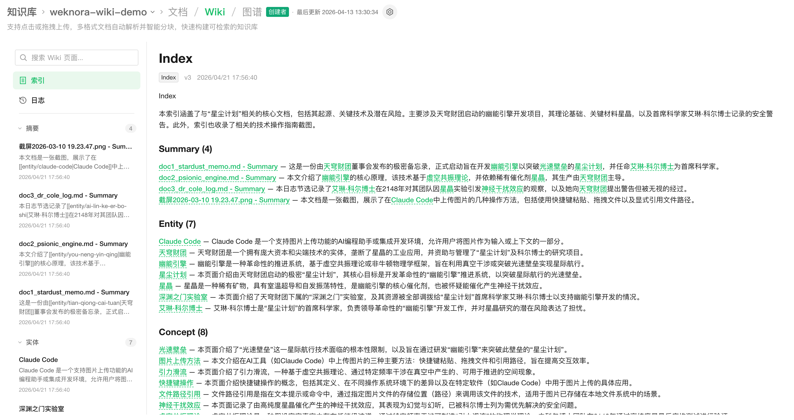
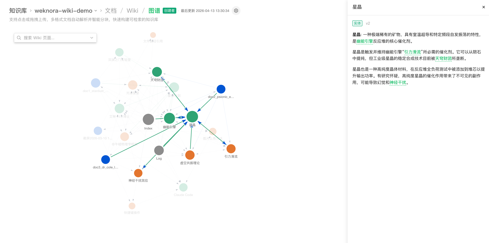
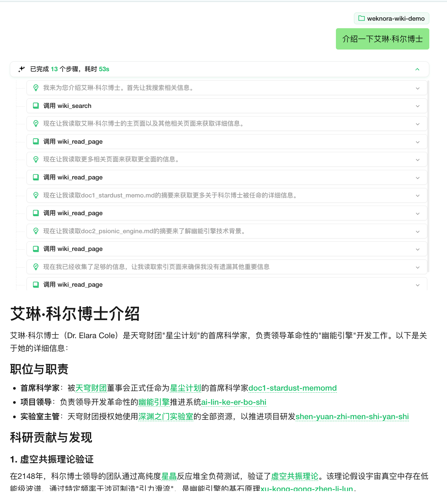
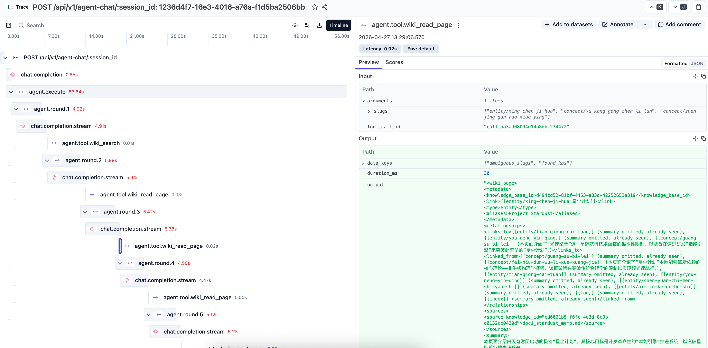

<p align="center">
  <picture>
    
  </picture>
</p>

<p align="center">
  <picture>
    <a href="https://trendshift.io/repositories/15289" target="_blank">
      
    </a>
  </picture>
</p>
<p align="center">
    <a href="https://weknora.weixin.qq.com" target="_blank">
        
    </a>
    <a href="https://chatbot.weixin.qq.com" target="_blank">
        
    </a>
    <a href="https://github.com/Tencent/WeKnora/blob/main/LICENSE">
        
    </a>
    <a href="./CHANGELOG.md">
        
    </a>
</p>

<p align="center">
| <a href="./README.md"><b>English</b></a> | <b>简体中文</b> | <a href="./README_JA.md"><b>日本語</b></a> | <a href="./README_KO.md"><b>한국어</b></a> |
</p>

<p align="center">
  <h4 align="center">

  [项目介绍](#-项目介绍) • [架构设计](#-架构设计) • [核心特性](#-核心特性) • [快速开始](#-快速开始) • [文档](#-文档) • [开发指南](#-开发指南)

  </h4>
</p>

# 💡 WeKnora — 让文档活起来：RAG、Agent 推理与自动 Wiki 一体化的知识框架

## 📌 项目介绍

**[WeKnora（维娜拉）](https://weknora.weixin.qq.com)** 是一款开源的、基于大语言模型（LLM）的知识管理框架，专为企业级文档理解、语义检索与智能推理场景打造。

框架围绕三大核心能力构建：**RAG 快速问答**适合日常知识查询，**ReAct Agent 智能推理**自主编排知识检索、MCP 工具与网络搜索完成复杂多步任务，全新的 **Wiki 模式**则让 Agent 从原始文档中自治生成相互链接的 Markdown 知识库与可视化知识图谱。结合多源数据接入（飞书 / Notion / 语雀，更多持续接入中）、二十余家主流模型厂商集成、Langfuse 全链路可观测性，以及完全可私有化部署的模块化架构，WeKnora 帮助团队把分散文档沉淀为可查询、可推理、可持续演进的专属知识资产。

框架支持从飞书、Notion 及语雀等外部平台自动同步知识（更多数据源持续接入中），覆盖 PDF、Word、图片、Excel 等十余种文档格式，并可通过企业微信、飞书、Slack、Telegram 等 IM 频道直接提供问答服务。模型层面兼容 OpenAI、DeepSeek、Qwen（阿里云）、智谱、混元、Gemini、MiniMax、NVIDIA、Ollama 等主流厂商。全流程模块化设计，大模型、向量数据库、存储等组件均可灵活替换，支持本地与私有云部署，数据完全自主可控。WeKnora 还无缝集成了 **Langfuse**，为 Agent 运行、Token 使用及任务流水线提供了全面的可观测性追踪。

## ✨ 最新更新

**v0.5.0 版本亮点：**

- **Wiki 模式**：全新推出 Agent 驱动的 Wiki 知识体系，可从原始文档中自动梳理并生成相互关联的 Markdown 页面，内置独立的 Wiki 浏览器与可视化知识图谱，直观呈现页面之间的引用与关联关系，帮助团队沉淀结构化、可迭代演进的专属知识库
- **可观测性**：集成 Langfuse 以深入跟踪 Agent ReAct 循环、LLM Token 消耗、工具调用以及 asynq 任务流水线，全面掌控 Agent 推理和系统性能
- **自定义索引策略**：用户现在可以在知识库级别，独立开启或关闭 向量检索、关键词检索（混合检索）、Wiki 模式 以及 知识图谱 构建
- **向量数据库 UI 与知识库绑定**：新增前端 Vector Store 管理界面与连通性测试功能，并支持为不同知识库绑定专属的向量数据库实例
- **语雀数据源**：新增语雀连接器，提供完整的 API 客户端，支持文档的全量与增量同步，实现语雀知识的无缝接入
- **Agent 能力增强**：新增 `json_repair` 工具以自动修复和解析异常 JSON 输出，预置了 `OpenMAIC Classroom` 智能体技能，并支持在 DuckDB 数据分析中加载 Excel 的所有工作表
- **前端与调试优化**：设置页面模型卡片新增快速复制功能，全面增强了所有模型厂商的 LLM 请求调试（`llm_debug`）和日志记录机制
- **问题修复**：修复 DuckDB 访问文件问题（将知识文件物化到临时目录）、移除纯 Wiki 模式 Agent 对 Rerank 模型的依赖，以及在 dockerignore 中将离线 protoc 压缩包加入白名单

<details>
<summary><b>更早版本</b></summary>

**v0.4.0 版本亮点：**

- **[知识助理](https://weknora.weixin.qq.com/platform)**：云端托管的知识助理服务，无需本地部署即可快速体验
- **WeKnora Cloud**：WeKnora Cloud 模型服务集成，提供托管大模型和文档解析能力，支持凭证管理与状态检查
- **[Chrome 插件](https://chromewebstore.google.com/detail/jpemjbopikggjlmikmclgbmkhhopjdgd)**：浏览器插件支持网页知识快速采集
- **[ClawHub Skill](https://clawhub.ai/lyingbug/weknora)**：ClawHub Skill 技能市场集成，一键安装 Agent 技能
- **微信 IM 集成**：微信频道适配器，支持扫码登录和长轮询消息接收
- **附件处理**：对话流水线支持文件附件，增强错误处理和内容格式化，注入图片/附件元数据
- **Azure OpenAI 提供商**：全面支持 Azure OpenAI 的 Chat、VLM 和 Embedding 模型，保留部署名称映射，支持 dimensions 参数配置
- **阿里云 OSS 存储**：通过 S3 兼容模式支持阿里云 OSS 对象存储，提供配置界面、连通性测试和多语言国际化支持
- **Notion 连接器**：Notion 数据源集成，包含 API 客户端、Markdown 渲染器和 Connector 接口实现
- **百度 & Ollama 网页搜索**：新增百度和 Ollama 作为网页搜索引擎
- **VectorStore 管理**：完整的 VectorStore CRUD 功能，包含实体、仓库、服务层、连通性测试和 API 端点
- **重要修复**：修复 Azure OpenAI 端点处理、Embedding 截断、IM 引用标签清理、neo4j Go 1.24 Windows 兼容性及 OSS 签名问题


**v0.3.6 版本亮点：**

- **ASR 语音识别**：集成 ASR 模型，支持音频文件上传、文档内音频预览和语音转写能力
- **数据源自动同步（飞书）**：完整的数据源管理功能，支持飞书 Wiki/云文档自动同步（增量/全量），同步日志与租户隔离
- **OIDC 统一认证**：支持 OpenID Connect 登录，自动发现端点、自定义端点配置及用户信息字段映射
- **IM 引用回复上下文**：IM 频道中提取引用消息并注入 LLM 提示词，实现上下文关联回复；非文本引用防幻觉处理
- **IM 线程会话模式**：IM 频道支持按线程维度独立会话（Slack、Mattermost、飞书、Telegram），线程内多用户协作
- **文档自动摘要**：AI 生成文档摘要，可配置最大输入长度，文档详情页展示专属摘要区域
- **Tavily 网页搜索**：新增 Tavily 搜索引擎；重构 Web Search Provider 架构，提升可扩展性
- **MCP 自动重连**：MCP 工具调用断线自动重连
- **并行工具调用**：Agent 模式支持通过 errgroup 并发执行多个工具调用，加速复杂任务处理
- **Agent @提及范围限制**：用户 @提及限制在 Agent 授权的知识库范围内，防止越权访问
- **登录页性能优化**：移除全部 backdrop-filter blur，精简动画元素，新增 GPU 合成加速提示

**v0.3.5 版本亮点：**

- **Telegram、钉钉 & Mattermost IM集成**：新增Telegram机器人（webhook/长轮询，流式editMessageText回复）、钉钉机器人（webhook/Stream模式，AI卡片流式输出）和Mattermost适配器；IM频道现已覆盖企业微信、飞书、Slack、Telegram、钉钉、Mattermost共6个平台
- **IM斜杠命令与QA队列**：可插拔斜杠命令框架（/help、/info、/search、/stop、/clear），配合有界QA工作池、用户级限流和基于Redis的多实例分布式协调
- **推荐问题**：Agent基于关联知识库自动生成上下文相关的推荐问题，在对话界面开场前展示；图片知识自动触发问题生成任务
- **VLM自动描述MCP工具返回图片**：当MCP工具返回图片时，Agent通过配置的VLM模型自动生成文字描述，使不支持图片输入的LLM也能理解图片内容
- **Novita AI提供商**：新增Novita AI，通过OpenAI兼容接口支持Chat、Embedding和VLLM模型类型
- **MCP工具名称稳定性**：工具名称改为基于service.Name（跨重连保持稳定），新增唯一名称约束和碰撞防护；前端将snake_case工具名格式化为可读形式
- **来源频道标记**：知识条目和消息新增channel字段，记录来源（web/api/im/browser_extension），便于追溯
- **重要修复**：修复无知识库时Agent空响应、中文/emoji文档摘要UTF-8截断、租户设置更新时API密钥加密丢失、vLLM流式推理内容缺失、Rerank空段落过滤等问题

**v0.3.4 版本亮点：**

- **IM机器人集成**：支持企业微信、飞书、Slack IM频道，WebSocket/Webhook双模式，流式回复与知识库集成
- **多模态图片支持**：图片上传与多模态图片处理，增强会话管理能力
- **手动知识下载**：支持手动知识内容导出下载，文件名清洗与格式化处理
- **NVIDIA模型API**：支持NVIDIA聊天模型API，自定义端点及VLM模型配置
- **Weaviate向量数据库**：新增Weaviate向量数据库后端，用于知识检索
- **AWS S3存储**：集成AWS S3存储适配器，配置界面及数据库迁移
- **AES-256-GCM加密**：API密钥静态加密，采用AES-256-GCM增强安全性
- **内置MCP服务**：支持内置MCP服务，扩展Agent能力
- **混合检索优化**：按目标分组并复用查询向量，提升检索性能
- **Final Answer工具**：新增final_answer工具及Agent耗时跟踪，优化Agent工作流

**v0.3.3 版本亮点：**

- **父子分块策略**：层级化的父子分块策略，增强上下文管理和检索精度
- **知识库置顶**：支持置顶常用知识库，快速访问
- **兜底回复**：无相关结果时的兜底回复处理及UI指示
- **Rerank段落清洗**：Rerank模型段落清洗功能，提升相关性评分准确度
- **存储桶自动创建**：存储引擎连通性检查增强，支持自动创建存储桶
- **Milvus向量数据库**：新增Milvus向量数据库后端，用于知识检索

**v0.3.2 版本亮点：**

- 🔍 **知识搜索**：新增"知识搜索"入口，支持语义检索，可将检索结果直接带入对话窗口
- ⚙️ **解析引擎与存储引擎配置**：设置中支持配置各个来源的文档解析引擎和存储引擎信息，知识库中支持为不同类型文件选择不同的解析引擎
- 🖼️ **本地存储图片渲染**：本地存储模式下支持对话过程中图片的渲染，流式输出中图片占位效果优化
- 📄 **文档预览**：使用内嵌的文档预览组件预览用户上传的原始文件
- 🎨 **交互优化**：知识库、智能体、共享空间列表页面交互全面优化
- 🗄️ **Milvus支持**：新增Milvus向量数据库后端，用于知识检索
- 🌋 **火山引擎TOS**：新增火山引擎TOS对象存储支持
- 📊 **Mermaid渲染**：对话中支持Mermaid图表渲染，全屏查看器支持缩放、导航和导出
- 💬 **对话批量管理**：支持批量管理和一键删除所有会话
- 🔗 **远程URL创建知识**：支持从远程文件URL创建知识条目
- 🧠 **记忆图谱预览**：用户级记忆图谱可视化预览
- 🔄 **异步重新解析**：支持异步API重新解析已有知识文档

**v0.3.0 版本亮点：**

- 🏢 **共享空间**：共享空间管理，支持成员邀请、知识库和Agent跨成员共享，租户隔离检索
- 🧩 **Agent Skills**：Agent技能系统，预置智能推理技能，基于沙盒的安全隔离执行环境
- 🤖 **自定义Agent**：支持创建、配置和选择自定义Agent，知识库选择模式（全部/指定/禁用）
- 📊 **数据分析Agent**：内置数据分析Agent，DataSchema工具支持CSV/Excel分析
- 🧠 **思考模式**：支持LLM和Agent思考模式，智能过滤思考内容
- 🔍 **搜索引擎扩展**：新增Bing和Google搜索引擎，与DuckDuckGo并列可选
- 📋 **FAQ增强**：批量导入预检、相似问题、搜索结果匹配问题字段、大批量导入卸载至对象存储
- 🔑 **API Key认证**：API Key认证机制，Swagger文档安全配置
- 📎 **输入框内选择**：输入框中直接选择知识库和文件，@提及显示
- ☸️ **Helm Chart**：完整的Kubernetes部署Helm Chart，支持Neo4j图谱
- 🌍 **国际化**：新增韩语（한국어）支持
- 🔒 **安全加固**：SSRF安全HTTP客户端、增强SQL验证、MCP stdio传输安全、沙盒化执行
- ⚡ **基础设施**：Qdrant向量数据库支持、Redis ACL、可配置日志级别、Ollama嵌入优化、`DISABLE_REGISTRATION`控制

**v0.2.0 版本亮点：**

- 🤖 **Agent模式**：新增ReACT Agent模式，支持调用内置工具、MCP工具和网络搜索，通过多次迭代和反思提供全面总结报告
- 📚 **多类型知识库**：支持FAQ和文档两种类型知识库，新增文件夹导入、URL导入、标签管理和在线录入功能
- ⚙️ **对话策略**：支持配置Agent模型、普通模式模型、检索阈值和Prompt，精确控制多轮对话行为
- 🌐 **网络搜索**：支持可扩展的网络搜索引擎，内置DuckDuckGo搜索引擎
- 🔌 **MCP工具集成**：支持通过MCP扩展Agent能力，内置uvx、npx启动工具，支持多种传输方式
- 🎨 **全新UI**：优化对话界面，支持Agent模式/普通模式切换，展示工具调用过程，知识库管理界面全面升级
- ⚡ **底层升级**：引入MQ异步任务管理，支持数据库自动迁移，提供快速开发模式

</details>


## 📱 功能展示

<table>
  <tr>
    <td colspan="2" align="center"><b>💬 智能问答对话</b><br/></td>
  </tr>
  <tr>
    <td width="50%" align="center"><b>📖 Wiki 浏览器</b><br/></td>
    <td width="50%" align="center"><b>🕸️ Wiki 知识图谱</b><br/></td>
  </tr>
  <tr>
    <td width="50%" align="center"><b>🤖 Agent 模式 · 工具调用过程</b><br/></td>
    <td width="50%" align="center"><b>⚙️ 对话设置</b><br/></td>
  </tr>
  <tr>
    <td colspan="2" align="center"><b>🔭 监控可观测性 · Langfuse Tracing</b><br/></td>
  </tr>
</table>

## 🏗️ 架构设计


从文档解析、向量化、检索到大模型推理，全流程模块化解耦，组件可灵活替换与扩展。支持本地 / 私有云部署，数据完全自主可控，零门槛 Web UI 快速上手。

## 🧩 功能概览

**智能对话**

| 能力 | 详情 |
|------|------|
| 智能推理 | ReACT 渐进式多步推理，自主编排知识检索、MCP 工具与网络搜索，支持自定义智能体 |
| 快速问答 | 基于知识库的 RAG 问答，快速准确地回答问题 |
| Wiki 模式 | Agent 驱动从原始文档中自动生成并维护结构化、相互链接的 Markdown Wiki 知识页面 |
| 工具调用 | 内置工具、MCP 工具、网络搜索 |
| 对话策略 | 在线 Prompt 编辑、检索阈值调节、多轮上下文感知 |
| 推荐问题 | 基于知识库内容自动生成推荐问题 |

**知识管理**

| 能力 | 详情 |
|------|------|
| 知识库类型 | FAQ / 文档 / Wiki，支持文件夹导入、URL 导入、标签管理、在线录入 |
| 数据源导入 | 飞书 / Notion / 语雀 知识库自动同步（更多数据源开发中），支持增量与全量同步 |
| 文档格式 | PDF / Word / Txt / Markdown / HTML / 图片 / CSV / Excel / PPT / JSON |
| 检索策略 | BM25 稀疏召回 / Dense 稠密召回 / GraphRAG 图谱增强 / 父子分块 / 多维度索引 |
| 端到端测试 | 检索+生成全链路可视化，评估召回命中率、BLEU / ROUGE 等指标 |

**集成与扩展**

| 能力 | 详情 |
|------|------|
| 模型厂商 | OpenAI / Azure OpenAI / DeepSeek / Qwen（阿里云）/ 智谱 / 混元 / 豆包（火山引擎）/ Gemini / MiniMax / NVIDIA / Novita AI / SiliconFlow / OpenRouter / Ollama |
| 向量数据库 | PostgreSQL (pgvector) / Elasticsearch / Milvus / Weaviate / Qdrant |
| 对象存储 | 本地 / 腾讯云COS / 火山引擎 TOS / MinIO / AWS S3 / 阿里云 OSS |
| IM 集成 | 企业微信 / 飞书 / Slack / Telegram / 钉钉 / Mattermost / 微信 |
| 网络搜索 | DuckDuckGo / Bing / Google / Tavily / Baidu / Ollama |


**平台能力**

| 能力 | 详情 |
|------|------|
| 部署 | 本地 / Docker / Kubernetes (Helm)，支持私有化离线部署 |
| 界面 | Web UI / RESTful API / Chrome Extension|
| 可观测性 | 集成 Langfuse 以追踪 ReAct 循环、Token 消耗、工具调用和任务流水线 |
| 任务管理 | MQ 异步任务，版本升级自动数据库迁移 |
| 模型管理 | 集中配置，知识库级别模型选择，多租户共享内置模型，WeKnora Cloud 托管模型与文档解析 |

## 🧩 Chrome 插件

[**WeKnora Chrome 插件**](https://chromewebstore.google.com/detail/jpemjbopikggjlmikmclgbmkhhopjdgd)支持在浏览器中直接将网页内容采集到 WeKnora 知识库。选中文本、图片或整个页面，一键保存为知识条目，无需复制粘贴或手动上传文件。


## 🦞 ClawHub Skill

[**WeKnora ClawHub Skill**](https://clawhub.ai/lyingbug/weknora) 是 WeKnora 发布在 ClawHub 平台上的技能。安装后，可通过 WeKnora REST API 上传文档（文件 / URL / Markdown）、执行混合检索（向量 + 关键词）以及管理知识条目。

- **文档导入** — 通过 Agent 上传文件、导入网页或写入 Markdown 知识
- **混合检索** — 在单个或多个知识库中进行向量 + 关键词混合搜索
- **知识管理** — 以编程方式浏览、编辑和删除知识条目


## 🚀 快速开始

### 🛠 环境要求

- [Docker](https://www.docker.com/) & [Docker Compose](https://docs.docker.com/compose/)
- [Git](https://git-scm.com/)

### 📦 安装与启动

```bash
git clone https://github.com/Tencent/WeKnora.git
cd WeKnora
cp .env.example .env   # 按需编辑 .env，详见文件内注释
docker compose up -d   # 启动核心服务
```

启动成功后访问 **http://localhost** 即可使用。

> 如需使用本地 Ollama 模型，请先运行 `ollama serve > /dev/null 2>&1 &`

### 🔧 可选服务（Docker Compose Profile）

按需添加 `--profile` 启动额外组件，多个 profile 可叠加使用：

| Profile | 说明 | 启动命令 |
|---------|------|----------|
| _(默认)_ | 核心服务 | `docker compose up -d` |
| `full` | 全部功能 | `docker compose --profile full up -d` |
| `neo4j` | 知识图谱 (Neo4j) | `docker compose --profile neo4j up -d` |
| `minio` | 对象存储 (MinIO) | `docker compose --profile minio up -d` |
| `langfuse` | 链路追踪 (Langfuse) | `docker compose --profile langfuse up -d` |

组合示例：`docker compose --profile neo4j --profile minio up -d`

停止服务：`docker compose down`

### 🌐 服务地址

| 服务 | 地址 |
|------|------|
| Web UI | `http://localhost` |
| 后端 API | `http://localhost:8080` |
| 链路追踪 (Langfuse) | `http://localhost:3000` |

## 文档知识图谱

WeKnora 支持将文档转化为知识图谱，展示文档中不同段落之间的关联关系。开启知识图谱功能后，系统会分析并构建文档内部的语义关联网络，不仅帮助用户理解文档内容，还为索引和检索提供结构化支撑，提升检索结果的相关性和广度。

具体配置请参考 [知识图谱配置说明](./docs/KnowledgeGraph.md) 进行相关配置。

## 配套MCP服务器

请参考 [MCP配置说明](./mcp-server/MCP_CONFIG.md) 进行相关配置。

## 🔌 使用微信对话开放平台

WeKnora 作为[微信对话开放平台](https://chatbot.weixin.qq.com)的核心技术框架，提供更简便的使用方式：

- **零代码部署**：只需上传知识，即可在微信生态中快速部署智能问答服务，实现"即问即答"的体验
- **高效问题管理**：支持高频问题的独立分类管理，提供丰富的数据工具，确保回答精准可靠且易于维护
- **微信生态覆盖**：通过微信对话开放平台，WeKnora 的智能问答能力可无缝集成到公众号、小程序等微信场景中，提升用户交互体验


## 📘 文档

常见问题排查：[常见问题排查](./docs/QA.md)

详细接口说明请参考：[API 文档](./docs/api/README.md)

产品规划与计划：[路线图 (Roadmap)](./docs/ROADMAP.md)

## 🧭 开发指南

### ⚡ 快速开发模式（推荐）

如果你需要频繁修改代码，**不需要每次重新构建 Docker 镜像**！使用快速开发模式：

```bash
# 启动基础设施
make dev-start

# 启动后端（新终端）
make dev-app

# 启动前端（新终端）
make dev-frontend
```

**开发优势：**

- ✅ 前端修改自动热重载（无需重启）
- ✅ 后端修改快速重启（5-10秒，支持 Air 热重载）
- ✅ 无需重新构建 Docker 镜像
- ✅ 支持 IDE 断点调试

**详细文档：** [开发环境快速入门](./docs/开发指南.md)

### 📁 项目目录结构

```
WeKnora/
├── client/      # go客户端
├── cmd/         # 应用入口
├── config/      # 配置文件
├── docker/      # docker 镜像文件
├── docreader/   # 文档解析项目
├── docs/        # 项目文档
├── frontend/    # 前端项目
├── internal/    # 核心业务逻辑
├── mcp-server/  # MCP服务器
├── migrations/  # 数据库迁移脚本
└── scripts/     # 启动与工具脚本
```

## 🤝 贡献指南

欢迎通过 [Issue](https://github.com/Tencent/WeKnora/issues) 反馈问题或提交 Pull Request。

**流程：** Fork → 新建分支 → 提交更改 → 创建 PR

**规范：** 使用 `gofmt` 格式化代码，遵循 [Conventional Commits](https://www.conventionalcommits.org/) 提交（`feat:` / `fix:` / `docs:` / `test:` / `refactor:`）

## 🔒 安全声明

**重要提示：** 从 v0.1.3 版本开始，WeKnora 提供了登录鉴权功能，以增强系统安全性。在生产环境部署时，我们强烈建议：

- 将 WeKnora 服务部署在内网/私有网络环境中，而非公网环境
- 避免将服务直接暴露在公网上，以防止重要信息泄露风险
- 为部署环境配置适当的防火墙规则和访问控制
- 定期更新到最新版本以获取安全补丁和改进

## 👥 贡献者

感谢以下优秀的贡献者们：

[](https://github.com/Tencent/WeKnora/graphs/contributors)

## 📄 许可证

本项目基于 [MIT](./LICENSE) 协议发布。
你可以自由使用、修改和分发本项目代码，但需保留原始版权声明。

## 📈 项目统计

<a href="https://www.star-history.com/#Tencent/WeKnora&type=date&legend=top-left">
 <picture>
   <source media="(prefers-color-scheme: dark)" srcset="https://api.star-history.com/svg?repos=Tencent/WeKnora&type=date&theme=dark&legend=top-left" />
   <source media="(prefers-color-scheme: light)" srcset="https://api.star-history.com/svg?repos=Tencent/WeKnora&type=date&legend=top-left" />
   
 </picture>
</a>

