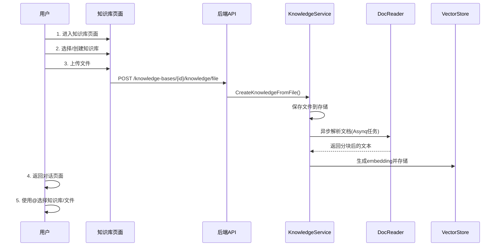

# 对话框直接上传文件进行分析 - 架构分析与解决方案

## 1. 项目架构概述

### 1.1 前端架构

WeKnora 前端使用 **Vue 3 + TypeScript + Vite** 构建，主要组件结构如下：

```
frontend/src/
├── views/chat/                    # 对话页面
│   ├── index.vue                  # 主对话页面（消息列表、输入框）
│   └── components/
│       ├── botmsg.vue             # 机器人消息组件
│       ├── usermsg.vue            # 用户消息组件
│       └── AgentStreamDisplay.vue # Agent流式显示组件
├── components/
│   ├── Input-field.vue            # 输入框组件（关键）
│   ├── KnowledgeBaseSelector.vue  # 知识库选择器
│   └── MentionSelector.vue        # @提及选择器
├── api/
│   ├── chat/                      # 对话相关API
│   └── knowledge-base/            # 知识库API
└── stores/
    ├── settings.ts                # 设置状态管理
    └── knowledge.ts               # 知识库状态管理
```

### 1.2 后端架构

后端使用 **Go + Gin** 框架，采用分层架构：

```
internal/
├── handler/                       # HTTP处理层
│   ├── session/                   # 会话相关处理
│   │   ├── qa.go                  # 问答处理（KnowledgeQA, AgentQA）
│   │   └── types.go               # 请求类型定义
│   └── knowledge.go               # 知识文件上传处理
├── application/service/           # 业务逻辑层
│   ├── knowledge.go               # 知识服务（7500+行）
│   └── session.go                 # 会话服务
├── types/                         # 类型定义
└── router/                        # 路由配置
```

### 1.3 文档处理流程

```
docreader/                         # Python文档解析服务
├── parser/                        # 各类文档解析器
│   ├── pdf_parser.py
│   ├── docx_parser.py
│   └── ...
└── splitter/                      # 文本分块器
```

---

## 2. 当前文件处理流程分析

### 2.1 现有流程（必须通过知识库）



### 2.2 关键代码位置

#### 前端 - 输入框组件 (`Input-field.vue`)

```typescript
// 第143-156行: @提及相关状态
const showMention = ref(false);
const mentionItems = ref<Array<{ id: string; name: string; type: 'kb' | 'file'; ... }>>([]);

// 第579-676行: 加载@提及项目（知识库和文件）
const loadMentionItems = async (q: string, resetIndex = true, append = false) => {
  // 获取知识库列表
  let kbItems = knowledgeBases.value.filter(kb => ...);
  // 搜索已存在的文件
  const res = await searchKnowledge(q || '', mentionOffset.value, MENTION_PAGE_SIZE);
  // ...
};
```

#### 后端 - QA请求类型 (`session/types.go`)

```go
// 第30-41行: 问答请求结构
type CreateKnowledgeQARequest struct {
    Query            string   `json:"query" binding:"required"`
    KnowledgeBaseIDs []string `json:"knowledge_base_ids"`      // 知识库IDs
    KnowledgeIds     []string `json:"knowledge_ids"`           // 知识文件IDs
    AgentEnabled     bool     `json:"agent_enabled"`
    MentionedItems   []MentionedItemRequest `json:"mentioned_items"` // @提及的项目
    // ...
}
```

#### 后端 - 文件上传处理 (`knowledge.go`)

```go
// 第86-200行: 从文件创建知识
func (h *KnowledgeHandler) CreateKnowledgeFromFile(c *gin.Context) {
    // 必须指定 knowledge_base_id
    kbID := c.Param("id")  // 知识库ID是URL的一部分
    // ...
}
```

---

## 3. 解决方案设计

### 3.1 方案对比

| 方案 | 描述 | 优点 | 缺点 |
|------|------|------|------|
| **方案A: 临时知识库** | 创建系统级临时知识库，对话中上传的文件存入此处 | 复用现有逻辑 | 需要定期清理，资源占用 |
| **方案B: 会话级文件** | 每个会话有独立的临时文件存储 | 隔离性好，清理简单 | 需要新增数据模型 |
| **方案C: 内存处理** | 文件仅在内存中处理，不持久化 | 快速，无存储负担 | 不支持大文件，无法复用 |
| **方案D: 附件模式** | 类似ChatGPT，文件作为消息附件 | 用户体验好，符合直觉 | 改动较大 |

### 3.2 推荐方案：方案B + 方案D 混合

采用「会话级临时文件 + 附件UI」的混合方案：

1. **后端**：新增会话级临时文件处理
2. **前端**：在输入框添加文件上传按钮和附件预览
3. **处理**：临时文件使用轻量级解析，不生成embedding

---

## 4. 详细设计方案

### 4.1 数据模型变更

#### 新增类型定义 (`internal/types/session_file.go`)

```go
// SessionFile 会话级临时文件
type SessionFile struct {
    ID          string    `json:"id"`
    SessionID   string    `json:"session_id"`
    TenantID    uint64    `json:"tenant_id"`
    FileName    string    `json:"file_name"`
    FileType    string    `json:"file_type"`
    FileSize    int64     `json:"file_size"`
    FilePath    string    `json:"file_path"`
    ParsedText  string    `json:"parsed_text"`  // 解析后的文本（不生成embedding）
    CreatedAt   time.Time `json:"created_at"`
    ExpiresAt   time.Time `json:"expires_at"`   // 过期时间
}
```

### 4.2 后端API变更

#### 4.2.1 新增API端点

| 方法 | 路径 | 描述 |
|------|------|------|
| POST | `/api/v1/sessions/{session_id}/files` | 上传临时文件 |
| GET | `/api/v1/sessions/{session_id}/files` | 获取会话文件列表 |
| DELETE | `/api/v1/sessions/{session_id}/files/{file_id}` | 删除临时文件 |

#### 4.2.2 新增Handler (`internal/handler/session/file.go`)

```go
// UploadSessionFile 上传会话临时文件
func (h *Handler) UploadSessionFile(c *gin.Context) {
    sessionID := c.Param("session_id")
    file, err := c.FormFile("file")
    // 1. 保存文件
    // 2. 调用docreader同步解析
    // 3. 将解析文本存入SessionFile
    // 4. 返回文件信息
}
```

#### 4.2.3 修改QA请求类型

```go
type CreateKnowledgeQARequest struct {
    Query            string   `json:"query" binding:"required"`
    KnowledgeBaseIDs []string `json:"knowledge_base_ids"`
    KnowledgeIds     []string `json:"knowledge_ids"`
    SessionFileIDs   []string `json:"session_file_ids"`  // 新增：会话临时文件IDs
    // ...
}
```

#### 4.2.4 修改QA逻辑

在 `executeNormalModeQA` 和 `executeAgentModeQA` 中：

```go
// 如果有会话文件，获取其解析文本作为上下文
if len(reqCtx.sessionFileIDs) > 0 {
    for _, fileID := range reqCtx.sessionFileIDs {
        sessionFile, _ := h.sessionFileService.GetByID(ctx, fileID)
        // 将文件内容添加到查询上下文
        additionalContext += fmt.Sprintf("\n\n[文件: %s]\n%s", 
            sessionFile.FileName, sessionFile.ParsedText)
    }
}
```

### 4.3 前端变更

#### 4.3.1 修改输入框组件 (`Input-field.vue`)

```vue
<template>
  <div class="input-container">
    <!-- 已上传文件预览 -->
    <div v-if="uploadedFiles.length > 0" class="uploaded-files">
      <div v-for="file in uploadedFiles" :key="file.id" class="file-tag">
        <FileIcon :type="file.fileType" />
        <span>{{ file.fileName }}</span>
        <CloseIcon @click="removeFile(file.id)" />
      </div>
    </div>
    
    <!-- 输入区域 -->
    <div class="input-row">
      <!-- 新增：文件上传按钮 -->
      <button class="upload-btn" @click="triggerFileUpload">
        <PaperclipIcon />
      </button>
      <input type="file" ref="fileInput" @change="handleFileUpload" hidden multiple />
      
      <!-- 原有输入框 -->
      <t-textarea v-model="query" ... />
      
      <!-- 发送按钮 -->
      <button class="send-btn" @click="sendMessage">
        <SendIcon />
      </button>
    </div>
  </div>
</template>

<script setup>
// 新增状态
const uploadedFiles = ref([]);
const fileInput = ref(null);

// 文件上传处理
const handleFileUpload = async (e) => {
  const files = e.target.files;
  for (const file of files) {
    const formData = new FormData();
    formData.append('file', file);
    
    const res = await uploadSessionFile(sessionId.value, formData);
    uploadedFiles.value.push(res.data);
  }
};

// 发送消息时包含文件IDs
const sendMessage = () => {
  emit('send-msg', query.value, modelId, mentionedItems, 
    uploadedFiles.value.map(f => f.id));  // 新增参数
};
</script>
```

#### 4.3.2 新增API函数 (`api/chat/index.ts`)

```typescript
// 上传会话临时文件
export async function uploadSessionFile(sessionId: string, formData: FormData) {
  return post(`/api/v1/sessions/${sessionId}/files`, formData, {
    headers: { 'Content-Type': 'multipart/form-data' }
  });
}

// 获取会话文件列表
export async function listSessionFiles(sessionId: string) {
  return get(`/api/v1/sessions/${sessionId}/files`);
}

// 删除会话文件
export async function deleteSessionFile(sessionId: string, fileId: string) {
  return del(`/api/v1/sessions/${sessionId}/files/${fileId}`);
}
```

### 4.4 文档解析服务调用

直接复用现有的 `docreader` 服务，但使用同步调用而非异步任务：

```go
// internal/application/service/session_file.go
func (s *sessionFileService) ParseFile(ctx context.Context, file *SessionFile) error {
    // 调用docreader解析
    parseResp, err := s.docReaderClient.ParseDocument(ctx, &proto.ParseRequest{
        FilePath: file.FilePath,
        FileName: file.FileName,
    })
    if err != nil {
        return err
    }
    
    // 合并所有文本块
    var texts []string
    for _, chunk := range parseResp.Chunks {
        texts = append(texts, chunk.Text)
    }
    file.ParsedText = strings.Join(texts, "\n\n")
    
    return s.repo.Update(ctx, file)
}
```

### 4.5 清理机制

```go
// internal/application/service/cleanup.go
// 定时任务：清理过期的会话文件
func (s *cleanupService) CleanupExpiredSessionFiles(ctx context.Context) error {
    expiredFiles, err := s.sessionFileRepo.ListExpired(ctx, time.Now())
    if err != nil {
        return err
    }
    
    for _, file := range expiredFiles {
        // 删除物理文件
        s.fileSvc.DeleteFile(ctx, file.FilePath)
        // 删除数据库记录
        s.sessionFileRepo.Delete(ctx, file.ID)
    }
    return nil
}
```

---

## 5. 实现步骤

### 第一阶段：后端基础设施（预计2-3天）

1. 创建 `SessionFile` 数据模型和数据库迁移
2. 实现 `SessionFileRepository` 和 `SessionFileService`
3. 新增文件上传/列表/删除 API
4. 实现同步文档解析逻辑

### 第二阶段：集成到问答流程（预计1-2天）

1. 修改 `CreateKnowledgeQARequest` 类型
2. 修改 `KnowledgeQA` 和 `AgentQA` 处理逻辑
3. 将临时文件内容注入到 LLM 上下文

### 第三阶段：前端UI（预计2-3天）

1. 在 `Input-field.vue` 添加文件上传按钮
2. 实现上传进度和预览UI
3. 修改发送消息逻辑，包含文件IDs
4. 添加相关样式和动画

### 第四阶段：清理和优化（预计1天）

1. 实现定时清理任务
2. 添加文件大小限制和类型限制
3. 错误处理和用户提示

---

## 6. 注意事项

### 6.1 性能考虑

- **文件大小限制**：建议单文件最大 10MB，每次最多上传 5 个文件
- **解析超时**：同步解析设置 30 秒超时
- **文本长度**：解析后的文本如果过长，需要截断或分页处理

### 6.2 安全考虑

- 文件类型白名单验证
- 文件内容安全扫描
- 临时文件存储路径隔离

### 6.3 用户体验

- 上传进度展示
- 解析状态反馈（解析中、解析完成、解析失败）
- 支持拖拽上传
- 文件预览（PDF、图片等）

---

## 7. 替代方案：最小改动版本

如果希望最小改动，可以采用「隐藏知识库」方案：

1. 创建一个系统级隐藏知识库（如 `_temp_chat_files`）
2. 对话中上传的文件自动添加到此知识库
3. 发送查询时自动包含此知识库
4. 定期清理超过 24 小时的临时文件

这种方案改动小，但会增加向量数据库的存储压力。

---

## 8. 结论

推荐采用**方案B+D混合**，即「会话级临时文件 + 附件UI」：

- **用户体验**：类似主流AI产品（ChatGPT、Claude），用户无需离开对话页面
- **资源隔离**：临时文件按会话隔离，易于管理和清理
- **性能优化**：不生成embedding，轻量级处理
- **复用现有能力**：直接使用 docreader 解析服务

预计总开发时间：**6-9个工作日**
