# 结构化数据库接入知识库扩展技术方案

> **版本**: v1.0  
> **日期**: 2026-02-12  
> **文档级别**: 架构评审文档  
> **适用读者**: 架构师、后端高级工程师、AI基础设施工程师、CTO  

---

## 目录

- [一、现有系统架构分析](#一现有系统架构分析)
- [二、当前知识库能力边界与问题](#二当前知识库能力边界与问题)
- [三、扩展目标与设计原则](#三扩展目标与设计原则)
- [四、总体目标架构设计](#四总体目标架构设计)
- [五、数据库连接层设计](#五数据库连接层设计)
- [六、数据同步与抽取策略](#六数据同步与抽取策略全量--增量--cdc)
- [七、结构化索引与向量索引融合策略](#七结构化索引与向量索引融合策略)
- [八、元数据注册与 Schema 管理机制](#八元数据注册与-schema-管理机制)
- [九、查询与分析流程设计](#九查询与分析流程设计)
- [十、技术选型对比分析](#十技术选型对比分析)
- [十一、性能与扩展性设计](#十一性能与扩展性设计)
- [十二、安全与权限控制设计](#十二安全与权限控制设计)
- [十三、风险评估](#十三风险评估)
- [十四、分阶段实施路线](#十四分阶段实施路线)
- [十五、未来演进方向](#十五未来演进方向)

---

## 一、现有系统架构分析

### 1.1 系统总体架构

WeKnora 是一个基于 Go 语言开发的企业级知识库管理与智能问答平台，采用分层架构设计，核心分层如下：

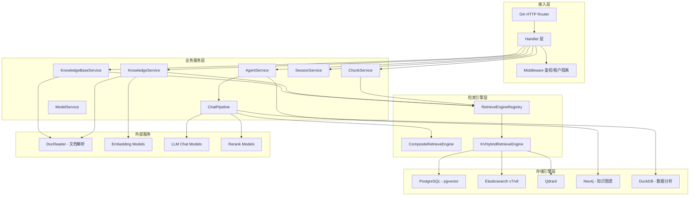

### 1.2 依赖注入与容器机制

系统采用 `uber/dig` 依赖注入框架，通过 `container.BuildContainer()` 统一管理所有服务实例的生命周期。核心组件注册链路：

1. **基础设施层**: `Config → Database (PostgreSQL/GORM) → Redis → AntsPool → Tracer`
2. **存储层**: `KnowledgeBaseRepository → KnowledgeRepository → ChunkRepository → ...`
3. **检索引擎层**: `RetrieveEngineRegistry → PostgresRepo / ElasticsearchRepo / QdrantRepo`
4. **业务层**: `KnowledgeBaseService → KnowledgeService → ChunkService → SessionService → AgentService`
5. **Pipeline层**: `EventManager → PluginSearch → PluginRerank → PluginMerge → PluginDataAnalysis → PluginChatCompletion`
6. **接口层**: `Handler → Router`

### 1.3 知识库类型定义

当前知识库类型仅支持两种（`internal/types/knowledgebase.go`）：

| 类型 | 常量 | 说明 |
|------|------|------|
| 文档知识库 | `KnowledgeBaseTypeDocument = "document"` | 上传文档（PDF/Word/Markdown等）进行切片、向量化、检索 |
| FAQ知识库 | `KnowledgeBaseTypeFAQ = "faq"` | 问答对格式，支持相似问导入，专用索引模式 |

### 1.4 检索引擎架构

系统实现了插件化的检索引擎注册机制（`RetrieveEngineRegistry`），当前支持：

| 引擎类型 | 常量 | 支持的检索方式 | 说明 |
|----------|------|----------------|------|
| PostgreSQL (pgvector) | `PostgresRetrieverEngineType` | 关键词 + 向量 | 基于 pgvector 扩展的向量检索 |
| Elasticsearch v7/v8 | `ElasticsearchRetrieverEngineType` | 关键词 + 向量 | BM25 + dense vector |
| Qdrant | `QdrantRetrieverEngineType` | 关键词 + 向量 | 专业向量数据库 |

检索引擎通过 `RETRIEVE_DRIVER` 环境变量动态加载（支持逗号分隔多引擎），所有引擎实现统一的 `RetrieveEngineRepository` 接口：

```go
type RetrieveEngineRepository interface {
    Save(ctx context.Context, indexInfo *IndexInfo, params map[string]any) error
    BatchSave(ctx context.Context, indexInfoList []*IndexInfo, params map[string]any) error
    Retrieve(ctx context.Context, params RetrieveParams) ([]*RetrieveResult, error)
    DeleteByChunkIDList(ctx context.Context, indexIDList []string, dimension int, knowledgeType string) error
    // ...
}
```

### 1.5 Chat Pipeline 架构

对话处理采用事件驱动的 Pipeline 模式：

```
Rewrite → Search → SearchEntity → SearchParallel → Rerank → FilterTopK → Merge 
→ DataAnalysis → IntoChatMessage → ChatCompletion → StreamFilter
```

其中 `PluginDataAnalysis` 已实现了对 CSV/Excel 结构化文件的 DuckDB SQL 分析能力，是结构化数据分析的初步探索。

### 1.6 数据存储一览

| 组件 | 用途 | 技术 |
|------|------|------|
| PostgreSQL | 业务数据主库 | GORM ORM |
| pgvector | 向量存储/检索 | pgvector-go |
| Elasticsearch | 全文检索 + 向量检索 | go-elasticsearch v7/v8 |
| Qdrant | 向量存储/检索 | go-client |
| Neo4j | 知识图谱 | neo4j-go-driver |
| DuckDB | 内存数据分析 | duckdb-go (内存模式) |
| Redis | 缓存/流管理/上下文存储 | go-redis |
| MinIO/COS/Local | 文件对象存储 | minio-go / COS SDK |

---

## 二、当前知识库能力边界与问题

### 2.1 能力边界

| 维度 | 当前能力 | 限制 |
|------|----------|------|
| **数据源类型** | 文档文件（PDF/Word/MD/HTML/CSV/Excel）、手动录入、FAQ导入 | 不支持实时连接外部数据库 |
| **数据接入方式** | 文件上传 → DocReader解析 → 切片 → 向量化 → 入库 | 仅支持离线批量导入，无在线查询能力 |
| **结构化数据处理** | CSV/Excel通过DuckDB临时加载做SQL分析 | 无持久化连接，无Schema管理，无增量同步 |
| **检索方式** | 向量检索 + BM25关键词检索 + 知识图谱检索 | 不支持SQL直查、不支持结构化过滤条件 |
| **知识库类型** | Document / FAQ | 缺少 Database / Structured 类型 |
| **多数据库支持** | 仅PostgreSQL作为系统数据库 | 不支持连接外部MySQL/Oracle/SQL Server/ClickHouse |

### 2.2 核心问题分析

**问题一：结构化数据无法作为知识源**

企业中大量关键数据存储在关系型数据库中（CRM、ERP、财务系统等），当前架构要求数据必须先导出为文件再上传，存在以下弊端：
- 数据时效性差：导出 → 上传 → 解析链路长，无法保证实时性
- 数据完整性差：文件导出丢失Schema语义、外键关系、约束信息
- 操作成本高：需要用户手动进行数据导出和格式转换

**问题二：DuckDB数据分析能力受限**

当前 `PluginDataAnalysis` 通过 DuckDB 内存模式加载 CSV/Excel 做分析，存在局限：
- 数据量受服务器内存限制
- 无法连接外部数据库直接查询
- 缺乏Schema元信息管理
- 不支持数据持续同步更新

**问题三：检索/分析界面模糊**

当前系统没有明确区分"非结构化知识检索"和"结构化数据分析"两种场景，缺少统一的混合查询编排机制。

---

## 三、扩展目标与设计原则

### 3.1 扩展目标

1. **新增知识库类型**: 引入 `KnowledgeBaseTypeDatabase = "database"` 类型，支持将外部结构化数据库作为知识源
2. **多数据库适配**: 支持 MySQL、PostgreSQL、Oracle、SQL Server、ClickHouse 及云数据库 RDS 的连接接入
3. **Schema 自动发现**: 连接数据库后自动探测表结构、字段类型、约束关系，生成元数据描述
4. **混合检索能力**: 在现有向量检索基础上，增加结构化SQL查询能力，支持自然语言到SQL的转换 (NL2SQL)
5. **数据同步机制**: 提供全量抽取、增量同步、CDC三种数据同步策略
6. **安全隔离**: 数据库连接凭据加密存储，查询权限沙箱化，防止SQL注入及越权访问

### 3.2 设计原则

| 原则 | 说明 |
|------|------|
| **最小侵入** | 扩展现有架构而非重构，新增模块通过接口注入，不改变核心数据流 |
| **接口一致** | 新增 Database 类型知识库复用现有 Knowledge/Chunk 数据模型，通过 ChunkType 扩展区分 |
| **引擎插件化** | 数据库连接器和同步驱动均以插件形式注册，支持运行时动态加载 |
| **安全优先** | 所有数据库凭据加密存储，查询通过白名单和沙箱机制限制 |
| **渐进增强** | 分阶段实施，先支核心的读取和Schema导入，再逐步增加CDC和高级分析 |

---

## 四、总体目标架构设计

### 4.1 扩展后总体架构

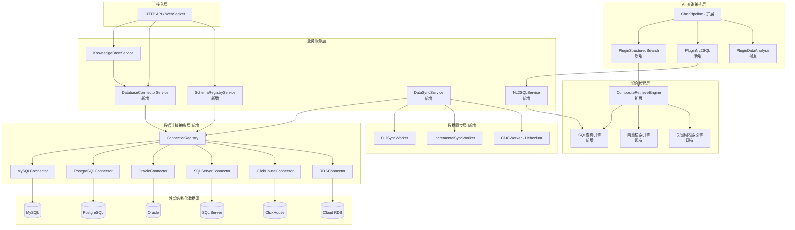

### 4.2 核心扩展点

| 模块 | 类型 | 说明 |
|------|------|------|
| `types/knowledgebase.go` | 扩展 | 新增 `KnowledgeBaseTypeDatabase` 类型常量 |
| `types/database_connector.go` | 新增 | 定义数据库连接信息、Schema元数据等类型 |
| `interfaces/database_connector.go` | 新增 | 定义连接器、Schema注册、同步等接口 |
| `application/repository/connector/` | 新增 | 各数据库连接器实现 |
| `application/service/database_connector.go` | 新增 | 数据库连接器管理服务 |
| `application/service/schema_registry.go` | 新增 | Schema自动发现和注册服务 |
| `application/service/data_sync.go` | 新增 | 数据同步服务 |
| `application/service/nl2sql.go` | 新增 | 自然语言转SQL服务 |
| `chat_pipline/structured_search.go` | 新增 | 结构化搜索Pipeline插件 |
| `handler/database_connector.go` | 新增 | 数据库连接管理HTTP接口 |
| `container/container.go` | 扩展 | 注册新增服务和连接器 |

---

## 五、数据库连接层设计

### 5.1 连接器抽象接口

```go
// DatabaseConnector 数据库连接器接口
type DatabaseConnector interface {
    // Type 返回数据库类型标识
    Type() DatabaseType
    
    // Connect 建立数据库连接
    Connect(ctx context.Context, config *DatabaseConnectionConfig) error
    
    // Ping 测试连接可用性
    Ping(ctx context.Context) error
    
    // Close 关闭连接
    Close() error
    
    // DiscoverSchemas 发现数据库中的所有Schema/Database
    DiscoverSchemas(ctx context.Context) ([]*SchemaInfo, error)
    
    // DiscoverTables 发现指定Schema下的所有表
    DiscoverTables(ctx context.Context, schema string) ([]*TableInfo, error)
    
    // DescribeTable 获取表的详细结构信息（列、索引、约束）
    DescribeTable(ctx context.Context, schema, table string) (*TableDetail, error)
    
    // SampleData 获取表的采样数据
    SampleData(ctx context.Context, schema, table string, limit int) ([]map[string]interface{}, error)
    
    // ExecuteQuery 执行只读SQL查询（带超时和行数限制）
    ExecuteQuery(ctx context.Context, sql string, args []interface{}, opts *QueryOptions) (*QueryResult, error)
    
    // EstimateRowCount 估算表行数
    EstimateRowCount(ctx context.Context, schema, table string) (int64, error)
}
```

### 5.2 连接配置数据模型

```go
// DatabaseType 数据库类型
type DatabaseType string

const (
    DatabaseTypeMySQL      DatabaseType = "mysql"
    DatabaseTypePostgreSQL DatabaseType = "postgresql"
    DatabaseTypeOracle     DatabaseType = "oracle"
    DatabaseTypeSQLServer  DatabaseType = "sqlserver"
    DatabaseTypeClickHouse DatabaseType = "clickhouse"
    DatabaseTypeRDS        DatabaseType = "rds"
)

// DatabaseConnectionConfig 数据库连接配置
type DatabaseConnectionConfig struct {
    ID               string       `json:"id" gorm:"type:varchar(36);primaryKey"`
    KnowledgeBaseID  string       `json:"knowledge_base_id" gorm:"type:varchar(36);index"`
    TenantID         uint64       `json:"tenant_id"`
    Type             DatabaseType `json:"type" gorm:"type:varchar(32)"`
    Host             string       `json:"host"`
    Port             int          `json:"port"`
    Database         string       `json:"database"`
    Username         string       `json:"username"`
    EncryptedPassword string      `json:"-" gorm:"column:encrypted_password"`   // AES-256-GCM 加密存储
    SSLMode          string       `json:"ssl_mode" gorm:"type:varchar(32)"`
    ExtraParams      JSON         `json:"extra_params" gorm:"type:json"`        // 数据库特定参数
    MaxConnections   int          `json:"max_connections" gorm:"default:5"`
    ConnectTimeout   int          `json:"connect_timeout" gorm:"default:30"`    // 秒
    QueryTimeout     int          `json:"query_timeout" gorm:"default:60"`      // 秒
    MaxRowsPerQuery  int          `json:"max_rows_per_query" gorm:"default:10000"`
    CreatedAt        time.Time    `json:"created_at"`
    UpdatedAt        time.Time    `json:"updated_at"`
    DeletedAt        gorm.DeletedAt `json:"deleted_at" gorm:"index"`
}
```

### 5.3 连接器注册中心

```go
// ConnectorRegistry 连接器注册中心
type ConnectorRegistry struct {
    factories map[DatabaseType]ConnectorFactory
    pools     map[string]*ConnectorPool   // key: connectionConfigID
    mu        sync.RWMutex
}

type ConnectorFactory func(config *DatabaseConnectionConfig) (DatabaseConnector, error)

// Register 注册连接器工厂
func (r *ConnectorRegistry) Register(dbType DatabaseType, factory ConnectorFactory)

// GetConnector 获取或创建连接器实例（带连接池管理）
func (r *ConnectorRegistry) GetConnector(ctx context.Context, configID string) (DatabaseConnector, error)
```

### 5.4 各数据库适配实现要点

| 数据库 | Go Driver | Schema发现方式 | 特殊考量 |
|--------|-----------|----------------|----------|
| **MySQL** | `go-sql-driver/mysql` | `INFORMATION_SCHEMA.TABLES/COLUMNS` | 字符集编码、大小写敏感性 |
| **PostgreSQL** | `lib/pq` / `pgx` | `pg_catalog` / `information_schema` | Schema隔离、自定义类型 |
| **Oracle** | `godror` | `ALL_TABLES` / `ALL_TAB_COLUMNS` | TNS连接串、权限体系复杂 |
| **SQL Server** | `go-mssqldb` | `sys.tables` / `sys.columns` | Windows认证、Schema命名空间 |
| **ClickHouse** | `clickhouse-go` | `system.tables` / `system.columns` | 列式存储特性、MergeTree引擎 |
| **云RDS** | 复用对应Driver | 同上 | SSL证书、VPC网络打通、IAM认证 |

### 5.5 连接池与健康检查

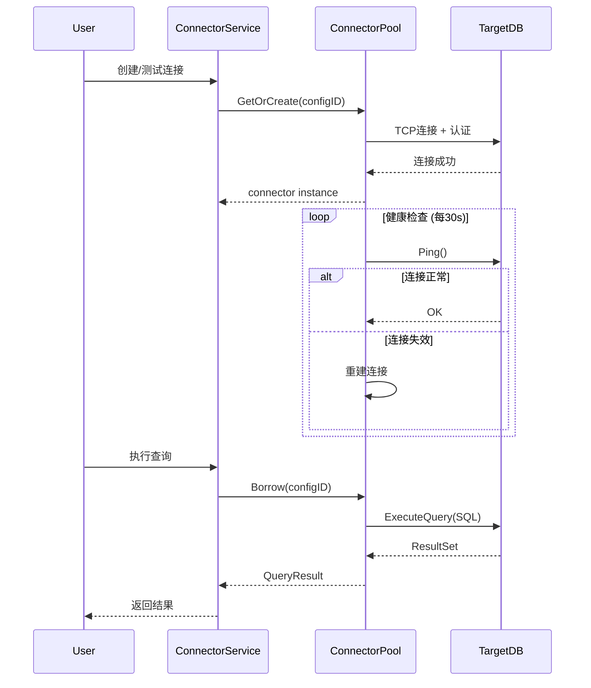

---

## 六、数据同步与抽取策略（全量 / 增量 / CDC）

### 6.0 核心设计理念：元数据预索引 + 实时远程查询

> **重要架构决策**: 本方案**不将外部数据库的业务行数据同步到本地**，而是采用「元数据预索引 + 实时远程查询」模式。

| 同步对象 | 同步方式 | 目的 |
|----------|----------|------|
| **Schema 元数据**（表结构、列信息、DDL、外键等） | 全量/增量/CDC | 建立向量索引，让检索能找到「用户问题相关的表」 |
| **LLM 生成描述**（表摘要、列描述） | 基于元数据变更触发 | 供向量语义检索使用 |
| **业务行数据** | ❌ **不同步** | 通过 NL2SQL 实时远程查询外部数据库获取 |

**不同步业务数据的理由：**
- 企业数据库可能有数十亿行，本地存储放不下
- 同步有延迟，用户期望查到的是最新数据
- 业务数据搬迁涉及合规审批，直查权限更可控
- 现有检索引擎为文本向量索引，不适合存储原始业务行数据

**与现有 CSV/Excel 处理流程的对比：**

| 维度 | CSV/Excel（现有） | 外部数据库（新增） |
|------|-------------------|--------------------|
| 数据位置 | 文件已上传到本地 | 数据在外部数据库 |
| 元数据索引 | DuckDB 加载 → LLM 生成描述 → 向量化 | 连接器发现 Schema → LLM 生成描述 → 向量化 |
| 查询执行 | DuckDB 内存临时加载文件 → SQL | 直接远程查询外部数据库 → SQL |
| 查询后处理 | DuckDB Cleanup 删除临时表 | 关闭连接归还连接池 |

### 6.1 元数据同步策略总览

| 策略 | 适用场景 | 元数据时效性 | 系统开销 | 实现复杂度 |
|------|----------|------------|----------|------------|
| **全量发现** | 初次接入、表数量少 | 每次同步时间点 | 低（仅扫描INFORMATION_SCHEMA） | 低 |
| **增量检测** | 定期刷新Schema变更 | 分钟级~小时级 | 极低（对比元数据差异） | 中 |
| **CDC (Change Data Capture)** | DDL变更实时感知 | 秒级~亚秒级 | 低（基于binlog DDL事件） | 高 |

### 6.2 全量 Schema 发现

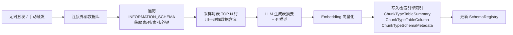

- **不抽取业务数据**: 仅扫描 `INFORMATION_SCHEMA`（MySQL）、`pg_catalog`（PG）等系统表获取元数据
- **采样有限**: 每表采样 TOP 10-100 行，仅用于 LLM 理解列含义，用完即丢
- **并发控制**: 多表间可配置并发度（默认 3 张表并行发现）
- **幂等性**: 元数据写入采用 `ON CONFLICT (knowledge_base_id, table_name) DO UPDATE`

### 6.3 增量 Schema 变更检测

```go
// SchemaRefreshConfig Schema 刷新配置
type SchemaRefreshConfig struct {
    RefreshInterval string `json:"refresh_interval"` // cron 表达式，如 "0 */6 * * *" 每6小时
    AutoRefresh     bool   `json:"auto_refresh"`     // 是否启用自动刷新
}
```

- **对比方式**: 每次刷新时重新查询 `INFORMATION_SCHEMA`，与 `SchemaRegistry` 中存储的快照对比
- **检测内容**: 新增表、删除表、列类型变更、新增/删除列、注释变更
- **增量处理**:
  - 新增表 → 采样 + LLM描述 + 向量化
  - 删除表 → 移除关联 Chunk 和索引
  - 列变更 → 重新生成列描述 + 更新索引
- **调度方式**: 通过 Asynq 定时任务调度（复用现有异步任务基础设施）
- **性能影响**: 极低，仅查询系统元数据表（通常毫秒级完成）

### 6.4 CDC (Change Data Capture) — 仅监听 DDL 变更

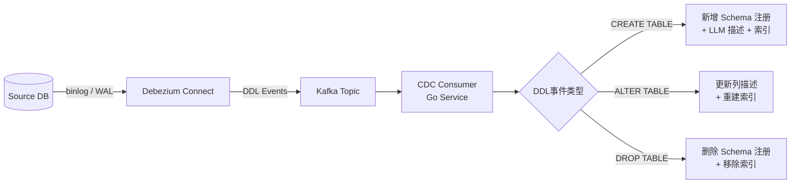

- **仅监听 DDL 事件**（CREATE/ALTER/DROP TABLE），**不监听 DML 事件**（INSERT/UPDATE/DELETE）
- 业务数据变更不需要本地感知，因为查询时会实时远程查询外部数据库
- **Debezium** 作为 CDC 引擎，配置过滤 DDL-only 事件
- **消息队列**: Kafka 作为变更事件管道（可选 Redis Streams 轻量级替代）
- **事件处理**: Go Consumer 消费 DDL 变更事件，触发 `SchemaRegistryService.RefreshSchema()` 更新元数据索引

### 6.5 Schema 同步任务管理

```go
// SchemaSyncTask Schema同步任务
type SchemaSyncTask struct {
    ID                 string        `json:"id" gorm:"type:varchar(36);primaryKey"`
    KnowledgeBaseID    string        `json:"knowledge_base_id"`
    ConnectionConfigID string        `json:"connection_config_id"`
    SyncType           string        `json:"sync_type"`    // "full_discovery", "incremental_detect", "cdc_ddl"
    Status             string        `json:"status"`       // "pending", "running", "completed", "failed"
    TablesDiscovered   int           `json:"tables_discovered"`   // 发现的表数
    TablesUpdated      int           `json:"tables_updated"`      // 更新的表数
    TablesRemoved      int           `json:"tables_removed"`      // 移除的表数
    ChunksCreated      int           `json:"chunks_created"`      // 创建的描述Chunk数
    ErrorMessage       string        `json:"error_message"`
    StartedAt          *time.Time    `json:"started_at"`
    CompletedAt        *time.Time    `json:"completed_at"`
    CreatedAt          time.Time     `json:"created_at"`
    UpdatedAt          time.Time     `json:"updated_at"`
}
```

---

## 七、结构化索引与向量索引融合策略

### 7.1 融合架构

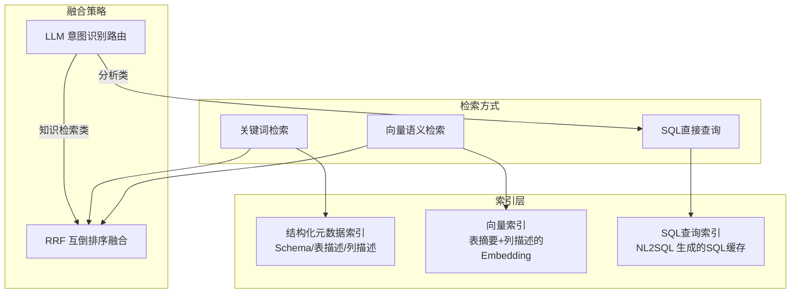

### 7.2 结构化数据的索引方案

与文档知识库对文本进行切片不同，结构化数据库知识库采用以下索引策略：

| Chunk类型 | 常量 | 内容 | 用途 |
|-----------|------|------|------|
| 表摘要 | `ChunkTypeTableSummary` (已存在) | LLM生成的表格功能描述 | 语义检索：找到相关表 |
| 列描述 | `ChunkTypeTableColumn` (已存在) | LLM生成的列元数据描述 | 语义检索：找到相关列 |
| Schema元数据 | `ChunkTypeSchemaMetadata` (新增) | DDL + 约束 + 索引信息 | NL2SQL：生成准确SQL |
| 采样描述 | `ChunkTypeSampleSummary` (新增) | 基于采样数据的值分布描述 | 辅助理解字段含义 |

### 7.3 向量化策略

```
表级向量 = Embedding("表名: orders | 描述: 订单交易记录表，记录所有用户的购买行为...")  
列级向量 = Embedding("表: orders | 列: total_amount | 含义: 订单总金额(元) | 类型: decimal(10,2)")
```

- 复用现有 `BatchEmbedder` 和 `EmbeddingModel` 进行向量化
- 索引写入复用现有 `RetrieveEngineService.BatchIndex()` 接口
- 检索时通过 `KnowledgeType` 字段区分普通文档检索和结构化元数据检索

### 7.4 混合检索流程

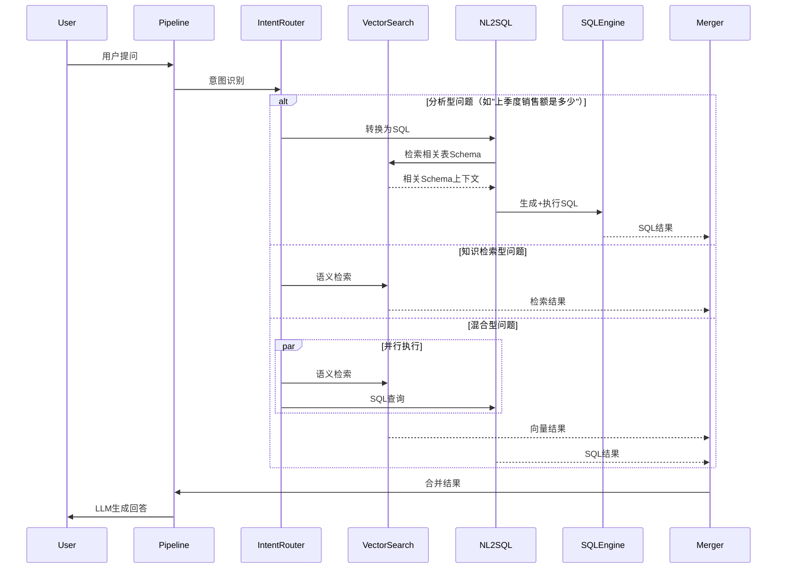

---

## 八、元数据注册与 Schema 管理机制

### 8.1 Schema 自动发现流程

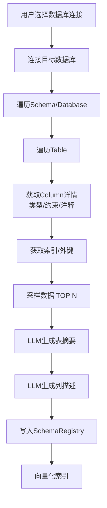

### 8.2 Schema 注册数据模型

```go
// SchemaRegistry 元数据注册表
type SchemaRegistry struct {
    ID                string    `json:"id" gorm:"type:varchar(36);primaryKey"`
    KnowledgeBaseID   string    `json:"knowledge_base_id" gorm:"index"`
    ConnectionConfigID string   `json:"connection_config_id"`
    SchemaName        string    `json:"schema_name"`
    TableName         string    `json:"table_name"`
    TableComment      string    `json:"table_comment"`          // 原始注释
    TableSummary      string    `json:"table_summary"`          // LLM 生成的摘要
    DDL               string    `json:"ddl"`                    // CREATE TABLE 语句
    EstimatedRows     int64     `json:"estimated_rows"`
    Columns           JSON      `json:"columns" gorm:"type:json"` // []ColumnMeta
    Indexes           JSON      `json:"indexes" gorm:"type:json"` // []IndexMeta
    ForeignKeys       JSON      `json:"foreign_keys" gorm:"type:json"` // []ForeignKeyMeta
    SyncStatus        string    `json:"sync_status"`            // "pending", "synced", "error"
    LastSyncAt        *time.Time `json:"last_sync_at"`
    CreatedAt         time.Time `json:"created_at"`
    UpdatedAt         time.Time `json:"updated_at"`
}

// ColumnMeta 列元数据
type ColumnMeta struct {
    Name         string `json:"name"`
    DataType     string `json:"data_type"`
    Nullable     bool   `json:"nullable"`
    IsPrimaryKey bool   `json:"is_primary_key"`
    DefaultValue string `json:"default_value,omitempty"`
    Comment      string `json:"comment,omitempty"`
    Description  string `json:"description,omitempty"`  // LLM 生成描述
}
```

### 8.3 Schema 变更检测

- **定期对比**: 每次同步时重新获取 `INFORMATION_SCHEMA`，与 `SchemaRegistry` 对比
- **变更类型**: 新增表/列、删除表/列、类型变更、注释变更
- **影响处理**:
  - 新增表：触发LLM描述生成 + 向量化
  - 删除表：移除相关Chunk和索引
  - 列变更：重新生成列描述 + 更新索引
  - Schema重大变更：通知管理者确认

---

## 九、查询与分析流程设计

### 9.1 NL2SQL 服务设计

```go
// NL2SQLService 自然语言转SQL服务
type NL2SQLService interface {
    // GenerateSQL 根据用户问题和Schema上下文生成SQL
    GenerateSQL(ctx context.Context, params *NL2SQLParams) (*NL2SQLResult, error)
    
    // ValidateSQL 验证SQL安全性（防注入、限制写操作）
    ValidateSQL(ctx context.Context, sql string) error
    
    // ExecuteAndFormat 执行SQL并格式化结果
    ExecuteAndFormat(ctx context.Context, connectorID string, sql string) (*FormattedResult, error)
}

// NL2SQLParams NL2SQL参数
type NL2SQLParams struct {
    Query          string          // 用户自然语言问题
    SchemaContexts []*SchemaRegistry // 相关表的Schema信息
    Dialect        DatabaseType    // 数据库方言
    MaxRows        int             // 最大返回行数
    History        []ChatMessage   // 对话历史（用于多轮SQL生成）
}

// NL2SQLResult NL2SQL结果
type NL2SQLResult struct {
    SQL           string                   // 生成的SQL
    Explanation   string                   // SQL解释
    Confidence    float64                  // 置信度
    QueryResult   *QueryResult             // 查询结果
    Visualization *VisualizationSuggestion // 可视化建议
}
```

### 9.2 SQL 安全验证

```go
// SQLValidator SQL安全验证器
type SQLValidator struct {
    // 白名单策略
    allowedStatements []string  // 仅允许 SELECT
    blockedKeywords   []string  // 阻止 DROP, DELETE, UPDATE, INSERT, ALTER, TRUNCATE, EXEC
    maxQueryLength    int       // SQL最大长度
    maxJoinTables     int       // 最大JOIN表数
    maxSubqueries     int       // 最大子查询深度
}
```

安全验证链:
1. **语句类型白名单**: 仅允许 `SELECT` 语句
2. **关键词黑名单**: 拒绝含有 DDL/DML 关键词的查询
3. **SQL AST 解析**: 使用 `pg_query_go`（已引入依赖）解析SQL语法树，进行深度安全检查
4. **资源限制**: 强制添加 `LIMIT` 子句、设置查询超时
5. **表权限校验**: 验证查询涉及的表是否在当前用户有权访问的范围内

### 9.3 查询结果处理

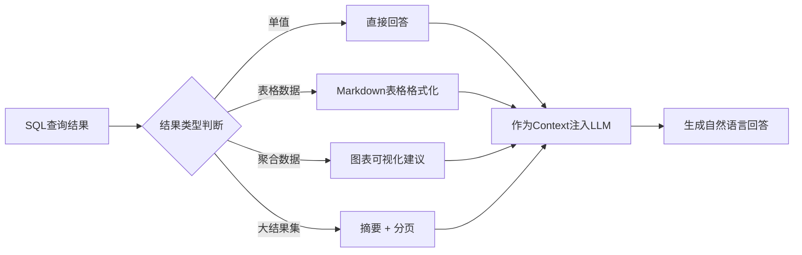

### 9.4 与现有 Pipeline 的集成

在 ChatPipeline 的 `Search` 阶段之后、`Merge` 阶段之前插入新的处理环节：

```
Rewrite → Search → SearchEntity → SearchParallel → [StructuredSearch] → [NL2SQL] 
→ Rerank → FilterTopK → Merge → DataAnalysis(增强) → IntoChatMessage → ChatCompletion
```

- `PluginStructuredSearch`: 对 Database 类型知识库进行元数据检索，找到相关 Schema
- `PluginNL2SQL`: 基于 Schema 上下文调用 LLM 生成 SQL，执行查询，将结果注入 `ChatManage.MergeResult`

---

## 十、技术选型对比分析

### 10.1 数据库连接方式对比

| 方案 | 支持数据库 | Go生态支持 | 性能 | 统一性 | 推荐度 |
|------|-----------|------------|------|--------|--------|
| **原生Go Driver** | 各数据库专用 | ★★★★★ | ★★★★★ | ★★☆ | ⭐⭐⭐⭐⭐ |
| **database/sql + Driver** | 所有SQL数据库 | ★★★★★ | ★★★★★ | ★★★★ | ⭐⭐⭐⭐⭐ |
| **SQLAlchemy(Python)** | 全面 | ★☆☆ (需跨语言) | ★★★ | ★★★★★ | ⭐⭐ |
| **JDBC (JVM)** | 全面 | ★☆☆ (需跨语言) | ★★★★ | ★★★★★ | ⭐⭐ |
| **ODBC** | 全面 | ★★★ | ★★★ | ★★★★ | ⭐⭐⭐ |
| **Trino/Presto** | 全面（联邦查询） | ★★★ | ★★★ | ★★★★★ | ⭐⭐⭐ (后期考虑) |

**推荐方案**: 采用 Go `database/sql` 标准接口 + 各数据库原生 Driver 的组合方案。

**理由**:
- WeKnora 主体为 Go 项目，原生 Go Driver 性能最优、部署最简
- `database/sql` 提供统一的连接池管理和事务接口，便于抽象
- 避免引入 JVM/Python 运行时带来的额外运维复杂度和性能开销
- 各数据库 Go Driver 成熟度高：`go-sql-driver/mysql`、`pgx`、`godror`、`go-mssqldb`、`clickhouse-go`

### 10.2 数据同步方式对比

| 方案 | 实时性 | 实现复杂度 | 运维成本 | 对源库影响 | 适用场景 |
|------|--------|------------|----------|------------|----------|
| **全量抽取** | 低 | 低 | 低 | 中（全表扫描） | 初次同步、小表、无增量标识 |
| **增量同步(时间戳/主键)** | 中 | 中 | 低 | 低 | 有规范更新时间戳的表 |
| **CDC (Debezium)** | 高 | 高 | 高（需Kafka+Debezium） | 极低（读binlog） | 实时性要求高的核心表 |

**推荐方案**: 阶段化采用。

- **第一阶段**: 全量抽取 + 增量同步（覆盖80%场景，实现成本低）
- **第二阶段**: 引入 CDC 支持（针对高实时性需求场景）

### 10.3 索引方案对比

| 方案 | 向量检索 | 全文检索 | 结构化过滤 | 混合查询 | 现有集成度 |
|------|----------|----------|------------|----------|------------|
| **Elasticsearch** | ✅ dense_vector | ✅ BM25 | ✅ | ✅ | ★★★★★ 已集成 |
| **PostgreSQL + pgvector** | ✅ | ✅ tsvector | ✅ | ✅ | ★★★★★ 已集成 |
| **Qdrant** | ✅ | ❌ | ✅ payload filter | 部分 | ★★★★ 已集成 |
| **Milvus** | ✅ | ❌ | ✅ scalar filter | 部分 | ☆ 未集成 |
| **Weaviate** | ✅ | ✅ | ✅ | ✅ | ☆ 未集成 |
| **OpenSearch** | ✅ knn | ✅ | ✅ | ✅ | ☆ 未集成（ES兼容） |
| **ClickHouse** | ✅ (实验性) | ✅ | ★★★★★ | 部分 | ☆ 未集成 |

**推荐方案**: 复用现有 Elasticsearch/PostgreSQL 作为元数据索引引擎。

**理由**:
- 结构化数据库知识库的元数据索引（表摘要、列描述）本质上仍是文本索引
- 现有 `RetrieveEngineService` 接口完全可以复用
- 避免引入新的向量数据库带来的运维成本
- Elasticsearch 天然支持结构化字段过滤 + 向量检索的混合查询

### 10.4 调度与数据管道对比

| 方案 | 功能丰富度 | Go集成 | 运维复杂度 | 推荐度 |
|------|-----------|--------|------------|--------|
| **Asynq (现有)** | ★★★ | ★★★★★ (原生Go) | ★☆ (已集成Redis) | ⭐⭐⭐⭐⭐ |
| **Apache Airflow** | ★★★★★ | ★★ (Python) | ★★★★ | ⭐⭐ |
| **Apache NiFi** | ★★★★ | ★★ (Java) | ★★★★ | ⭐⭐ |
| **Kafka** | ★★★★ | ★★★★ | ★★★★ | ⭐⭐⭐ (CDC场景) |

**推荐方案**: 
- **基础调度**: 复用现有 Asynq（已集成 Redis 后端，满足定时任务/增量同步需求）
- **CDC场景**: 引入 Kafka 作为变更事件管道（仅在第二阶段CDC需求时）

---

## 十一、性能与扩展性设计

### 11.1 性能设计

#### 连接池管理

```go
// ConnectorPool 连接器池
type ConnectorPool struct {
    maxSize          int
    idleTimeout      time.Duration
    healthCheckInterval time.Duration
    connectors       sync.Pool
    activeCount      atomic.Int64
}
```

- 每个外部数据库连接配置维护独立连接池，默认 5 个连接/池
- 空闲连接超时回收（默认 10 分钟）
- 后台健康检查（默认 30 秒间隔）

#### 查询性能优化

| 策略 | 说明 |
|------|------|
| **查询缓存** | 对热点NL2SQL结果做Redis缓存（key=query_hash+schema_hash, TTL=5min） |
| **采样预热** | Schema发现时预加载TOP 1000采样数据，生成统计信息辅助查询优化 |
| **分页流式** | 大结果集使用cursor-based pagination，避免内存溢出 |
| **查询超时** | 所有外部查询强制60秒超时（可配置），防止慢查询阻塞 |
| **并发限制** | 单租户同时查询并发数限制（默认10），通过信号量控制 |

#### 索引性能

- 元数据索引量远小于文档切片索引量（通常 <10000 条/知识库），对现有检索引擎无性能压力
- Schema变更检测和重新索引为异步任务，不阻塞在线查询

### 11.2 扩展性设计

| 维度 | 设计 |
|------|------|
| **水平扩展** | 各数据库连接器无状态，可部署多实例，连接池分布在各实例 |
| **新数据库类型** | 实现 `DatabaseConnector` 接口 + 在 `ConnectorRegistry` 注册即可 |
| **新检索方式** | 实现 `RetrieveEngineRepository` 接口 + 在 `RetrieveEngineRegistry` 注册即可 |
| **新同步策略** | 实现 `SyncWorker` 接口 + 注册 Asynq 任务处理器即可 |
| **多租户隔离** | 连接配置按 `TenantID` 隔离，每个租户独立的连接池上限 |

---

## 十二、安全与权限控制设计

### 12.1 安全架构

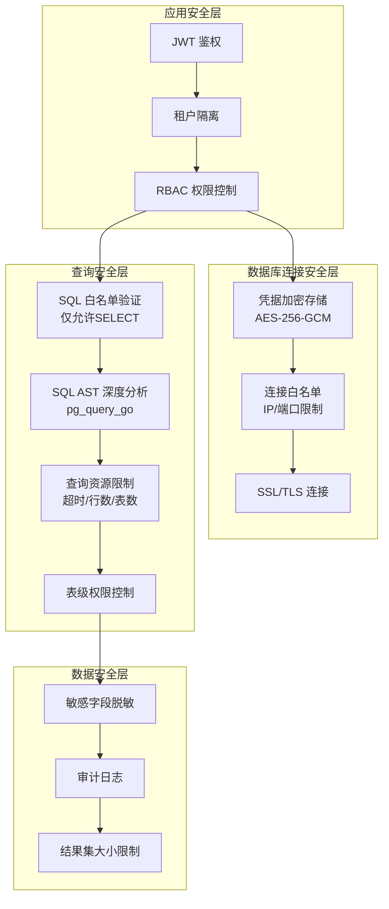

### 12.2 具体安全措施

| 安全层面 | 措施 | 实现方式 |
|----------|------|----------|
| **凭据存储** | 密码 AES-256-GCM 加密 | 加密密钥从环境变量读取，密码不明文存库 |
| **网络安全** | 强制 SSL 连接选项 | 连接配置中 `ssl_mode` 参数控制 |
| **查询安全** | SQL 白名单 + AST 审查 | `pg_query_go` 解析语法树，拒绝非 SELECT 语句 |
| **资源防护** | 查询超时 + 行数限制 | `QueryOptions.Timeout`, `QueryOptions.MaxRows` |
| **权限控制** | 表级白名单 | `SchemaRegistry` 中标记允许查询的表 |
| **数据脱敏** | 敏感列标记 + 脱敏规则 | `ColumnMeta.Sensitive=true` 时自动脱敏 |
| **审计日志** | 所有查询记录审计 | 记录 who/when/what/result_count |

### 12.3 多租户安全隔离

```
租户A → 连接配置A1 → MySQL实例1 → 仅可见已注册表
     → 连接配置A2 → PostgreSQL实例2 → 仅可见已注册表

租户B → 连接配置B1 → Oracle实例3 → 独立命名空间
```

- 连接配置与 `KnowledgeBase` 绑定，继承知识库的可见性规则（`global`/`org`/`private`）
- 查询时自动注入租户ID过滤，防止跨租户数据泄露
- 连接池按租户-连接配置二级隔离

---

## 十三、风险评估

### 13.1 技术风险

| 风险 | 影响 | 概率 | 等级 | 缓解措施 |
|------|------|------|------|----------|
| **外部数据库不可达** | 结构化查询失败，影响用户体验 | 中 | 🟡 中 | 连接健康检查 + 降级策略（返回缓存结果或提示用户） |
| **NL2SQL生成错误SQL** | 查询结果不正确，误导用户 | 高 | 🔴 高 | SQL验证链 + 结果置信度评分 + 多轮确认机制 |
| **大表全量同步OOM** | 同步服务崩溃 | 中 | 🟡 中 | 分页抽取 + 内存限制 + 行数上限 |
| **SQL注入** | 安全漏洞，数据泄露/破坏 | 低 | 🔴 高 | AST验证 + 参数化查询 + 白名单 + 只读连接 |
| **连接泄露** | 外部数据库连接耗尽 | 低 | 🟡 中 | 连接池管理 + 空闲超时 + 泄露检测 |
| **Schema变更导致索引失效** | 检索结果不准确 | 中 | 🟡 中 | 定期Schema对比 + 变更事件通知 |

### 13.2 业务风险

| 风险 | 影响 | 概率 | 等级 | 缓解措施 |
|------|------|------|------|----------|
| **用户误操作暴露敏感数据** | 数据合规问题 | 中 | 🔴 高 | 敏感列识别 + 自动脱敏 + 审计日志 |
| **数据库连接凭据管理复杂** | 安全运维负担 | 高 | 🟡 中 | 加密存储 + 凭据轮转提醒 + 云IAM集成 |
| **NL2SQL理解偏差** | 用户得到错误分析结论 | 高 | 🟡 中 | 展示生成的SQL + 允许用户修改 + 结果验证 |

### 13.3 运维风险

| 风险 | 影响 | 概率 | 等级 | 缓解措施 |
|------|------|------|------|----------|
| **CDC引入Kafka/Debezium增加运维复杂度** | 系统可靠性下降 | 中 | 🟡 中 | 第二阶段才引入 + 提供非CDC替代方案 |
| **多种数据库驱动的兼容性问题** | 某些数据库连接异常 | 中 | 🟡 中 | 完善每种数据库的集成测试 + 逐步灰度 |
| **同步任务积压** | 数据时效性下降 | 低 | 🟢 低 | Asynq队列监控 + 优先级调度 + 告警 |

---

## 十四、分阶段实施路线

### 阶段一：基础接入（4-6周）

**目标**: 完成数据库连接层和Schema发现能力

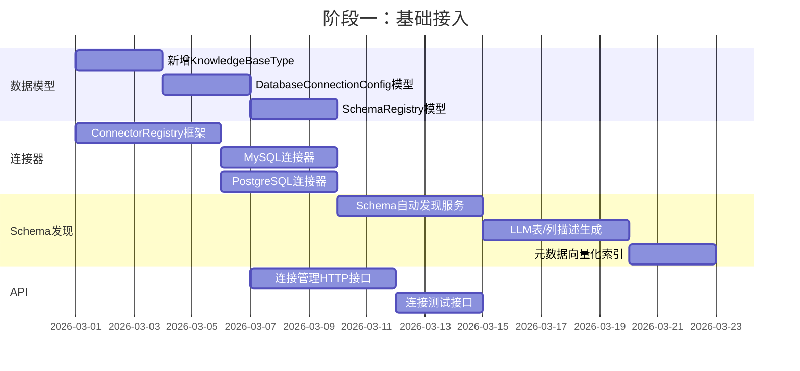

**交付物**:
- Database 类型知识库创建/管理
- MySQL、PostgreSQL 两种数据库连接能力
- Schema自动发现和元数据注册
- LLM驱动的表/列描述生成
- 元数据向量化索引

### 阶段二：查询能力（4-6周）

**目标**: 实现NL2SQL和结构化查询能力

**交付物**:
- NL2SQL 服务（基于LLM + Schema上下文）
- SQL 安全验证链
- ChatPipeline 结构化搜索插件
- 混合检索（语义+SQL）
- 查询结果格式化
- Oracle、SQL Server 连接器

### 阶段三：数据同步（3-4周）

**目标**: 实现全量和增量数据同步

**交付物**:
- 全量抽取 Worker
- 增量同步 Worker (基于时间戳/主键)
- 同步任务管理和监控
- 断点续传
- ClickHouse 连接器

### 阶段四：高级特性（4-6周）

**目标**: CDC、高级安全、性能优化

**交付物**:
- CDC 集成（Debezium + Kafka）
- 敏感数据识别与脱敏
- 查询缓存与性能优化
- 云RDS适配（IAM认证、SSL）
- 完整的审计日志

### 里程碑总览

| 里程碑 | 预计时间 | 关键交付 |
|--------|----------|----------|
| M1 - 基础接入 | T+6周 | 数据库连接 + Schema发现 + 元数据索引 |
| M2 - 查询能力 | T+12周 | NL2SQL + 混合检索 + 4种数据库 |
| M3 - 数据同步 | T+16周 | 全量/增量同步 + 5种数据库 |
| M4 - 高级特性 | T+22周 | CDC + 安全增强 + 6种数据库 |

---

## 十五、未来演进方向

### 15.1 短期演进（6-12个月）

| 方向 | 说明 |
|------|------|
| **更多数据库** | 支持 TiDB、GaussDB、DM（达梦）等国产数据库 |
| **联邦查询** | 引入 Trino 作为联邦查询引擎，支持跨库JOIN |
| **数据血缘** | 追踪数据来源和转换链路，辅助数据治理 |
| **自动可视化** | 基于查询结果自动生成图表（柱状图、折线图、饼图） |

### 15.2 中期演进（1-2年）

| 方向 | 说明 |
|------|------|
| **智能数据分析Agent** | 基于 Agent 框架实现多步骤数据分析工作流 |
| **数据质量监控** | 自动检测数据异常、缺失、不一致 |
| **知识图谱融合** | 将结构化数据的表关系导入 Neo4j，与文档知识图谱融合 |
| **实时数据仪表盘** | 支持定义指标、创建实时监控仪表盘 |

### 15.3 长期愿景（2年+）

| 方向 | 说明 |
|------|------|
| **Data Fabric** | 构建企业级数据编织层，统一所有数据资产访问 |
| **自治数据库管理** | AI驱动的索引推荐、查询优化、容量规划 |
| **多模态数据融合** | 文档 + 数据库 + API + 实时流的统一知识层 |
| **隐私计算** | 支持联邦学习、安全多方计算等隐私保护数据分析 |

---

## 附录 A：关键接口定义汇总

```go
// ─── 新增接口 ──────────────────────────────────────────
// interfaces/database_connector.go

type DatabaseConnector interface {
    Type() DatabaseType
    Connect(ctx context.Context, config *DatabaseConnectionConfig) error
    Ping(ctx context.Context) error
    Close() error
    DiscoverSchemas(ctx context.Context) ([]*SchemaInfo, error)
    DiscoverTables(ctx context.Context, schema string) ([]*TableInfo, error)
    DescribeTable(ctx context.Context, schema, table string) (*TableDetail, error)
    SampleData(ctx context.Context, schema, table string, limit int) ([]map[string]interface{}, error)
    ExecuteQuery(ctx context.Context, sql string, args []interface{}, opts *QueryOptions) (*QueryResult, error)
    EstimateRowCount(ctx context.Context, schema, table string) (int64, error)
}

type ConnectorRegistry interface {
    Register(dbType DatabaseType, factory ConnectorFactory)
    GetConnector(ctx context.Context, configID string) (DatabaseConnector, error)
    CloseAll() error
}

type SchemaRegistryService interface {
    DiscoverAndRegister(ctx context.Context, kbID string, connConfigID string) error
    GetRegisteredSchemas(ctx context.Context, kbID string) ([]*SchemaRegistry, error)
    RefreshSchema(ctx context.Context, registryID string) error
}

type DataSyncService interface {
    FullSync(ctx context.Context, kbID string, tableFilter []string) error
    IncrementalSync(ctx context.Context, kbID string) error
    GetSyncStatus(ctx context.Context, kbID string) ([]*SyncTask, error)
}

type NL2SQLService interface {
    GenerateSQL(ctx context.Context, params *NL2SQLParams) (*NL2SQLResult, error)
    ValidateSQL(ctx context.Context, sql string) error
    ExecuteAndFormat(ctx context.Context, connectorID string, sql string) (*FormattedResult, error)
}
```

## 附录 B：环境变量配置参考

| 环境变量 | 说明 | 默认值 |
|----------|------|--------|
| `DB_CONNECTOR_ENCRYPTION_KEY` | 数据库凭据加密密钥（32字节Base64） | 必填 |
| `DB_CONNECTOR_MAX_POOL_SIZE` | 每个外部连接的连接池上限 | 5 |
| `DB_CONNECTOR_IDLE_TIMEOUT` | 空闲连接超时（秒） | 600 |
| `DB_CONNECTOR_QUERY_TIMEOUT` | 查询超时（秒） | 60 |
| `DB_CONNECTOR_MAX_ROWS` | 单次查询最大行数 | 10000 |
| `NL2SQL_CONFIDENCE_THRESHOLD` | NL2SQL最低置信度阈值 | 0.7 |
| `CDC_KAFKA_BROKERS` | Kafka Broker 地址（CDC启用时） | - |
| `CDC_DEBEZIUM_CONNECT_URL` | Debezium Connect API 地址 | - |

## 附录 C：与现有模块变更影响分析

| 模块 | 变更类型 | 影响范围 | 风险等级 |
|------|----------|----------|----------|
| `types/knowledgebase.go` | 新增常量 | 极小（仅新增，不改已有） | 🟢 低 |
| `types/chunk.go` | 新增ChunkType | 极小（仅新增常量） | 🟢 低 |
| `container/container.go` | 新增服务注册 | 小（追加注册，不改已有链路） | 🟢 低 |
| `chat_pipline/` | 新增2个Plugin | 小（插件模式，按事件激活） | 🟢 低 |
| `handler/` | 新增Handler | 无（新增文件） | 🟢 低 |
| `router/` | 新增路由 | 小（追加路由组） | 🟢 低 |
| `RetrieveEngineRegistry` | 无变更 | 无（复用现有接口） | 🟢 低 |

---

> **文档修订记录**
> 
> | 版本 | 日期 | 修订内容 | 作者 |
> |------|------|----------|------|
> | v1.0 | 2026-02-12 | 初始版本 | WeKnora Architecture Team |
