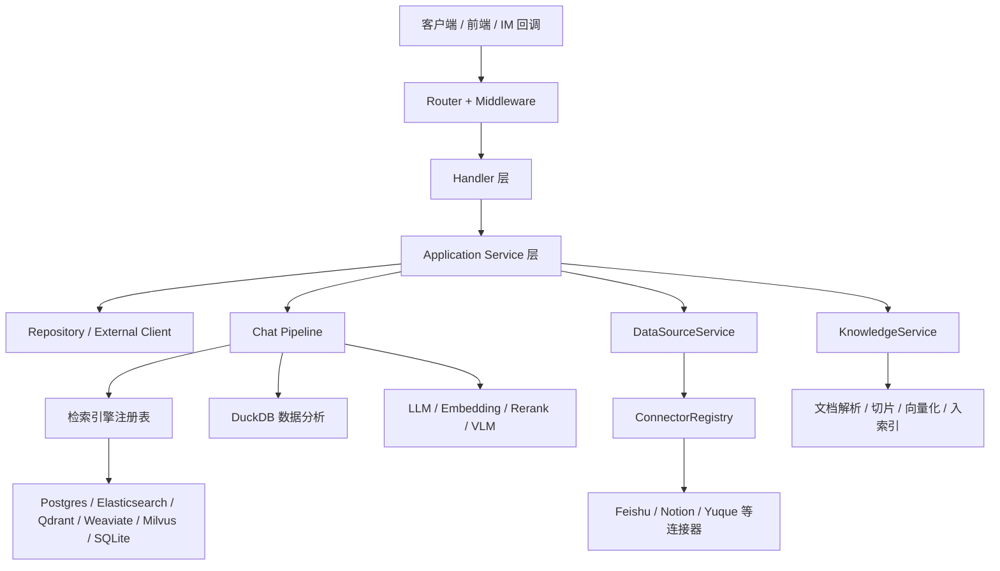
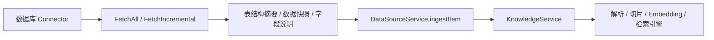
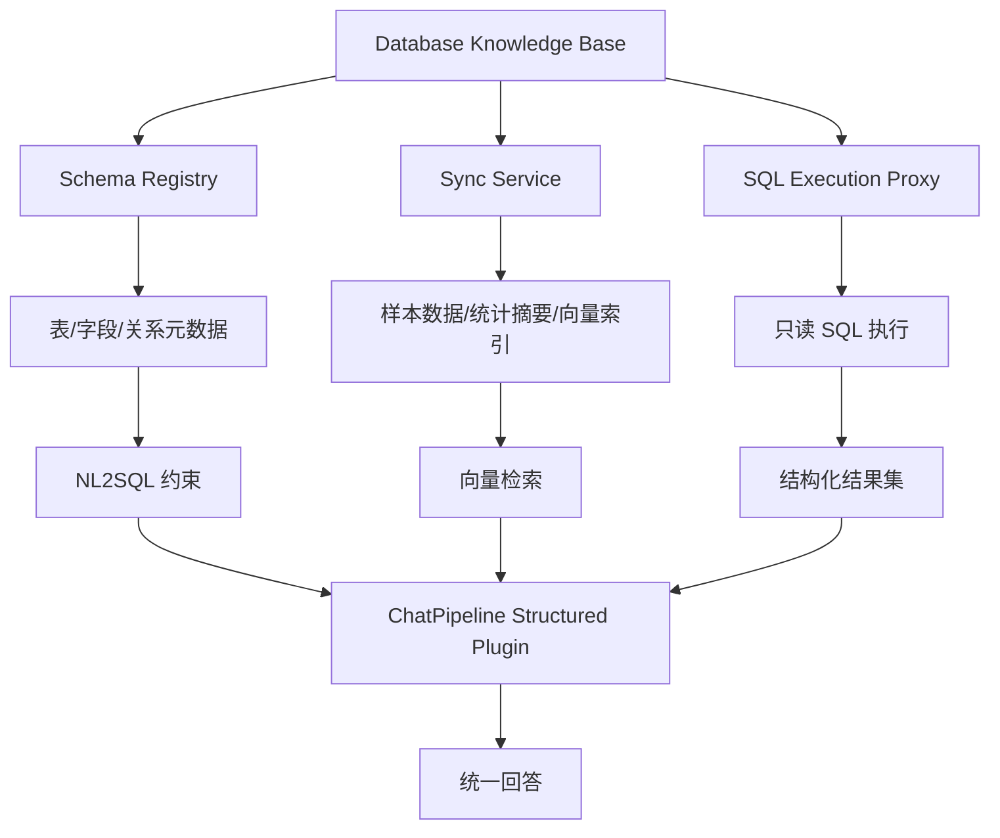

# WeKnora 当前系统架构分析与结构化数据库接入方案对比

> 日期：2026-04-29  
> 结论定位：本方案基于当前仓库真实代码结构分析，不是脱离实现的概念稿。  
> 目标：梳理 WeKnora 当前系统架构，评估“扩展接入数据库”的可行路径，并给出优劣势对比与推荐实施路线。

---

## 一、分析范围与代码锚点

本次分析重点基于以下代码路径：

- `internal/router/router.go`：HTTP 路由入口、鉴权、中间件、业务 API 装配。
- `internal/container/container.go`：`dig` 依赖注入容器、核心基础设施初始化、检索引擎注册、数据源同步框架装配。
- `internal/types/knowledgebase.go`：知识库类型定义。
- `internal/types/datasource.go`：外部数据源、同步游标、同步日志、连接配置定义。
- `internal/datasource/connector.go`：统一数据源连接器抽象。
- `internal/datasource/scheduler.go`：定时同步调度器、去重与异步任务编排。
- `internal/application/service/datasource_service.go`：数据源同步主流程，以及同步结果落到知识库的方式。
- `internal/agent/tools/database_query.go`：Agent 的受限数据库查询工具。
- `internal/agent/tools/data_analysis.go`：DuckDB 文件级结构化分析工具。
- `internal/application/service/chat_pipeline/data_analysis.go`：ChatPipeline 中对 CSV/Excel 的自动数据分析插件。
- `internal/database/migration.go`：系统主库迁移能力。

这几个锚点足以说明当前系统如何处理：

1. 主业务请求进入系统。
2. 知识库内容如何被创建、解析、切片、索引。
3. 外部数据源如何被同步进系统。
4. 结构化数据分析能力目前处于什么层级。
5. 为什么“数据库接入”当前还没有形成完整产品能力。

---

## 二、当前系统架构分析

### 2.1 总体分层

从当前代码看，WeKnora 的主干是比较明确的分层架构：

这套架构的核心特征是：

- 接入层、业务层、存储层、AI 编排层职责比较清晰。
- 依赖注入集中在 `container.BuildContainer()`，初始化顺序明确。
- “外部内容接入”与“知识库摄取”已经被拆成两个阶段：先同步，再转成 Knowledge。
- 检索能力采用注册表 + 多引擎组合模式，具备可扩展性。
- 结构化数据分析能力已经存在，但主要是文件级 DuckDB 能力，不是外部数据库型能力。

### 2.2 入口层与服务装配

`internal/router/router.go` 表明系统采用 Gin 作为统一 HTTP 入口，路由层负责：

- CORS、语言、日志、恢复、错误处理中间件。
- 统一认证与租户上下文注入。
- 业务 API 注册，包括知识库、知识、会话、模型、数据源、导出等。

`internal/container/container.go` 是整套系统的装配中心，说明当前系统不是零散调用，而是一个标准化的可扩展服务容器。这里已经注册了：

- 基础设施：配置、Tracer、Langfuse、主数据库、Redis、DuckDB。
- Repository：知识库、知识、分块、模型、组织、数据源、同步日志等。
- Service：KnowledgeBaseService、KnowledgeService、ChunkService、SessionService、AgentService、DataSourceService 等。
- ChatPipeline 插件：搜索、重排、合并、数据分析、对话补全等。
- 检索引擎注册表：Postgres、SQLite、Elasticsearch v7/v8、Qdrant、Weaviate、Milvus。

这意味着数据库扩展如果走“新增可插拔组件”的方式，能够自然接入现有容器体系，不需要推翻现有架构。

### 2.3 知识库主链路

当前知识库类型定义位于 `internal/types/knowledgebase.go`，现有类型只有：

- `document`
- `faq`
- `wiki`

没有 `database` 或 `structured` 类型。这是当前结构化数据库接入的第一处产品级缺口。

从 `KnowledgeService` 的现有能力以及 `DataSourceService.ingestItem()` 可以看出，当前知识进入系统的标准路径仍然是：

1. 文件上传。
2. URL 下载。
3. 手工 Markdown/Passage 录入。
4. 外部数据源同步后，转成文件或 URL，再调用 `CreateKnowledgeFromFile` 或 `CreateKnowledgeFromURL`。

这条路径的优点是复用性高。只要能把外部数据“转换成系统认得的内容对象”，就能进入既有解析、切片、Embedding、索引、检索链路。

### 2.4 检索与索引架构

`initRetrieveEngineRegistry()` 说明当前检索层已经支持多引擎注册，并由 `RETRIEVE_DRIVER` 决定实际启用哪些引擎。已接入能力包括：

- PostgreSQL
- SQLite
- Elasticsearch v7/v8
- Qdrant
- Weaviate
- Milvus

检索层本质上已经是插件化的。也就是说：

- 如果只是“把数据库里的内容同步成普通知识块”，当前检索层无需大改。
- 如果希望做“自然语言转 SQL + 结果集分析 + 结构化过滤 + 向量检索融合”，则需要在现有检索架构之上新增一层结构化查询编排，而不是简单复用当前向量检索接口。

### 2.5 外部数据源同步架构

`internal/datasource/connector.go` 定义了统一的 `Connector` 接口：

- `Validate`
- `ListResources`
- `FetchAll`
- `FetchIncremental`

`internal/types/datasource.go` 则给出了支撑数据源同步的模型：

- `DataSource`
- `DataSourceConfig`
- `SyncCursor`
- `SyncLog`
- `SyncResult`

`internal/datasource/scheduler.go` 进一步说明当前已经具备：

- Cron 调度。
- Redis / Asynq 异步任务派发。
- 运行中任务去重。
- 同步日志落库。

最关键的是 `internal/application/service/datasource_service.go`：

- `ProcessSync()` 负责拉取外部数据。
- 拉取后不会直接进入某个数据库专用链路，而是调用 `ingestItem()`。
- `ingestItem()` 最终通过 `KnowledgeService.CreateKnowledgeFromFile` 或 `CreateKnowledgeFromURL` 写入知识库。

这说明当前数据源体系的本质不是“实时联邦查询”，而是“同步式导入知识库”。

这也是数据库扩展最有价值的现有锚点：

- 如果数据库接入目标是“把数据库中的结构化内容纳入知识库”，最小成本路径就是扩展新的数据库 Connector。
- 如果数据库接入目标是“让 Agent 直接查询外部业务数据库”，那么现有 DataSource 链路只能复用一部分调度和配置管理，查询执行链路仍需新增。

### 2.6 当前结构化数据能力的真实边界

当前代码里已经存在两类与结构化数据相关的能力，但它们都不是“外部数据库知识库”。

#### 2.6.1 Agent 的内部数据库查询工具

`internal/agent/tools/database_query.go` 提供了受限 SQL 查询工具，但它的特点非常明确：

- 面向当前系统主库，而不是用户配置的外部业务数据库。
- 只允许 `SELECT`。
- 自动注入 `tenant_id`。
- 自动过滤软删除记录。
- 只允许有限表范围。

这更像“运维型 / 管理型查询能力”，不是数据库接入产品能力。

#### 2.6.2 文件级 DuckDB 数据分析

`internal/agent/tools/data_analysis.go` 与 `internal/application/service/chat_pipeline/data_analysis.go` 表明：

- 系统已经能把 CSV/Excel 装载进 DuckDB。
- LLM 可以决定是否需要 SQL 分析。
- 分析结果可以回灌到 ChatPipeline。

这说明系统已经具备一部分“结构化数据问答”的基础能力，但当前输入对象仍然是：

- CSV
- Excel

而不是：

- MySQL
- PostgreSQL
- Oracle
- SQL Server
- ClickHouse
- 云数据库

因此，当前结构化能力的准确定位应该是：

> WeKnora 已具备“文件型结构化数据分析能力”，但尚未具备“数据库型结构化知识源接入能力”。

### 2.7 主数据库与迁移能力

`internal/database/migration.go` 显示系统主库迁移目前主要围绕：

- PostgreSQL
- SQLite

这部分能力服务于 WeKnora 自身元数据存储，不等于支持将这些数据库当作外部知识源接入。但它说明一点：

- 团队已经具备数据库迁移、连接管理、错误恢复的工程经验。

这对未来增加“数据库连接配置表、Schema 注册表、同步检查点表、查询审计表”等元数据模型是有利的。

---

## 三、当前架构对数据库接入的适配性判断

综合代码现状，可以得出三个判断：

### 3.1 适合复用的部分

- `dig` 容器适合新增数据库连接器、Schema 服务、同步服务。
- `DataSource` 模型适合承载数据库连接配置、同步模式、游标与同步日志。
- `Scheduler + Asynq` 适合承载数据库全量 / 增量同步任务。
- `KnowledgeService` 现有摄取链路适合承接“数据库导出后的知识化结果”。
- `ChatPipeline` 已有数据分析插件，适合作为未来结构化查询插件的落点。

### 3.2 不足以直接复用的部分

- 知识库类型缺少 `database`。
- 连接器接口目前默认输出 `FetchedItem`，语义更偏文档对象，不适合表达表、视图、Schema、关系、索引、查询模板等结构化元数据。
- 检索引擎接口偏向文本 / 向量召回，不直接承载 SQL 查询计划。
- 当前 Agent 数据库工具只面向系统内部有限表，不适合直接外放到业务库。

### 3.3 最关键的架构结论

> 当前仓库最自然的数据库接入演进方式，不是直接把外部数据库硬塞进现有 `DatabaseQueryTool`，而是优先复用 `DataSourceService` 和 `Connector` 体系做数据库同步接入，再按业务目标决定是否升级为“数据库型知识库 + SQL 编排层”。

---

## 四、结构化数据库接入的三种可行方案

下述三种方案都可行，但适用场景、改造成本和收益不同。

### 4.1 方案 A：数据库作为新型 DataSource，同步为现有知识库内容

#### 方案说明

新增数据库连接器，例如：

- `mysql`
- `postgresql`
- `oracle`
- `sqlserver`
- `clickhouse`

这些连接器仍实现现有 `Connector` 接口：

- `ListResources()` 返回可选库 / Schema / 表 / 视图。
- `FetchAll()` 拉取表数据快照。
- `FetchIncremental()` 按主键、时间戳或版本列拉取增量。

拉取后的结果转换为以下一种或多种内容形态，再复用 `ingestItem()`：

- Markdown 表摘要。
- CSV 分片文件。
- 表结构说明文档。
- 样例行 + 字段语义描述。
- 业务口径说明文档。

#### 目标架构

#### 优势

- 改造最小，最贴合当前代码架构。
- 可以直接复用 `DataSourceService`、`Scheduler`、`SyncLog`、`KnowledgeService`。
- 不会破坏现有知识检索与 ChatPipeline 主链路。
- 租户隔离、同步调度、失败重试、日志追踪都可以沿用现有机制。
- 适合先把“数据库内容进入知识库”做出来，交付速度最快。

#### 劣势

- 丢失一部分结构化语义，尤其是跨表 Join、约束、关系图、实时过滤能力。
- 当表数据很大时，同步为文档或 CSV 的成本较高。
- 更偏“离线知识化”，不适合强实时业务查询。
- NL2SQL 的效果有限，因为底层不是真实数据库执行，而是“数据库内容导出的知识化表示”。

#### 适用场景

- 以知识问答、知识检索为主。
- 数据实时性要求不高，分钟级到小时级可接受。
- 先验证业务价值，再决定是否做更重的数据库型知识库。

### 4.2 方案 B：新增 Database 类型知识库，构建结构化查询与混合检索能力

#### 方案说明

在现有 `document / faq / wiki` 之外新增：

- `database`

这类知识库不再把数据库简单等同于导入文档，而是引入新的领域对象：

- DatabaseConnection
- SchemaCatalog
- TableCatalog
- ColumnCatalog
- QueryTemplate
- SyncCheckpoint
- QueryAuditLog

系统需要新增以下能力：

- Schema 自动发现。
- 表与字段元数据管理。
- NL2SQL 生成与校验。
- 读权限白名单。
- SQL 执行代理。
- 查询结果摘要化与二次解释。
- 结构化检索与向量检索融合。

#### 目标架构

#### 优势

- 结构化语义保留最好。
- 能支持自然语言问答、条件过滤、聚合统计、跨表关联。
- 能把“知识检索”和“结构化分析”整合成统一体验。
- 对后续的报表问答、运营分析、指标问答、数据 Copilot 更友好。

#### 劣势

- 改造面明显更大，不再只是加一个 Connector。
- 需要新增安全机制：SQL 白名单、字段脱敏、审计、查询超时、行数限制。
- 需要新增元数据存储与 UI 设计。
- 需要处理 NL2SQL 幻觉、错误 Join、过大扫描等风险。

#### 适用场景

- 用户明确希望“直接问数据库”。
- 需要聚合统计、TopN、环比、维度筛选等结构化分析。
- 中长期要把 WeKnora 从文档 RAG 平台升级成“文档 + 数据统一智能问答平台”。

### 4.3 方案 C：引入联邦查询网关或 MCP 数据服务，WeKnora 只做编排层

#### 方案说明

把数据库接入从 WeKnora 主进程中部分外置：

- 用 Trino / Presto 做联邦查询层。
- 或用独立 SQL Proxy / 数据网关服务。
- 或以 MCP Server 形式提供结构化查询能力。

WeKnora 负责：

- 数据源配置。
- 权限控制。
- Schema 缓存。
- LLM 编排。
- 结果摘要。

实际的数据库连接、跨源 Join、查询执行、资源治理由外部网关处理。

#### 优势

- 对多种数据库和异构数据源最友好。
- 主系统耦合度低，便于横向扩展。
- 企业级场景下更容易承接大量数据源接入。
- 适合后续与湖仓、数据中台、数仓平台对接。

#### 劣势

- 运维复杂度最高。
- 引入额外部署组件、链路延迟和稳定性依赖。
- 权限模型会分散到 WeKnora 与外部网关两侧。
- 对当前仓库来说，不是最短落地路径。

#### 适用场景

- 大型企业、多数据源、跨库联邦查询场景。
- 已经有 Trino / Presto / 数据网关基础设施。
- 团队接受更高的运维与治理成本。

---

## 五、三种方案的优劣势对比

| 对比维度 | 方案 A：同步为现有知识库 | 方案 B：新增 Database 知识库 | 方案 C：联邦查询网关 / MCP |
|---|---|---|---|
| 改造成本 | 低 | 中高 | 高 |
| 与当前代码贴合度 | 最高 | 高 | 中 |
| 上线速度 | 最快 | 中等 | 最慢 |
| 实时性 | 低到中 | 中到高 | 高 |
| 结构化语义保留 | 一般 | 最好 | 好 |
| 对大表支持 | 一般 | 好 | 好 |
| 对多库异构支持 | 中 | 中高 | 最高 |
| 安全治理复杂度 | 低到中 | 高 | 高 |
| 运维复杂度 | 低 | 中高 | 最高 |
| 适合当前团队迭代方式 | 最合适 | 次优 | 不建议作为第一阶段 |

---

## 六、底层技术选型建议与对比

### 6.1 数据库连接方式对比

| 方式 | 是否适合当前 Go 代码基线 | 优势 | 劣势 | 建议 |
|---|---|---|---|---|
| 原生 Go Driver | 是 | 与现有 Go 服务最一致，性能稳定，易接入容器与调度体系 | 需要分别适配各数据库驱动差异 | 第一优先 |
| ODBC | 一般 | 理论上可统一部分驱动接入 | 运维复杂，部署依赖重 | 不建议首选 |
| JDBC 网关 | 一般 | 对 Oracle / SQL Server 等生态兼容度较好 | 需要额外 Java 服务 | 可作为补充方案 |
| SQLAlchemy 微服务 | 一般 | Python 数据生态丰富 | 增加跨语言维护成本 | 仅在强数据工程场景考虑 |
| Trino / Presto | 适合方案 C | 联邦查询强，跨源能力强 | 组件更重 | 企业级二阶段可选 |

**建议**：

当前仓库应优先采用原生 Go 驱动直连：

- MySQL：`go-sql-driver/mysql`
- PostgreSQL：`pgx` 或现有 PostgreSQL 相关能力复用
- SQL Server：`denisenkom/go-mssqldb`
- Oracle：`godror`
- ClickHouse：`clickhouse-go/v2`

### 6.2 数据同步方式对比

| 同步方式 | 优势 | 劣势 | 推荐阶段 |
|---|---|---|---|
| 全量同步 | 实现简单，容易验证正确性 | 大表成本高，窗口长 | 第一阶段必备 |
| 增量同步 | 成本更低，适合周期更新 | 依赖 `updated_at`、自增键或版本列 | 第一阶段推荐 |
| CDC | 实时性最好，适合生产级数据同步 | 架构最复杂，对数据库权限和中间件依赖高 | 第二阶段以后 |

**建议**：

- 首批实现“全量 + 增量”。
- CDC 不作为第一版强制目标。
- 当目标是运营问答、报表问答、分钟级更新时，再考虑 Debezium + Kafka 方案。

### 6.3 数据表示方式对比

| 表示方式 | 优势 | 劣势 | 适合方案 |
|---|---|---|---|
| 转 Markdown 表摘要 | 便于进入现有文档链路 | 丢失细粒度结构 | A |
| 转 CSV 分片 | 与现有 DuckDB 分析能力兼容 | 大数据量文件化成本高 | A |
| 存 Schema 元数据 + 样本 + 统计摘要 | 保留结构信息更好 | 需要新增元数据模型 | A+ / B |
| 直接 SQL 执行 + 结果摘要 | 最贴近真实数据库 | 安全与治理成本高 | B / C |

---

## 七、推荐方案

### 7.1 推荐结论

**推荐采用“两阶段路线”，短期落地方案 A+，中期演进到方案 B。**

这里的 A+ 指的是：

- 保持 DataSource + Connector + Scheduler 主框架不变。
- 首批把数据库接入实现成新的 Connector。
- 同步时不仅生成数据快照，还额外生成 Schema 摘要、字段说明、统计摘要。
- 在不新增 `database` 知识库类型的前提下，先把数据库内容纳入现有检索与问答体系。

随后，当业务验证通过，再推进：

- `KnowledgeBaseTypeDatabase`
- Schema Registry
- SQL Execution Proxy
- Structured Search Plugin

### 7.2 为什么不是直接选方案 B

因为从当前代码看，最成熟、最稳定、最容易复用的链路是：

- `DataSourceService.ProcessSync()`
- `ingestItem()`
- `KnowledgeService.CreateKnowledgeFromFile/CreateKnowledgeFromURL`

如果直接做方案 B，虽然产品能力更完整，但第一阶段要同时改：

- 类型系统
- 元数据模型
- 查询执行代理
- ChatPipeline 编排
- 权限治理
- 前端管理界面

这会显著拉长交付周期，并提高首版失败概率。

### 7.3 为什么不建议第一阶段选方案 C

因为当前仓库并没有现成的联邦查询治理层，直接引入 Trino / Presto / 外部数据网关，会导致：

- 研发链路分裂。
- 运维复杂度突然上升。
- 首版问题定位困难。

除非业务已经明确要求多源联邦和实时复杂 SQL，否则不建议作为第一阶段。

---

## 八、推荐实施设计

### 8.1 第一阶段：基于现有 DataSource 体系增加数据库 Connector

#### 建议新增内容

1. 在 `internal/types/datasource.go` 新增连接器类型常量：
   - `mysql`
   - `postgresql`
   - `oracle`
   - `sqlserver`
   - `clickhouse`

2. 在 `ConnectorMetadataRegistry` 增加数据库连接器元信息。

3. 在 `initConnectorRegistry()` 中注册数据库 Connector。

4. 新增共享数据库连接抽象，例如：
   - `internal/datasource/connector/dbbase/`
   - 包含 DSN 构造、连接测试、Schema 发现、增量游标处理、查询限流等公共逻辑。

5. 约定 `ListResources()` 的资源层级：
   - 数据库
   - Schema
   - 表
   - 视图

6. 约定 `DataSourceConfig.Settings` 增加字段：
   - `host`
   - `port`
   - `database`
   - `schema`
   - `ssl_mode`
   - `table_allowlist`
   - `view_allowlist`
   - `incremental_column`
   - `batch_size`
   - `query_timeout_sec`

#### 同步输出建议

每张表同步时至少输出三类知识对象：

1. 表结构摘要：字段、类型、主键、索引、更新时间列。
2. 表语义摘要：行数、字段分布、枚举值样本、业务说明。
3. 数据快照分片：按批次导出为 CSV 或 Markdown 段。

这样做的原因是：

- 仅同步原始数据，Agent 仍然很难理解表语义。
- 仅同步 Schema，又无法回答实际数据问题。
- “Schema + 摘要 + 快照”的组合，最符合当前文档型知识库链路。

### 8.2 第二阶段：引入 Database Knowledge Base

建议新增模型：

- `database_connections`
- `database_schema_catalog`
- `database_table_catalog`
- `database_column_catalog`
- `database_sync_checkpoints`
- `database_query_audit_logs`

建议新增服务：

- `DatabaseConnectionService`
- `SchemaRegistryService`
- `StructuredQueryService`
- `DatabaseSyncService`

建议新增 ChatPipeline 插件：

- `PluginStructuredSearch`
- `PluginNL2SQL`
- `PluginQueryResultSummarize`

### 8.3 SQL 安全治理设计

无论方案 A 还是 B，数据库接入都必须默认只读，并采用以下约束：

- 只允许 `SELECT`。
- 强制 `LIMIT` 上限。
- 强制超时。
- 只允许白名单表 / 视图。
- 禁止 DDL / DML。
- 对敏感字段做黑名单或脱敏。
- 完整记录 SQL 审计日志。
- 按租户隔离连接配置与访问范围。

这一点不能简单复用当前 `DatabaseQueryTool`，因为它现在只针对内部系统库和少量安全表做保护，不适合作为外部数据库通用执行器。

---

## 九、风险与应对

| 风险 | 说明 | 应对建议 |
|---|---|---|
| 大表同步成本过高 | 首次全量同步耗时长、占存储 | 限制首版表规模、分页拉取、分批知识化 |
| NL2SQL 幻觉 | LLM 可能生成错误查询 | 加 Schema 约束、SQL AST 校验、只读代理 |
| 权限越权 | 用户可能查询到不该看的表或字段 | 租户隔离 + 表白名单 + 字段黑名单 + 审计 |
| 数据时效性不达标 | 同步链路无法满足准实时需求 | 首版说明同步时效，后续再上 CDC |
| 多数据库驱动差异 | Oracle / SQL Server 元数据查询方式不一致 | 抽取公共接口 + 分数据库适配层 |
| 系统复杂度上升 | 增加大量配置和元数据表 | 先做 A+，验证后再做 B |

---

## 十、建议的分阶段路线

### 阶段 1：最小可用版本

目标：让数据库内容能够进入现有知识库。

范围：

- MySQL、PostgreSQL 两种连接器。
- 全量同步 + 基于时间戳的增量同步。
- 表结构摘要 + 表样本数据同步。
- 通过现有检索链路参与问答。

交付价值：

- 最快验证数据库接入的业务价值。
- 风险最低。

### 阶段 2：增强版结构化问答

目标：让系统具备更强的结构化理解与回答能力。

范围：

- 增加 SQL Server、Oracle、ClickHouse。
- 增加字段语义摘要、统计摘要。
- 在 ChatPipeline 中增加结构化查询意图识别。
- 增加数据库知识库类型草案。

### 阶段 3：数据库型知识库正式化

目标：把数据库作为一等知识源对象。

范围：

- `database` 知识库类型。
- Schema Registry。
- SQL Execution Proxy。
- Query Audit。
- 结构化检索与向量检索融合。

### 阶段 4：实时化与联邦化

目标：支撑企业级复杂数据场景。

范围：

- CDC。
- 联邦查询。
- 外部网关或 MCP 数据服务。
- 多源统一编排。

---

## 十一、最终建议

如果目标是“尽快把数据库里的业务数据接入 WeKnora，参与知识检索与问答”，推荐：

**优先做方案 A+。**

如果目标是“把 WeKnora 演进成既能问文档，也能直接问数据库的统一智能平台”，推荐：

**中期升级到方案 B。**

如果目标是“大规模异构数据源联邦查询”，且组织已经具备数据平台基础设施，才考虑：

**方案 C。**

从当前代码真实结构看，最稳妥、最符合仓库演进方式的路线是：

> 先复用现有 DataSource 同步框架做数据库接入，再逐步引入数据库型知识库与结构化查询编排能力。

这个路线既保守，又务实，而且最符合当前代码基础设施的复用价值。