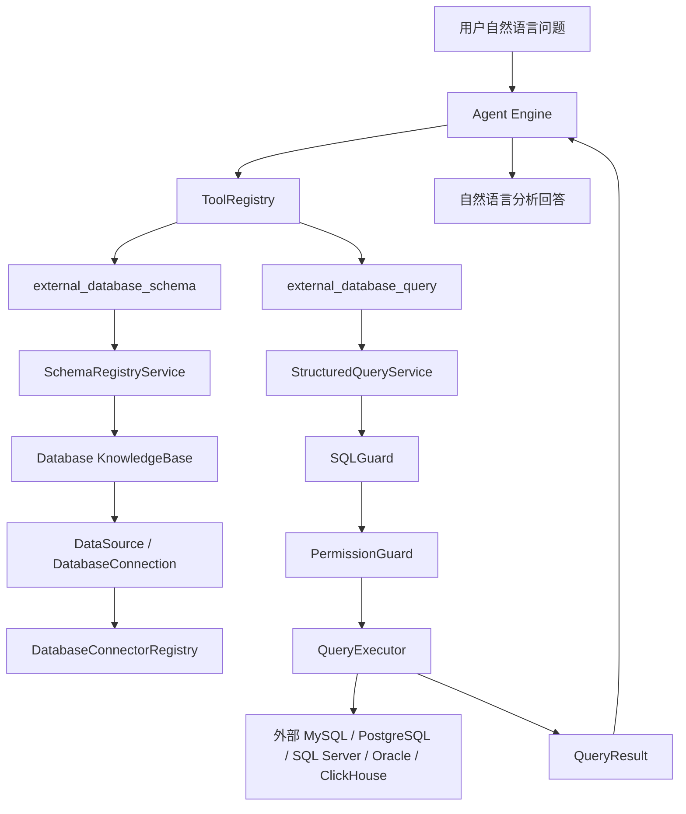
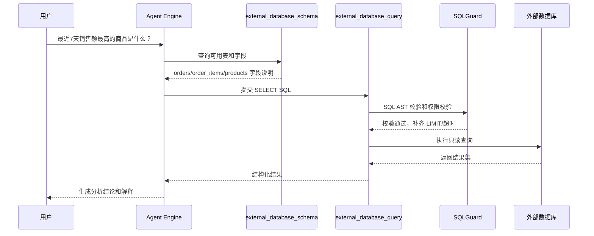

# 基于 Agent 的外部数据库实时查询技术方案

> 日期：2026-04-29  
> 方案基线：基于前序《结构化数据库接入系统架构分析与方案对比》中的方案 B。  
> 核心目标：接入外部数据库，由 Agent 根据自然语言生成 SQL，实时查询业务数据库，并对结果做数据分析与自然语言解释。  
> 设计原则：最大程度复用当前 WeKnora 的 Agent、ToolRegistry、DataSource、KnowledgeBase、租户隔离、SQL 校验和 ChatPipeline 架构。

---

## 零、设计审查结论与修正摘要

基于当前代码复核后，本文方案的主方向成立：应基于方案 B 新增 `database` 类型知识库，并通过 Agent ToolRegistry 暴露外部数据库 Schema 查询与实时 SQL 查询工具。但原方案中有几处需要修正，避免开发时与现有代码结构冲突。

### 0.1 审查结论

| 审查项 | 结论 | 修正动作 |
|---|---|---|
| Agent 扩展点 | 准确 | 继续复用 `ToolRegistry`、`AllowedTools`、参数 JSON Schema 校验和工具输出截断机制。 |
| `database_query` 复用方式 | 原方案判断准确 | 现有 `database_query` 面向系统主库，不能改造成外部业务库查询工具，应新增 `external_database_schema` 与 `external_database_query`。 |
| DataSource 复用方式 | 需要补充边界 | `DataSourceService.CreateDataSource` 当前依赖同步型 `ConnectorRegistry` 做类型校验，因此数据库类型若复用现有 `/api/v1/datasource`，必须提供管理适配器；实时查询仍走新的 `DatabaseConnectorRegistry`。 |
| 配置加密 | 原方案表述过强 | 当前 `DataSourceConfig.ToJSON()` 与 `ParseConfig()` 只是 JSON 编解码，未实际加密；数据库密码必须新增显式 AES-GCM 加解密逻辑，不能假设 `data_sources.config` 已加密。 |
| KB 能力位 | 需要补全 | 当前 `KBCapabilities` 只有 `vector/keyword/wiki/graph/faq`，需要新增 `database`，并同步后端与前端能力映射。 |
| API 路径 | 需要校正 | 当前数据源路由是 `/api/v1/datasource`，新接口应尽量沿用该路径或明确新增 `/api/v1/database-*` 路由，不能写成已存在的复数路径。 |
| 开发计划粒度 | 原方案偏粗 | 已在本文第十章以后改为可执行任务拆分，包含文件路径、接口、迁移、测试与验收标准。 |

### 0.2 关键修正后的总体原则

1. **Database KB 是 Agent 可选能力载体**：用于 SearchTarget、权限、能力过滤和 UI 展示。
2. **DataSource 只承载连接配置和管理态**：第一版复用 `data_sources` 表，但不把 `ProcessSync()` 作为实时查询主链路。
3. **双注册但职责分离**：数据库类型在现有 `datasource.ConnectorRegistry` 中注册轻量管理适配器；在新增 `DatabaseConnectorRegistry` 中注册真实 Schema 发现与 SQL 执行连接器。
4. **外部查询工具独立命名**：保留现有 `database_query` 的系统库语义，新增 `external_database_schema` 与 `external_database_query`。
5. **安全先于能力**：只读账号、SQL AST 校验、表白名单、字段黑名单、LIMIT、超时、审计日志必须随 MVP 同步交付。

---

## 一、需求重新定义

本次需求不是把外部数据库离线同步成文档知识，而是要实现：

1. 用户在 Agent 对话中提出自然语言问题。
2. 系统识别相关外部数据库、Schema、表和字段。
3. Agent 依据 Schema 生成只读 SQL。
4. 后端对 SQL 做安全校验、权限校验、限流和超时控制。
5. 系统实时访问外部数据库执行 SQL。
6. Agent 基于查询结果做进一步分析、归因、聚合解释和最终回答。

典型问题包括：

- “最近 7 天销售额最高的 10 个商品是什么？”
- “按区域统计本月新增客户数量，并给出异常波动说明。”
- “查询上周退款率超过 5% 的门店，并按退款金额排序。”
- “对比今年和去年同月的订单增长情况。”

这类需求的本质是“数据库级实时分析型 Agent”，不是传统 RAG，也不是 CSV/Excel 文件分析。

---

## 二、当前架构中可复用的关键能力

### 2.1 Agent 工具体系可直接复用

当前 Agent 模式已经具备完整的工具调用链路：

- `agentService.CreateAgentEngine()` 创建 Agent Engine。
- `agentService.registerTools()` 根据 `AgentConfig.AllowedTools` 注册工具。
- `tools.ToolRegistry` 负责工具注册、参数校验、执行、输出截断和清理。
- `tools.AvailableToolDefinitions()` 负责对前端暴露工具元信息。
- `tools.DefaultAllowedTools()` 负责默认工具列表。
- `ToolCapabilityRequirements` 负责工具与知识库能力的兼容性约束。

这意味着外部数据库实时查询不应该另起一套 Agent 调用框架，而应该新增一个内置工具，例如：

- `external_database_schema`
- `external_database_query`

或者更精简地第一版只新增：

- `database_schema`
- `database_query_live`

但为了避免与现有 `database_query` 混淆，建议命名为：

- `external_database_schema`
- `external_database_query`

现有 `database_query` 当前面向系统内部主库，并自动注入 `tenant_id`，不适合作为外部业务数据库查询工具直接改造。

### 2.2 DataSource 配置模型可部分复用

当前 `types.DataSource` 已包含：

- `TenantID`
- `KnowledgeBaseID`
- `Type`
- `Config`
- `Status`
- `SyncSchedule`
- `SyncMode`
- `LastSyncCursor`
- `SyncLog`

虽然它原本服务于“同步型外部数据源”，但其中的连接配置、租户隔离、状态管理和资源发现能力非常适合作为外部数据库连接管理基础。

本方案建议：

- 复用 `data_sources` 作为第一版数据库连接配置表。
- 当 `type` 为 `mysql/postgresql/oracle/sqlserver/clickhouse` 时，进入实时数据库查询能力。
- `SyncSchedule` 和 `SyncMode` 在实时查询模式中不是主路径，但可用于定期刷新 Schema 元数据。
- `Config` 可以继续承载连接参数、白名单表、字段脱敏规则、查询限制等，但当前代码里的 `DataSourceConfig.ToJSON()` 与 `ParseConfig()` 只是 JSON 编解码；外部数据库密码/API Key 必须新增显式加密处理，不能依赖现有实现自动加密。

### 2.3 KnowledgeBase 可作为数据库能力载体

当前知识库类型有：

- `document`
- `faq`
- `wiki`

方案 B 需要新增：

- `database`

新增 `database` 类型的意义不是把数据库内容变成文档，而是把“某一组外部数据库连接 + Schema + 权限范围 + 查询策略”封装为一个可被 Agent 选择和授权的知识对象。

也就是说，Database KnowledgeBase 的职责是：

- 管理外部数据库连接范围。
- 管理可查询表和字段。
- 管理 Schema 描述和业务语义。
- 作为 Agent 的 SearchTarget / Capability 过滤对象。
- 让前端和后端都能统一识别“这个 Agent 具备实时数据库分析能力”。

### 2.4 现有 SQL 工具的安全思路可复用，但不能直接复用实现

`internal/agent/tools/database_query.go` 已经包含一些有价值的安全设计：

- 只允许 `SELECT`。
- 自动租户过滤。
- 限定可查询表。
- 执行结果结构化返回。
- 查询结果带 `display_type`。

但外部数据库查询不能直接使用它，原因是：

- 它绑定的是 `*gorm.DB` 系统主库。
- 它的表白名单是系统表。
- 它的租户过滤基于 WeKnora 内部表结构。
- 它不支持多连接、多数据库驱动和连接池治理。

正确做法是复用“模式”，而不是复用“实现”：新增 `ExternalDatabaseQueryTool`，底层调用新的 `StructuredQueryService`。

### 2.5 DuckDB 数据分析链路可作为结果分析参考

当前 `data_analysis` 工具会对 CSV/Excel 做：

- Schema 获取。
- LLM 生成 DuckDB SQL。
- SQL 校验。
- 执行查询。
- 将结果作为分析上下文回灌给 Agent。

外部数据库实时查询可以复用这个思路，但执行器从 DuckDB 换成外部数据库连接池，Schema 来源从文件解析换成 Schema Registry。

---

## 三、推荐目标架构

### 3.1 总体架构



### 3.2 核心设计思想

本方案将外部数据库实时查询拆成五层：

| 层级 | 组件 | 职责 | 复用现有能力 |
|---|---|---|---|
| Agent 编排层 | Agent Engine + ToolRegistry | 让 LLM 决定何时查 Schema、何时执行 SQL | 复用现有 Agent 工具体系 |
| 能力载体层 | Database KnowledgeBase | 表示一个可被 Agent 选择的数据库知识库 | 扩展现有 KnowledgeBase 类型 |
| 连接配置层 | DataSource / DatabaseConnection | 保存外部库连接、白名单、限制策略 | 复用 DataSource 模型，必要时扩展专表 |
| Schema 管理层 | SchemaRegistryService | 发现、缓存、描述表字段和关系 | 复用 DataSource ListResources 思路 |
| 查询执行层 | StructuredQueryService | 校验 SQL、执行查询、返回结构化结果 | 复用现有 SQL 校验与 ToolResult 模式 |

---

## 四、为什么这是对当前架构的最优扩展

### 4.1 不改造现有文档 RAG 主链路

文档知识库、FAQ、Wiki、Chunk 检索、向量库都不需要重构。Database KnowledgeBase 是新增能力，不侵入现有文档摄取链路。

### 4.2 不重写 Agent 机制

外部数据库查询作为新 Tool 加入：

- 继续走 `AllowedTools`。
- 继续走参数 JSON Schema 校验。
- 继续走 Tool 输出截断。
- 继续走 Agent 多轮推理。
- 继续走最终回答工具。

这样最大化利用已有 Agent 工程能力。

### 4.3 不复用错误抽象

不把外部数据库硬塞进现有 `database_query`，避免内部主库查询和外部业务库查询混杂。新增外部数据库 Tool 可以保持边界清晰：

- `database_query`：系统内部受限查询。
- `external_database_query`：外部业务数据库实时查询。

### 4.4 DataSource 与 KnowledgeBase 分工清晰

推荐分工：

- `KnowledgeBase(type=database)`：用户可见的数据库知识库对象，供 Agent 选择和授权。
- `DataSource(type=mysql/postgresql/...)`：具体连接配置和资源发现对象。
- `SchemaRegistry`：数据库结构元数据缓存。
- `StructuredQueryService`：实时查询执行服务。

这比把所有信息都塞到 `KnowledgeBase.Config` 或 `DataSource.Config` 更清晰。

---

## 五、核心模块设计

### 5.1 Database KnowledgeBase

新增知识库类型：

```go
const KnowledgeBaseTypeDatabase = "database"
```

当前 `KBCapabilities` 尚未包含数据库能力，需新增 `Database` 字段，并补充 `IsDatabaseEnabled()`：

```go
type KBCapabilities struct {
    Vector   bool `json:"vector"`
    Keyword  bool `json:"keyword"`
    Wiki     bool `json:"wiki"`
    Graph    bool `json:"graph"`
    FAQ      bool `json:"faq"`
    Database bool `json:"database"`
}

func (kb *KnowledgeBase) IsDatabaseEnabled() bool {
    return kb != nil && kb.Type == KnowledgeBaseTypeDatabase
}
```

`Capabilities()` 需要返回 `Database: kb.IsDatabaseEnabled()`。`EnsureDefaults()` 也要处理 database 类型：database KB 不应默认打开文档向量化/切片管线，建议将 `IndexingStrategy` 置为零检索或新增数据库专属默认策略，避免创建后被当作文档知识库处理。

这样可以让 ToolCapabilityRequirements 增加数据库能力约束：

```go
"external_database_schema": {AllOf: []KBCapability{CapDatabase}},
"external_database_query":  {AllOf: []KBCapability{CapDatabase}},
```

对应前端 `tool-capabilities.ts` 也要同步，否则 Agent 编辑器、知识库选择器和后端过滤逻辑会不一致。

### 5.2 DatabaseConnection / DataSource 配置

第一版为了最大复用，可以继续使用 `data_sources` 表保存连接配置。建议配置结构如下：

```json
{
  "type": "mysql",
  "credentials": {
    "username": "readonly_user",
    "password": "encrypted_password"
  },
  "settings": {
    "host": "10.0.0.10",
    "port": 3306,
    "database": "crm",
    "schema": "public",
    "ssl_mode": "required",
    "table_allowlist": ["orders", "customers", "refunds"],
    "column_denylist": ["customers.phone", "customers.id_card"],
    "max_rows": 500,
    "query_timeout_sec": 10,
    "sample_rows": 20,
    "schema_refresh_cron": "0 */6 * * * *"
  }
}
```

落地时要补充加密规则：

- `credentials.password` 必须使用 `utils.EncryptAESGCM` 加密后入库。
- 解密时使用 `utils.DecryptAESGCM`，密钥来源仍沿用 `SYSTEM_AES_KEY`。
- 如果 `SYSTEM_AES_KEY` 缺失，生产环境应拒绝保存数据库密码；开发环境可以显式允许明文但必须有日志告警。
- 参考 `types.VectorStore.ConnectionConfig` 的敏感字段加解密模式实现，避免重复设计。

中长期如果需要更强治理，建议拆出专表：

- `database_connections`
- `database_connection_policies`
- `database_allowed_tables`
- `database_masking_rules`

第一版可以先不拆，降低迁移成本。

### 5.3 SchemaRegistryService

职责：

- 连接外部数据库。
- 发现库、Schema、表、视图、字段、主键、索引。
- 保存 Schema 快照。
- 生成给 Agent 使用的简洁 Schema 描述。
- 记录 Schema Hash，用于判断是否变化。

建议接口：

```go
type SchemaRegistryService interface {
    RefreshSchema(ctx context.Context, dataSourceID string) error
    GetDatabaseSchema(ctx context.Context, kbID string) (*DatabaseSchema, error)
    GetTableSchema(ctx context.Context, kbID string, tableName string) (*TableSchema, error)
    BuildPromptSchema(ctx context.Context, kbID string, selectedTables []string) (string, error)
}
```

Schema 元数据建议保存：

```go
type DatabaseSchema struct {
    ID              string
    TenantID        uint64
    KnowledgeBaseID string
    DataSourceID    string
    DatabaseType    string
    DatabaseName    string
    SchemaName      string
    Tables          []TableSchema
    SchemaHash      string
    RefreshedAt     time.Time
}

type TableSchema struct {
    Name        string
    Type        string // table / view
    Comment     string
    RowEstimate int64
    Columns     []ColumnSchema
    PrimaryKeys []string
    Indexes      []IndexSchema
}

type ColumnSchema struct {
    Name        string
    DataType    string
    Nullable    bool
    Comment     string
    IsSensitive bool
    SampleValues []string
}
```

### 5.4 DatabaseConnectorRegistry

现有 `ConnectorRegistry` 面向同步型数据源，接口输出 `FetchedItem`。实时查询更适合新增数据库专用连接器接口：

```go
type DatabaseConnector interface {
    Type() string
    Validate(ctx context.Context, cfg *DatabaseConnectionConfig) error
    DiscoverSchema(ctx context.Context, cfg *DatabaseConnectionConfig) (*DatabaseSchema, error)
    Open(ctx context.Context, cfg *DatabaseConnectionConfig) (*sql.DB, error)
    Dialect() SQLDialect
}
```

为什么不直接改现有 `datasource.Connector`：

- 现有接口服务于同步，返回 `FetchedItem`。
- 实时查询需要 SQL 方言、Schema 发现、连接池、执行器能力。
- 强行合并会让同步型连接器和数据库型连接器互相污染。

但注册方式可以复用现有思路：

- 新增 `DatabaseConnectorRegistry`。
- 在 `container.BuildContainer()` 中注册。
- MySQL / PostgreSQL / ClickHouse 等连接器各自实现接口。

为了复用当前 `DataSourceHandler` 与 `DataSourceService.CreateDataSource()`，还需要为 MySQL/PostgreSQL 在现有 `datasource.ConnectorRegistry` 中注册轻量管理适配器：

```go
type DatabaseDataSourceAdapter struct {
    dbConnector DatabaseConnector
}

func (a *DatabaseDataSourceAdapter) Type() string { return a.dbConnector.Type() }
func (a *DatabaseDataSourceAdapter) Validate(ctx context.Context, cfg *types.DataSourceConfig) error { ... }
func (a *DatabaseDataSourceAdapter) ListResources(ctx context.Context, cfg *types.DataSourceConfig) ([]types.Resource, error) { ... }
func (a *DatabaseDataSourceAdapter) FetchAll(...) ([]types.FetchedItem, error) { return nil, ErrRealtimeDatabaseDoesNotSupportSync }
func (a *DatabaseDataSourceAdapter) FetchIncremental(...) ([]types.FetchedItem, *types.SyncCursor, error) { return nil, nil, ErrRealtimeDatabaseDoesNotSupportSync }
```

这层适配器只服务于创建、测试连接、列资源，不承担实时查询执行。实时查询必须通过 `StructuredQueryService -> DatabaseConnectorRegistry -> QueryExecutor`。

### 5.5 StructuredQueryService

这是实时查询的核心服务。

建议职责：

1. 根据 `KnowledgeBaseID` 找到数据库连接配置。
2. 获取 Schema 和权限策略。
3. 解析 LLM 传入的 SQL。
4. 校验只读、单语句、表白名单、字段黑名单、函数黑名单。
5. 根据数据库方言补齐或重写 LIMIT。
6. 执行查询。
7. 对结果脱敏、截断和格式化。
8. 记录审计日志。

建议接口：

```go
type StructuredQueryService interface {
    ValidateSQL(ctx context.Context, req ValidateSQLRequest) (*ValidatedSQL, error)
    ExecuteQuery(ctx context.Context, req ExecuteQueryRequest) (*QueryResult, error)
    ExplainQuery(ctx context.Context, req ExplainQueryRequest) (*QueryPlan, error)
}
```

请求结构：

```go
type ExecuteQueryRequest struct {
    TenantID        uint64
    UserID          string
    SessionID       string
    KnowledgeBaseID string
    SQL             string
    Purpose         string
    MaxRows         int
    TimeoutSeconds  int
}
```

结果结构：

```go
type QueryResult struct {
    Columns     []QueryColumn
    Rows        []map[string]any
    RowCount    int
    Truncated   bool
    ExecutedSQL string
    DurationMS  int64
    DisplayType string
}
```

### 5.6 Agent 工具设计

#### 5.6.1 external_database_schema

用途：让 Agent 在生成 SQL 前获取数据库结构。

输入：

```json
{
  "knowledge_base_id": "database-kb-id",
  "tables": ["orders", "customers"]
}
```

输出：

- 表名。
- 字段名。
- 字段类型。
- 字段注释。
- 主键。
- 可 Join 关系。
- 允许查询范围。
- 敏感字段提示。
- 示例查询模板。

#### 5.6.2 external_database_query

用途：执行只读 SQL 并返回结构化结果。

输入：

```json
{
  "knowledge_base_id": "database-kb-id",
  "sql": "SELECT region, COUNT(*) AS new_customers FROM customers WHERE created_at >= CURRENT_DATE - INTERVAL '30 day' GROUP BY region ORDER BY new_customers DESC LIMIT 20",
  "purpose": "统计最近 30 天各区域新增客户数量"
}
```

输出：

```json
{
  "columns": [...],
  "rows": [...],
  "row_count": 20,
  "truncated": false,
  "display_type": "external_database_query"
}
```

工具说明中必须明确：

- 只能使用 `external_database_schema` 返回过的表字段。
- 只能生成 `SELECT`。
- 必须加聚合或 LIMIT。
- 不允许查询敏感字段。
- 不允许 DDL / DML。
- 不确定字段含义时先调用 Schema 工具。

### 5.7 Agent 注册逻辑改造

需要修改：

- `internal/agent/tools/definitions.go`
- `internal/agent/tools/capabilities.go`
- `internal/application/service/agent_service.go`
- 前端工具能力映射文件

建议新增常量：

```go
ToolExternalDatabaseSchema = "external_database_schema"
ToolExternalDatabaseQuery  = "external_database_query"
```

`registerTools()` 中新增：

```go
case tools.ToolExternalDatabaseSchema:
    toolToRegister = tools.NewExternalDatabaseSchemaTool(s.schemaRegistryService)

case tools.ToolExternalDatabaseQuery:
    toolToRegister = tools.NewExternalDatabaseQueryTool(s.structuredQueryService)
```

同时新增 `hasDatabaseKB` 检测逻辑：

```go
if kb.IsDatabaseEnabled() {
    hasDatabaseKB = true
}
```

没有 Database KB 时，要过滤外部数据库工具，避免 Agent 拿到无法执行的工具。

同时 `agentService` 结构体和构造函数需要增加依赖：

```go
schemaRegistryService  interfaces.SchemaRegistryService
structuredQueryService interfaces.StructuredQueryService
```

并同步修改：

- `interfaces.AgentService` 不需要变，因为新增依赖只影响具体构造函数。
- `service.NewAgentService` 参数列表需要变。
- `container.BuildContainer()` 中 `service.NewAgentService` 依赖解析会自动跟随，但必须先注册新增服务。
- 相关单元测试如有手工构造 `agentService`，需要补齐依赖或提供 mock。

---

## 六、自然语言到 SQL 的执行流程

### 6.1 ReAct Agent 推荐流程



### 6.2 推荐 Prompt 策略

Agent 系统提示词应加入数据库分析规则：

1. 涉及数据库统计、聚合、排序、筛选时，先调用 `external_database_schema`。
2. 只能基于 Schema 中存在的表和字段生成 SQL。
3. 不要猜测表字段。
4. SQL 必须是只读查询。
5. 查询结果不足以回答问题时，可以继续发起第二次查询。
6. 最终回答必须说明查询口径、时间范围和限制条件。

---

## 七、安全与治理设计

### 7.1 SQL 安全校验

必须使用 SQL Parser 做 AST 级校验，不建议用字符串判断。校验规则：

- 仅允许单条语句。
- 仅允许 `SELECT` / `WITH ... SELECT`。
- 禁止 `INSERT/UPDATE/DELETE/CREATE/DROP/ALTER/TRUNCATE/COPY/CALL/EXEC`。
- 禁止多语句。
- 禁止危险函数。
- 禁止访问非白名单表。
- 禁止返回字段黑名单中的敏感字段。
- 强制 LIMIT。
- 强制超时。

现有 `utils.ValidateSQL` 可以作为第一版基础，但需要评估其对多数据库方言的覆盖。如果覆盖不足，建议按数据库类型引入方言解析器，至少 MySQL 与 PostgreSQL 首版要有可靠 AST 校验。

### 7.2 连接权限

外部数据库账号必须是只读账号，后端仍要二次校验。推荐数据库侧权限：

- 只授予指定库 / Schema 的 SELECT。
- 尽量使用视图暴露业务数据。
- 敏感字段在视图层预先脱敏。
- 禁止使用业务写账号。

### 7.3 查询资源治理

建议配置：

- 默认超时：10 秒。
- 默认最大返回行数：500。
- 默认最大输出字符数：沿用 ToolRegistry 的输出截断机制。
- 默认禁止全表无条件扫描大表。
- 对高风险查询先执行 `EXPLAIN` 或估算扫描行数。

### 7.4 审计日志

新增 `database_query_audit_logs`：

| 字段 | 说明 |
|---|---|
| id | 审计记录 ID |
| tenant_id | 租户 |
| user_id | 用户 |
| session_id | 会话 |
| knowledge_base_id | Database KB |
| data_source_id | 数据源 |
| original_sql | LLM 生成 SQL |
| executed_sql | 实际执行 SQL |
| status | success / failed / rejected |
| row_count | 返回行数 |
| duration_ms | 执行耗时 |
| error_message | 错误原因 |
| created_at | 创建时间 |

审计日志对企业场景非常关键，不能后补。

---

## 八、数据模型落地建议

### 8.1 最小表结构

第一版推荐新增三类表：

1. Schema 快照表。
2. 表字段元数据表。
3. 查询审计表。

#### database_schema_snapshots

```sql
CREATE TABLE database_schema_snapshots (
    id varchar(36) PRIMARY KEY,
    tenant_id bigint NOT NULL,
    knowledge_base_id varchar(36) NOT NULL,
    data_source_id varchar(36) NOT NULL,
    database_type varchar(32) NOT NULL,
    database_name varchar(255) NOT NULL,
    schema_name varchar(255),
    schema_hash varchar(128) NOT NULL,
    schema_json jsonb NOT NULL,
    refreshed_at timestamptz NOT NULL,
    created_at timestamptz NOT NULL,
    updated_at timestamptz NOT NULL,
    deleted_at timestamptz
);
```

#### database_table_columns

```sql
CREATE TABLE database_table_columns (
    id varchar(36) PRIMARY KEY,
    tenant_id bigint NOT NULL,
    knowledge_base_id varchar(36) NOT NULL,
    data_source_id varchar(36) NOT NULL,
    table_name varchar(255) NOT NULL,
    column_name varchar(255) NOT NULL,
    data_type varchar(128) NOT NULL,
    nullable boolean NOT NULL DEFAULT true,
    comment text,
    is_sensitive boolean NOT NULL DEFAULT false,
    ordinal_position integer,
    created_at timestamptz NOT NULL,
    updated_at timestamptz NOT NULL,
    deleted_at timestamptz
);
```

#### database_query_audit_logs

```sql
CREATE TABLE database_query_audit_logs (
    id varchar(36) PRIMARY KEY,
    tenant_id bigint NOT NULL,
    user_id varchar(36) NOT NULL,
    session_id varchar(36),
    knowledge_base_id varchar(36) NOT NULL,
    data_source_id varchar(36) NOT NULL,
    original_sql text NOT NULL,
    executed_sql text,
    purpose text,
    status varchar(32) NOT NULL,
    row_count integer NOT NULL DEFAULT 0,
    duration_ms bigint NOT NULL DEFAULT 0,
    error_message text,
    created_at timestamptz NOT NULL
);
```

### 8.2 是否复用 data_sources

建议第一版复用 `data_sources`，理由：

- 已有租户字段。
- 已有关联知识库字段。
- 已有 JSON Config 字段，便于承载连接配置；但当前实现未实际加密，必须补凭据加密。
- 已有状态字段。
- 已有资源发现思路。

但需要注意：

- `DataSourceService.ProcessSync()` 不应成为实时查询主路径。
- Database 类型 DataSource 可以只使用 `ValidateConnection` 和 `ListAvailableResources`，不强制走同步。
- Schema 刷新可复用 Scheduler，但实时查询不依赖同步任务。

---

## 九、API 设计建议

### 9.1 管理接口

当前已有数据源路由前缀是 `/api/v1/datasource`，建议尽量复用现有路径，并补充数据库专属动作：

- `POST /api/v1/datasource`：创建数据库 DataSource，`type=mysql/postgresql`。
- `POST /api/v1/datasource/validate-credentials`：复用连接测试，数据库适配器负责校验。
- `GET /api/v1/datasource/:id/resources`：复用资源发现，返回 database/schema/table/view 层级。
- `POST /api/v1/datasource/:id/refresh-schema`：新增，刷新 Schema 快照。
- `GET /api/v1/knowledge-bases/:id/database-schema`：新增，按 Database KB 获取当前 Schema。
- `GET /api/v1/database-query-audits`：新增，查询审计日志。

如果希望避免继续扩展 `DataSourceHandler`，也可以新增 `DatabaseSourceHandler`，但路径仍建议与现有资源保持一致，减少前端理解成本。

### 9.2 Agent 执行接口

Agent 执行接口不需要新增，继续通过现有会话问答入口。核心变化是：

- Agent 配置允许选择 Database KB。
- Agent 允许启用外部数据库工具。
- ToolRegistry 注册新工具。

这是最大复用现有代码路径的关键点。

---

## 十、可执行开发计划

以下计划按“能独立提交、能独立测试”的粒度拆分。当前 PostgreSQL 迁移最新为 `000041`，新增迁移建议从 `000042` 开始；SQLite 迁移目录当前只有 `000000`，如 Lite/SQLite 版本需要同等能力，应同步新增 SQLite 迁移。

### 10.1 任务 1：补齐数据库知识库类型与能力位

目标：让后端和前端都能识别 Database KB，并让 Agent 工具能力过滤可用。

后端改动：

- 修改 `internal/types/knowledgebase.go`。
- 增加 `KnowledgeBaseTypeDatabase = "database"`。
- `KBCapabilities` 增加 `Database bool`。
- `Capabilities()` 增加 `Database: kb.IsDatabaseEnabled()`。
- 新增 `IsDatabaseEnabled()`。
- 调整 `EnsureDefaults()`：database KB 不应默认按文档 KB 开启向量/关键词处理；若当前 `IndexingStrategy` 零值会自动回填文档默认策略，需要为 database 类型单独处理。
- 检查 `KnowledgeBaseService.ListKnowledgeBases`、`FillKnowledgeBaseCounts` 对未知类型的处理，database 类型可返回 0 `KnowledgeCount/ChunkCount`，不要报错。

前端改动：

- 修改 `frontend/src/api/agent/index.ts` 的 `KBCapabilities`，增加 `database: boolean`。
- 修改 `frontend/src/utils/tool-capabilities.ts`，`KBCapability` 增加 `'database'`，`ScopeCapabilities` 增加 `database`。
- `RequirementMissKind` 增加 `needsDatabase`。
- `primaryMissKind()` 增加 database 分支。

验收标准：

- 创建 type 为 `database` 的 KB 后，接口返回 `capabilities.database=true`。
- 现有 document/faq/wiki KB 能力不变。
- Agent 编辑器可以基于 database 能力过滤工具和知识库。

建议测试：

- `go test ./internal/types ./internal/application/service -run 'KnowledgeBase|Capability'`
- `cd frontend && pnpm typecheck`

### 10.2 任务 2：新增数据库连接配置类型与加密能力

目标：外部数据库凭据不能明文落库。

新增或修改文件：

- 新增 `internal/types/database_connection.go`。
- 可选新增 `internal/types/database_connection_test.go`。

建议类型：

```go
type DatabaseConnectionConfig struct {
    Type        string                 `json:"type"`
    Credentials DatabaseCredentials    `json:"credentials"`
    Settings    DatabaseSourceSettings `json:"settings"`
}

type DatabaseCredentials struct {
    Username string `json:"username"`
    Password string `json:"password,omitempty"`
}

type DatabaseSourceSettings struct {
    Host             string   `json:"host"`
    Port             int      `json:"port"`
    Database         string   `json:"database"`
    Schema           string   `json:"schema,omitempty"`
    SSLMode          string   `json:"ssl_mode,omitempty"`
    TableAllowlist   []string `json:"table_allowlist,omitempty"`
    ColumnDenylist   []string `json:"column_denylist,omitempty"`
    MaxRows          int      `json:"max_rows,omitempty"`
    QueryTimeoutSec  int      `json:"query_timeout_sec,omitempty"`
    SampleRows       int      `json:"sample_rows,omitempty"`
}
```

加密要求：

- 参考 `types.VectorStore.ConnectionConfig.Value/Scan` 的方式。
- `Password` 入库前加密，读取后解密。
- 不要把解密后的配置直接写回 `DataSource.Config`。
- `SYSTEM_AES_KEY` 缺失时，生产模式拒绝保存；非生产模式允许但记录警告。

验收标准：

- 创建数据库 DataSource 后，数据库中的 `config` 不包含明文密码。
- 读取配置后，连接器能拿到明文密码建立连接。
- 重复保存不会二次加密。

建议测试：

- `go test ./internal/types -run 'DatabaseConnection|Encrypt|Decrypt'`

### 10.3 任务 3：数据库连接器接口与 MySQL/PostgreSQL MVP

目标：建立真实外部数据库连接、测试连接、发现 Schema。

新增目录建议：

- `internal/databaseconnector/`
- `internal/databaseconnector/mysql/`
- `internal/databaseconnector/postgres/`

核心接口：

```go
type DatabaseConnector interface {
    Type() string
    Validate(ctx context.Context, cfg *types.DatabaseConnectionConfig) error
    DiscoverSchema(ctx context.Context, cfg *types.DatabaseConnectionConfig) (*types.DatabaseSchema, error)
    Query(ctx context.Context, cfg *types.DatabaseConnectionConfig, sql string, timeout time.Duration) (*sql.Rows, error)
    Dialect() types.SQLDialect
}
```

注册器：

- 新增 `DatabaseConnectorRegistry`。
- 新增 `Register/Get/List` 方法，风格参考 `datasource.ConnectorRegistry`。
- 在 `container.BuildContainer()` 中注册 `initDatabaseConnectorRegistry()`。

依赖建议：

- MySQL：`github.com/go-sql-driver/mysql`。
- PostgreSQL：优先使用 `github.com/jackc/pgx/v5/stdlib` 或现有 PostgreSQL 相关依赖，避免和系统主库 GORM 强绑定。

验收标准：

- MySQL/PostgreSQL 连接参数正确时 `Validate` 成功。
- 账号权限不足、主机不可达、库不存在时返回可读错误。
- `DiscoverSchema` 能返回表、视图、字段、主键、字段注释。

建议测试：

- 单元测试覆盖 DSN 构造、配置校验、错误分支。
- 集成测试可用 docker-compose 或 Testcontainers 后续补充。

### 10.4 任务 4：现有 DataSource 管理适配器

目标：复用 `/api/v1/datasource` 创建、测试、资源发现接口，同时不让实时数据库走同步主路径。

新增目录建议：

- `internal/datasource/connector/database/`

实现内容：

- 新增 `DatabaseDataSourceAdapter`，实现现有 `datasource.Connector`。
- `Validate()`：解析 `DataSourceConfig` 到 `DatabaseConnectionConfig`，调用 `DatabaseConnector.Validate()`。
- `ListResources()`：调用 `DiscoverSchema()`，转换成 `types.Resource`，资源类型建议为 `database/schema/table/view`。
- `FetchAll()` 与 `FetchIncremental()`：返回明确错误，例如 `realtime database datasource does not support sync`。
- `initConnectorRegistry()` 中注册 MySQL/PostgreSQL 管理适配器。

同时修改：

- `DataSourceService.ManualSync()` 或 `ProcessSync()` 对数据库类型提前拒绝，避免用户误触同步后进入失败重试。
- 前端对数据库 DataSource 隐藏“同步/暂停/恢复”操作，仅保留测试连接、刷新 Schema。

验收标准：

- `POST /api/v1/datasource` 能创建 `type=mysql/postgresql` 的数据源。
- `POST /api/v1/datasource/:id/validate` 能测试连接。
- `GET /api/v1/datasource/:id/resources` 能列出表和视图。
- 对数据库类型调用 `/sync` 返回 400 或业务错误，不创建无意义同步任务。

### 10.5 任务 5：Schema 元数据持久化

目标：将外部数据库结构缓存到 WeKnora 主库，供 Agent 生成 SQL 时使用。

迁移文件：

- PostgreSQL：`migrations/versioned/000042_database_query.up.sql` / `.down.sql`。
- SQLite：如 Lite 需要支持，新增 `migrations/sqlite/000001_database_query.up.sql` / `.down.sql`。

新增表：

- `database_schema_snapshots`。
- `database_table_columns`。
- `database_query_audit_logs`。

新增类型：

- `types.DatabaseSchemaSnapshot`。
- `types.DatabaseTableColumn`。
- `types.DatabaseQueryAuditLog`。
- `types.DatabaseSchema`、`TableSchema`、`ColumnSchema` 作为服务层 DTO。

新增 Repository：

- `internal/application/repository/database_schema.go`。
- `internal/application/repository/database_query_audit.go`。
- 对应接口放入 `internal/types/interfaces/database_query.go`。

索引建议：

- `(tenant_id, knowledge_base_id)`。
- `(tenant_id, data_source_id)`。
- `(tenant_id, knowledge_base_id, table_name)`。
- `database_query_audit_logs(created_at)`。

验收标准：

- 刷新 Schema 后能查到最新快照。
- 同一 KB 多次刷新只保留最新有效快照，或能按 `refreshed_at` 获取最新快照。
- 软删除 DataSource 后，不再被 Schema 查询返回。

### 10.6 任务 6：SchemaRegistryService

目标：封装 Schema 刷新、读取、Prompt Schema 构建逻辑。

新增文件：

- `internal/application/service/database_schema.go`

接口：

```go
type SchemaRegistryService interface {
    RefreshSchema(ctx context.Context, dataSourceID string) error
    GetDatabaseSchema(ctx context.Context, kbID string) (*types.DatabaseSchema, error)
    GetTableSchema(ctx context.Context, kbID string, tableName string) (*types.TableSchema, error)
    BuildPromptSchema(ctx context.Context, kbID string, selectedTables []string) (string, error)
}
```

实现要点：

- 校验 DataSource 与 KB 租户一致。
- 仅允许 `KnowledgeBaseTypeDatabase`。
- 应用 `table_allowlist` 和 `column_denylist` 后再保存/输出。
- `BuildPromptSchema()` 输出要短，默认只输出表名、字段、类型、注释、主键、敏感字段提示，不输出大量样本值。

验收标准：

- Database KB 未绑定 DataSource 时返回明确错误。
- 非 Database KB 调用时返回明确错误。
- Prompt Schema 不包含被 denylist 屏蔽的字段。

### 10.7 任务 7：SQLGuard 与 StructuredQueryService

目标：实现只读 SQL 校验、权限控制、执行、脱敏、审计。

新增文件：

- `internal/application/service/structured_query.go`
- `internal/application/service/sql_guard.go`

SQLGuard MVP 规则：

- 只允许单语句。
- 只允许 `SELECT` 或 `WITH ... SELECT`。
- 禁止 DDL/DML/存储过程/导出类语句。
- 表必须在 allowlist 或已发现 Schema 内。
- 字段不能命中 denylist。
- 强制 LIMIT，默认 500。
- 强制超时，默认 10 秒。
- 查询执行前后都要记录审计，失败和拒绝也要记录。

实现建议：

- 第一版可复用 `utils.ValidateSQL()` 的 `WithSingleStatement`、`WithAllowedTables`、`WithNoDangerousFunctions`。
- 同时需要补充 `WITH`、别名、schema-qualified table、MySQL 反引号、PostgreSQL 双引号的测试；如果现有工具覆盖不足，应在 `SQLGuard` 封装里补方言处理或引入方言解析器。
- 不建议在工具层拼接字符串重写 SQL，LIMIT 补齐应在解析后谨慎处理；MVP 可以要求 Agent 必须提供 LIMIT，未提供则拒绝并让 Agent 重试。

验收标准：

- `SELECT * FROM allowed_table LIMIT 10` 可执行。
- `DROP/UPDATE/INSERT/DELETE` 被拒绝。
- 访问非白名单表被拒绝。
- 查询敏感字段被拒绝或脱敏。
- 超时查询被取消。
- 每次执行都有审计记录。

### 10.8 任务 8：Agent 外部数据库工具

目标：让 Agent 能查 Schema、提交 SQL、拿到结构化结果。

新增文件：

- `internal/agent/tools/external_database_schema.go`
- `internal/agent/tools/external_database_query.go`

修改文件：

- `internal/agent/tools/definitions.go`
- `internal/agent/tools/capabilities.go`
- `internal/application/service/agent_service.go`
- `internal/im/service.go` 工具中文名映射如有展示要求也要同步。

工具输入：

```go
type ExternalDatabaseSchemaInput struct {
    KnowledgeBaseID string   `json:"knowledge_base_id"`
    Tables          []string `json:"tables,omitempty"`
}

type ExternalDatabaseQueryInput struct {
    KnowledgeBaseID string `json:"knowledge_base_id"`
    SQL             string `json:"sql"`
    Purpose         string `json:"purpose"`
}
```

工具输出：

- `display_type=external_database_schema`。
- `display_type=external_database_query`。
- `Data` 中保留 `columns/rows/row_count/truncated/executed_sql/duration_ms`。

AgentService 修改：

- `agentService` 增加 `schemaRegistryService` 与 `structuredQueryService` 字段。
- `NewAgentService()` 增加参数。
- `registerTools()` 增加 `hasDatabaseKB` 检测。
- `ragToolSet` 不要包含外部数据库工具，单独新增 `databaseToolSet`。
- 没有 Database KB 时过滤 `external_database_schema/external_database_query`。

验收标准：

- Agent 绑定 Database KB 且启用工具时，ToolRegistry 中存在两个新工具。
- 未绑定 Database KB 时，新工具被后端过滤。
- Agent 能先调用 Schema 工具，再调用 Query 工具完成一次实时查询。

### 10.9 任务 9：管理 API 与 Handler

目标：提供前端所需管理能力。

可选实现方式：

- 在 `DataSourceHandler` 增加数据库专属方法。
- 或新增 `DatabaseSourceHandler`，但保持路径清晰。

建议新增路由：

- `POST /api/v1/datasource/:id/refresh-schema`。
- `GET /api/v1/knowledge-bases/:id/database-schema`。
- `GET /api/v1/database-query-audits`。

修改文件：

- `internal/router/router.go`。
- `internal/handler/datasource.go` 或新增 `internal/handler/database_source.go`。
- `internal/container/container.go` 注册 Handler。

验收标准：

- 用户只能刷新自己租户下、自己有权限访问的 KB/DataSource。
- Schema API 不返回密码。
- 审计列表按租户过滤，支持分页。

### 10.10 任务 10：Agent 预设、前端工具能力与配置页

目标：让用户可以配置和使用数据库分析 Agent。

后端配置：

- 修改 `config/agent_type_presets.yaml`，新增 `database-analysis` 预设。
- 修改 `internal/types/custom_agent.go`，新增 `AgentTypeDatabaseAnalysis` 常量。

前端修改：

- `frontend/src/api/agent/index.ts`：`AgentType` 增加 `database-analysis`，`KBCapabilities` 增加 `database`。
- `frontend/src/utils/tool-capabilities.ts`：新增 database 能力与两个工具要求。
- `frontend/src/views/agent/AgentEditorModal.vue`：增加数据库分析类型展示和 i18n 映射。
- `frontend/src/api/datasource/index.ts`：补充数据库连接配置类型。
- 新增或扩展数据源配置 UI：MySQL/PostgreSQL、主机、端口、库、Schema、用户名、密码、SSL、表白名单、字段黑名单、最大行数、超时。
- Schema 浏览 UI：展示表、字段、注释、敏感字段标识、刷新按钮。
- 审计 UI：展示查询时间、用户、KB、SQL、状态、耗时、行数。

验收标准：

- 创建数据库分析 Agent 时，只能选择 Database KB。
- 工具列表能显示并启用 `external_database_schema` 与 `external_database_query`。
- 非 Database KB 下工具不可选或提示 `needsDatabase`。

### 10.11 任务 11：测试矩阵

后端单元测试：

- `internal/types`：Database KB capability、数据库连接配置加解密。
- `internal/databaseconnector`：DSN 构造、Validate 参数校验、Schema 映射。
- `internal/application/service`：SchemaRegistry、SQLGuard、StructuredQueryService。
- `internal/agent/tools`：两个新工具参数校验、错误输出、ToolResult 格式。

后端集成测试：

- MySQL/PostgreSQL 测试库建表。
- 刷新 Schema。
- Agent Tool 执行聚合查询。
- 敏感字段拒绝。
- 非白名单表拒绝。

前端测试：

- `pnpm typecheck`。
- Agent 类型选择与 KB 过滤。
- 工具能力缺失提示。
- 数据源表单校验。

建议验收命令：

```bash
go test ./internal/types ./internal/agent/tools ./internal/application/service ./internal/databaseconnector/...
cd frontend && pnpm typecheck
```

### 10.12 任务 12：MVP 完成标准

MVP 完成必须满足以下端到端场景：

1. 管理员创建 `database` 类型知识库。
2. 管理员创建 MySQL 或 PostgreSQL DataSource，密码加密入库。
3. 点击测试连接成功。
4. 刷新 Schema 成功，能看到表和字段。
5. 创建 database-analysis Agent，绑定该 Database KB。
6. 用户提问“按状态统计最近 30 天订单数”。
7. Agent 调用 `external_database_schema` 获取 Schema。
8. Agent 生成 SQL，并调用 `external_database_query`。
9. 后端校验 SQL、执行查询、记录审计。
10. Agent 返回自然语言分析结论，说明口径和限制。

---

## 十一、第一版 MVP 边界

### 11.1 支持数据库

- MySQL
- PostgreSQL

### 11.2 支持能力

- 创建 Database KnowledgeBase。
- 绑定一个外部数据库 DataSource。
- 测试连接。
- 自动发现 Schema。
- 手动刷新 Schema。
- Agent 调用 Schema 工具。
- Agent 生成 SQL。
- SQLGuard 校验。
- 实时执行 SELECT。
- 返回结构化结果。
- Agent 输出分析结论。
- 查询审计。

### 11.3 暂不支持

- CDC。
- 跨多个外部库 Join。
- 写入操作。
- 自动建模业务指标。
- 大规模 BI 报表替代。
- Oracle / SQL Server / ClickHouse 首版全量支持。
- 复杂权限下推到业务系统账号体系。

---

## 十二、风险复核与处理策略

| 风险 | 当前代码相关点 | 处理策略 |
|---|---|---|
| DataSource 配置未实际加密 | `DataSourceConfig.ToJSON/ParseConfig` 仅 JSON 编解码 | 新增数据库连接配置加解密，生产缺少 `SYSTEM_AES_KEY` 时拒绝保存密码。 |
| 数据库类型无法通过 DataSource 创建 | `CreateDataSource` 会查现有 `ConnectorRegistry` | 为数据库类型注册轻量管理适配器，同时真实查询走 `DatabaseConnectorRegistry`。 |
| Agent 工具被错误过滤 | 当前 capability 仅有 vector/keyword/wiki/graph/faq | 新增 database capability，并同步后端、前端、预设配置。 |
| SQL 校验覆盖不足 | `utils.ValidateSQL` 已有能力但需验证多方言 | SQLGuard 封装方言差异，MVP 先限制 MySQL/PostgreSQL 并补测试。 |
| 大查询拖垮业务库 | Agent 可能生成大范围查询 | 只读账号、LIMIT、timeout、可选 EXPLAIN、白名单表、最大返回行数。 |
| 敏感字段泄露 | Schema 发现可能暴露所有字段 | 保存和输出前应用 column denylist，必要时只通过视图暴露数据。 |

---

## 十三、推荐实施顺序

推荐按以下顺序开发，保证每一步都能独立验证：

1. **类型与能力位**：`database` KB、capability、前后端能力映射。
2. **连接配置加密**：数据库配置类型、AES-GCM 加解密、测试。
3. **连接器 MVP**：MySQL/PostgreSQL Validate 与 DiscoverSchema。
4. **DataSource 管理适配器**：复用现有数据源 API 完成创建、测试、资源发现。
5. **迁移与 Repository**：Schema 快照、字段元数据、审计日志。
6. **SchemaRegistryService**：刷新和 Prompt Schema 输出。
7. **SQLGuard + StructuredQueryService**：只读校验、执行、审计。
8. **Agent Tools**：Schema 工具、Query 工具、AgentService 注册过滤。
9. **前端配置与预设**：database-analysis agent、连接表单、Schema 浏览、审计。
10. **端到端联调**：以 MySQL/PostgreSQL 各跑一个真实查询场景。

---

## 十四、最终结论

针对“接入外部数据库做基于 Agent 的数据库级查询，根据自然语言生成实时数据分析”的目标，最优扩展方式是：

> 新增 `database` 类型知识库作为能力载体，复用现有 Agent ToolRegistry 机制新增外部数据库 Schema 与 Query 工具，复用 DataSource 保存连接配置，新增 SchemaRegistryService 与 StructuredQueryService 承载实时查询能力。

该方案的核心优点是：

- 不破坏现有文档 RAG、FAQ、Wiki、数据源同步链路。
- 最大程度复用 Agent 工具体系。
- 把外部数据库实时查询与内部系统库查询清晰隔离。
- 能逐步从 MySQL/PostgreSQL MVP 演进到多数据库支持。
- 安全边界清晰，具备企业级落地条件。

第一版不建议追求大而全，建议先完成：

> Database KB + MySQL/PostgreSQL + Schema 发现 + 外部数据库查询 Tool + SQLGuard + 审计日志。

完成这条闭环后，WeKnora 就可以从“文档知识问答平台”扩展为“文档知识 + 外部数据库实时分析”的 Agent 平台。