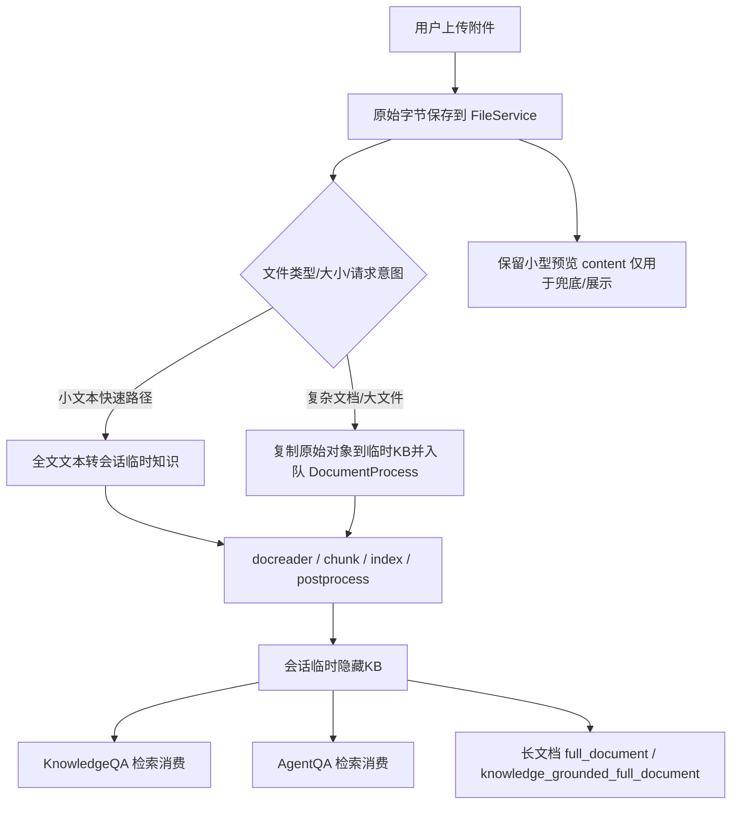

# 附件文档增强解析与知识化处理修正方案

## 1. 目标

基于 [my_docs/20260706-02-附件上传问答整体流程审查报告.md](my_docs/20260706-02-附件上传问答整体流程审查报告.md) 的结论，本方案要解决的不是“把 500 行上限调大一点”，而是把聊天附件尽可能接入当前系统已经具备的完整能力链：

1. 文档解析引擎能力。
2. 多模态图片解析能力。
3. Go chunker 切分能力。
4. 向量/关键词索引能力。
5. 摘要、问题生成、图谱、Wiki 等后处理能力。
6. 已有的隐藏临时知识库与会话态清理能力。
7. 长文档模式与知识增强问答能力。

目标不是让附件继续作为“拼进 prompt 的一段截断文本”，而是让附件在需要时升级成**可检索、可追踪、可复用、可清理**的会话级知识。

## 2. 审查结论

### 2.1 当前附件链路最大的问题，不是“没有解析”，而是“解析完被丢弃”

当前附件处理并不只是简单保留前 500 行。对于非纯文本文件，后端其实已经调用了解析器：

- [internal/handler/session/attachment_processor.go](internal/handler/session/attachment_processor.go#L111)
- [internal/handler/session/attachment_processor.go](internal/handler/session/attachment_processor.go#L116)

在 `processWithDocParser()` 和 `processWithDocumentReader()` 里，系统已经拿到了完整的 `ReadResult.MarkdownContent`，并且还会解析内嵌图片并回写 provider URL：

- [internal/handler/session/attachment_processor.go](internal/handler/session/attachment_processor.go#L153)
- [internal/handler/session/attachment_processor.go](internal/handler/session/attachment_processor.go#L210)

但随后这些完整结果会被 `applyLineTruncation()` 压成前 500 行：

- [internal/handler/session/attachment_processor.go](internal/handler/session/attachment_processor.go#L287)

这意味着当前系统已经支付了“完整解析”的成本，却只保留了“截断预览”的产物。这是本次增强方案最关键的出发点。

### 2.2 当前附件链路完全绕过知识库能力

附件在 `parseQARequest()` 中被解码、保存、解析后，只会进入 `req.Attachments`，然后以 `BuildPrompt()` 的形式追加到普通问答上下文：

- [internal/handler/session/qa.go](internal/handler/session/qa.go#L1398)
- [internal/application/service/session_agent_qa.go](internal/application/service/session_agent_qa.go#L237)
- [internal/application/service/session_knowledge_qa.go](internal/application/service/session_knowledge_qa.go#L200)
- [internal/types/message.go](internal/types/message.go#L90)

也就是说，附件当前具备的是：

- 原始字节存储。
- 简单预览文本注入。

附件当前缺失的是：

- `Knowledge` 记录。
- `DocumentProcess` 解析任务。
- `chunk` 落库。
- 向量/关键词索引。
- 检索复用。
- 会话级生命周期管理。

这也是为什么附件场景无法最大程度复用现有知识库能力。

### 2.3 当前系统已经具备实现“附件知识化”的关键基础设施

本次审查确认，现有代码已经具备做成“附件临时知识化”的三类关键基础设施。

#### 2.3.1 隐藏临时知识库已经存在

`KnowledgeBase` 本身就支持 `IsTemporary=true`，并且 UI/查询层会自动过滤掉临时 KB：

- [internal/types/knowledgebase.go](internal/types/knowledgebase.go#L59)
- [internal/utils/inject.go](internal/utils/inject.go#L622)

`web_search` 已经在生产代码里使用这一模式：

- [internal/application/service/web_search.go](internal/application/service/web_search.go#L142)
- [internal/application/service/web_search_state.go](internal/application/service/web_search_state.go#L30)

这说明“会话内临时隐藏 KB”不是新概念，而是现成模式。

#### 2.3.2 完整文档入库流水线已经存在

标准知识文件上传会走：

1. `CreateKnowledgeFromFile()` 保存文件并创建 `Knowledge` 记录：[internal/application/service/knowledge_create.go](internal/application/service/knowledge_create.go#L45)
2. 组装 `DocumentProcessPayload` 并入队 `TypeDocumentProcess`：[internal/application/service/knowledge_create.go](internal/application/service/knowledge_create.go#L263)
3. `ProcessDocument()` 调用 docreader / parser engine，执行切分、向量索引、多模态、后处理：[internal/application/service/knowledge_process.go](internal/application/service/knowledge_process.go#L2665)
4. `KnowledgePostProcessService` 进一步触发摘要、问题生成、图谱、Wiki 等能力：[internal/application/service/knowledge_post_process.go](internal/application/service/knowledge_post_process.go#L18)

尤其在 `convert()` 中，系统已经具备：

- 统一 `ReadRequest` / `ReadResult` 模型：[internal/types/docparser.go](internal/types/docparser.go)
- tenant 级 parser override 合并：[internal/application/service/knowledge_process.go](internal/application/service/knowledge_process.go#L3102)
- docreader 调用超时控制：[internal/application/service/knowledge_process.go](internal/application/service/knowledge_process.go#L3197)
- URL/file 双模式读取：[internal/application/service/knowledge_process.go](internal/application/service/knowledge_process.go#L3078)

附件能力最应该复用的，就是这整条成熟链路，而不是另写一套简化解析器。

#### 2.3.3 文件服务已经支持同 backend 的对象复制

`FileService` 已经定义了 `CopyFile()`：

- [internal/types/interfaces/file.go](internal/types/interfaces/file.go#L11)

各 provider 都实现了“把已有对象复制到新的 knowledge-owned 路径”：

- MinIO：[internal/application/service/file/minio.go](internal/application/service/file/minio.go#L168)
- local：[internal/application/service/file/local.go](internal/application/service/file/local.go#L157)
- S3：[internal/application/service/file/s3.go](internal/application/service/file/s3.go#L250)

知识库克隆/移动也已经在复用这一能力：

- [internal/application/service/knowledge_clone_move.go](internal/application/service/knowledge_clone_move.go#L23)

这意味着，附件想升级为知识库文件，并不一定需要重新上传原始字节；在同 backend 情况下可以直接 server-side copy。

## 3. 当前设计的根因问题

### 3.1 “聊天附件”与“知识文件”被切成了两条互不复用的链

当前架构把文件处理分成两套：

1. 聊天附件：`AttachmentProcessor -> MessageAttachment.Content -> BuildPrompt()`。
2. 知识上传：`CreateKnowledgeFromFile -> DocumentProcess -> chunk/index/postprocess`。

问题不是两套链都存在，而是当前附件链完全没有通向知识链的提升路径。

### 3.2 500 行只是症状，真正的问题是“缺少全文证据承载层”

如果只把 `maxTextFileLines` 从 500 改到 5000：

- prompt 体积会迅速膨胀。
- 多附件时上下文更容易爆。
- 不会获得检索、切分、索引、长文档 grounding 能力。

因此，真正需要替换的不是“500 行这个值”，而是“只靠 `BuildPrompt()` 承载附件全文证据”这件事本身。

### 3.3 现有 `KnowledgeService` 缺少“从已存储附件路径创建知识”的入口

当前接口只提供：

- `CreateKnowledgeFromFile()`
- `CreateKnowledgeFromURL()`
- `CreateKnowledgeFromPassage()` / `CreateKnowledgeFromPassageSync()`
- `CreateKnowledgeFromManual()`

见：[internal/types/interfaces/knowledge.go](internal/types/interfaces/knowledge.go#L12)

但没有“从已有 `provider://path` 文件创建知识”的接口。这是附件复用知识流水线的主要缺口。

## 4. 目标架构

建议把附件处理拆成三层，不再让“截断文本”承担全部职责：

1. **原始附件层**：保存原始字节和基础元数据。
2. **附件知识化层**：把附件提升为会话级临时知识。
3. **问答/长文档消费层**：优先用检索结果，不再直接吃全文 prompt。

推荐的总体链路如下：



## 5. 方案设计

### 5.1 核心原则

#### 原则 1：`MessageAttachment.Content` 只做预览，不再承担全文证据职责

当前 `types.MessageAttachment` 里的 `Content` 已经被聊天链路广泛消费，短期不建议把它改成“全文字段”。

建议保留：

- `Content`：预览/兜底文本。
- `IsTruncated` / `LineCount`：提示预览是否截断。

但全文能力应转移到：

- 临时知识库中的 `Knowledge` + `Chunk`。
- 或单独的“解析快照对象”。

这样可以避免把超大文档内容塞进消息 JSON，导致消息记录膨胀。

#### 原则 2：优先复用已有知识流水线，不另造第二套文档处理系统

对于复杂文档，最应该复用的是：

- `DocumentProcess`
- `convert()`
- `chunker.Split()` / `SplitParentChild()`
- vector / keyword indexing
- multimodal OCR / caption
- summary / question generation / wiki / graph

这些能力已经在线上跑通，重复造轮子只会引入第二套不一致逻辑。

#### 原则 3：区分“预览”和“检索”两种时序目标

上传后立刻回答，需要的是低延迟；后续多轮问答/长文档，需要的是高质量全文证据。

因此不能再用一个 `Content` 字段同时满足：

- 首轮快速展示。
- 后续全文 grounding。

建议把这两个目标拆开。

### 5.2 推荐方案：会话级隐藏临时 KB + 附件知识化

这是本次审查推荐的主方案。

#### 5.2.1 为每个聊天 Session 维护一个附件临时 KB

直接复用 web_search 的模式：

- `KnowledgeBase.IsTemporary=true`：[internal/types/knowledgebase.go](internal/types/knowledgebase.go#L59)
- Redis 维护 `sessionID -> tempKBID + knowledgeIDs`：[internal/application/service/web_search_state.go](internal/application/service/web_search_state.go#L30)

建议新增一组附件专用状态服务，模式与 web_search_state 类似：

- `GetAttachmentTempKBState(sessionID)`
- `SaveAttachmentTempKBState(sessionID, kbID, knowledgeIDs, attachmentMap)`
- `DeleteAttachmentTempKBState(sessionID)`

与 web_search 的区别在于，附件临时 KB 不是一次性工具结果，而是会话内文档证据池。

#### 5.2.2 附件上传后，优先物化为临时知识，而不是只拼进 prompt

##### 路线 A：小文本快速路径

对于：

- `.txt/.md/.markdown/.json/.xml/.yaml/.yml/.csv/.log`
- 且总大小/总行数在可控阈值内

可直接使用全文内容走 `CreateKnowledgeFromPassageSync()`：

- [internal/application/service/knowledge_create.go](internal/application/service/knowledge_create.go#L753)

优点：

- 无需再走 docreader。
- 可同步得到可检索 chunk。
- 首轮问答可直接等待其完成，再进入 QA。

缺点：

- 只能处理文本段落，不适合复杂文件、多模态图片、原始文件复用。

建议把它作为“小文本快车道”。

##### 路线 B：复杂文档/大文件标准路径

对于：

- PDF、DOCX、PPTX、XLSX、EPUB、MHTML
- 图片、音频
- 超过快车道阈值的长文本

建议新增 `CreateKnowledgeFromStoredFile()` 或同义方法：

输入建议：

- `kbID`
- `attachmentURL`
- `fileName`
- `fileType`
- `fileSize`
- `channel`
- `processOverrides`

实现建议：

1. 创建 `Knowledge` 记录。
2. 目标 file service 由 `resolveFileService(ctx, kb)` 决定：[internal/application/service/knowledge_util.go](internal/application/service/knowledge_util.go#L241)
3. 如果附件 provider 与目标 KB provider 相同：
   - 直接 `dstSvc.CopyFile(ctx, srcPath, tenantID, knowledgeID)`。
4. 如果是跨 provider：
   - `srcSvc.GetFile(ctx, srcPath)` + `dstSvc.SaveBytes(...)` 做流式复制。
5. 生成 `DocumentProcessPayload` 入队，完整复用 `ProcessDocument()`：[internal/application/service/knowledge_create.go](internal/application/service/knowledge_create.go#L263)

这里最关键的是：

- 当前仓库已经有 `CopyFile()` 接口和 `copyOwnedObject()` 模式。
- 缺的是“附件到知识”的入口，而不是底层文件复制能力。

### 5.3 推荐的处理分层

#### P0 层：原始对象必须保留

继续保留现在的 `SaveBytes()` 行为：

- [internal/handler/session/attachment_processor.go](internal/handler/session/attachment_processor.go#L88)

这是所有后续能力的根基：

- 失败重试。
- 异步物化。
- 下载原件。
- 从附件转正式知识。

#### P1 层：预览内容不再是“前 500 行唯一证据”

建议调整为：

1. 保留 `Content` 作为 preview。
2. preview 生成方式改为按类型动态选择：
   - 小文本：全文或更大阈值。
   - 长文本：head + middle + tail 采样，参考 `sampleLongContent()` 的策略：[internal/application/service/knowledge_process.go](internal/application/service/knowledge_process.go#L820)
   - 复杂文档：优先用解析结果摘要，而不是机械截断。

这样做的意义是：

- prompt 仍可控。
- 用户看到的预览更有代表性。
- 但全文证据不再依赖 preview。

#### P2 层：检索和长文档只消费临时 KB，不再直接吃大段附件全文

一旦附件物化为临时知识：

- `KnowledgeQA` 不应再把整段 `BuildPrompt()` 作为主证据，只保留 metadata 或极短 preview。
- `AgentQA` 同理，不应在 temp KB ready 后继续把首 500 行拼进 `agentQuery`。
- 长文档路由若命中附件相关 full_document，应等待附件 temp KB ready，并把该 KB 作为有效知识范围，走 `knowledge_grounded_full_document`。

这一步能直接解决“根据附件生成完整方案时只看到前 500 行”的问题。

### 5.4 为什么不建议直接把 `maxTextFileLines` 提到无限大

原因很简单：

1. 普通 AgentQA/KnowledgeQA 不是长文档专用流水线。
2. 多附件情况下全文直塞 prompt 很快会超上下文预算。
3. 一次性全文注入没有 chunking，没有检索，没有定位，不具备可恢复性。

因此本方案明确反对“把当前 prompt 改成全文上传”，推荐的是“全文知识化”。

### 5.5 长文档场景如何最大化利用当前系统能力

结合前一份长文档报告，本次附件增强必须直接服务于长文档模式。

建议规则：

1. 用户请求是“根据附件生成完整方案/完整报告/全文翻译”时：
   - 优先启动附件物化。
   - 等附件 temp KB 至少进入 `indexed/ready`。
   - 再进入 `knowledge_grounded_full_document`。

2. 如果附件物化尚未完成：
   - 不再降级为普通 Agent 直接消费前 500 行。
   - 改为流式显示“正在解析附件并建立检索索引”。

3. 附件 temp KB ready 后，长文档链路复用现有 KB 检索和 section-evidence 逻辑，不再特殊对待附件。

这能把“附件驱动长文档”收敛回统一的知识增强长文档主链路。

## 6. 代码修改建议

### 6.1 `internal/handler/session/attachment_processor.go`

建议职责调整：

1. 把当前同步解析的结果从“只生成 preview”升级为“生成 preview + 解析结果对象”。
2. 不要在该层直接把全文塞回 `MessageAttachment.Content`。
3. 把 `processWithDocParser()` / `processWithDocumentReader()` 的完整输出传给上层决策。

建议新增中间结果结构，例如：

```go
type AttachmentProcessResult struct {
    Attachment        *types.MessageAttachment
    FullText          string
    MarkdownContent   string
    Metadata          map[string]string
    StoredImages      []docparser.StoredImage
    IsTextLike        bool
    CanFastMaterialize bool
}
```

这里的核心不是字段名，而是把“预览产物”和“完整解析产物”分开。

### 6.2 `internal/types/interfaces/knowledge.go` 与 `knowledge_create.go`

建议新增一个知识服务入口，例如：

```go
CreateKnowledgeFromStoredFile(
    ctx context.Context,
    kbID string,
    filePath string,
    fileName string,
    fileType string,
    fileSize int64,
    channel string,
    processOverrides *types.KnowledgeProcessOverrides,
) (*types.Knowledge, error)
```

必要性：

- 当前只有 multipart/URL/passage/manual 入口。
- 聊天附件已经保存成 `provider://path`，再强行回转 multipart 不自然，也浪费资源。

实现上：

- 复用 `CreateKnowledgeFromFile()` 的大部分逻辑。
- 唯一区别是文件来源改成“已有 path + CopyFile/streaming fallback”。

### 6.3 新增 `AttachmentTempKBStateService`

参考：

- [internal/application/service/web_search_state.go](internal/application/service/web_search_state.go)

建议新增：

- `GetAttachmentTempKBState(sessionID)`
- `SaveAttachmentTempKBState(sessionID, kbID, knowledgeIDs, attachments)`
- `DeleteAttachmentTempKBState(sessionID)`

状态至少要记录：

- `tempKBID`
- `knowledgeIDs`
- `attachmentURL -> knowledgeID`
- `parse_status`
- `created_at`

### 6.4 `internal/handler/session/qa.go`

当前 `parseQARequest()` 只做了：

- 处理附件
- 保存 `processedAttachments`

建议增加：

1. 根据附件类型和用户请求意图，决定是否物化附件知识。
2. 对需要全文能力的请求：
   - 先物化临时知识。
   - 再构造 `qaRequestContext`。
3. 当 temp KB ready 时，把其 KBID 注入本轮有效知识范围。

这样当前 QA 主链就能直接消费附件临时 KB，而不是继续依赖 `BuildPrompt()`。

### 6.5 `internal/application/service/session_agent_qa.go` / `session_knowledge_qa.go`

建议增加一条简单规则：

- 若本轮已存在 ready 的附件 temp KB，则 `BuildPrompt()` 只保留附件 metadata/摘要，不再把全文 preview 当主证据。

当前：

- [internal/application/service/session_agent_qa.go](internal/application/service/session_agent_qa.go#L237)
- [internal/application/service/session_knowledge_qa.go](internal/application/service/session_knowledge_qa.go#L200)

这两处都应该从“全文注入”切换成“KB ready 前兜底注入、KB ready 后弱注入”。

### 6.6 `internal/application/service/knowledge_process.go`

这里不需要重写主逻辑，重点是复用：

- `convert()`：[internal/application/service/knowledge_process.go](internal/application/service/knowledge_process.go#L3078)
- `chunker.Split` / `SplitParentChild()`：[internal/application/service/knowledge_process.go](internal/application/service/knowledge_process.go#L3021)
- embedding / keyword indexing / multimodal / postprocess：[internal/application/service/knowledge_process.go](internal/application/service/knowledge_process.go#L560)

如果后续追求极致性能，可以在 P1/P2 再考虑新增 `CreateKnowledgeFromReadResult()`，避免对已经在附件处理器里解析过的复杂文档再次调用 docreader。

### 6.7 前端展示建议

当前前端只知道“附件上传成功”，不知道“附件知识化是否完成”。

建议新增：

1. 附件处理状态展示：
   - 已上传
   - 解析中
   - 建索引中
   - 可用于问答
2. 对需要全文 grounding 的请求：
   - 若附件仍在处理，输入发送后显示附件处理进度而不是立即给普通回答。
3. 提供“保存到正式知识库”入口：
   - 把 temp KB 中对应 knowledge 移动/克隆到用户指定 KB。

## 7. 推荐实施路线

### P0：让附件进入临时隐藏 KB，并参与问答检索

目标：不再只靠前 500 行问答。

实现：

1. 新增 `AttachmentTempKBStateService`。
2. 新增 `CreateKnowledgeFromStoredFile()`。
3. `qa.go` 中对附件启用临时知识物化。
4. 本轮检索自动带上 attachment temp KB。

预期收益：

- 普通问答和 AgentQA 都可基于全文 chunk 检索。
- 500 行截断从“唯一证据”退化为“展示预览”。

### P1：让长文档模式直接吃附件临时 KB

目标：附件驱动的完整方案/完整报告不再退回普通 Agent prompt。

实现：

1. 附件 temp KB ready 后，再做长文档 route finalization。
2. 对附件全文生成类请求，统一切到 `knowledge_grounded_full_document`。
3. 未 ready 时流式展示“附件解析/索引进度”。

预期收益：

- “根据附件生成完整技术方案”真正进入知识增强长文档主链。

### P2：避免重复解析，支持 parse-once / reuse-many

目标：减少重复 docreader 调用。

实现：

1. 扩展附件处理器返回完整 `ReadResult` 级别中间结果。
2. 新增 `CreateKnowledgeFromReadResult()` 或等价入口。
3. 对已经同步解析过的复杂附件，直接进入 chunk/index/postprocess，而不是再跑一次 `convert()`。

预期收益：

- 降低复杂文档首轮处理时延。
- 减少 docreader 资源消耗。

### P3：附件临时知识到正式知识库的提升/沉淀

目标：会话附件可沉淀。

实现：

1. 提供“保存到知识库”入口。
2. 对 temp KB knowledge 执行 move/clone 到正式 KB。
3. 保留已有 chunk/index，避免重新解析。

## 8. 风险与边界

### 8.1 不建议默认开启所有后处理能力

虽然当前系统支持 summary / question generation / graph / wiki：

- [internal/application/service/knowledge_post_process.go](internal/application/service/knowledge_post_process.go#L139)

但对会话附件建议默认策略是：

- 启用：docreader、chunking、vector/keyword index、必要时 multimodal。
- 视预算启用：summary、question generation。
- 默认关闭：wiki、graph（除非用户显式需要）。

原因：

- 会话附件的主要目标是“高质量问答/长文档 grounding”，不是构建长期知识资产。
- 全开会显著拉长首轮可用时间。

### 8.2 不能把完整附件正文直接塞回消息 JSON

`MessageAttachment.Content` 若变成全文字段，会带来：

- 消息表膨胀。
- SSE/历史加载体积过大。
- 前端渲染风险上升。

全文证据应存在：

- 临时 KB knowledge/chunk。
- 或单独的解析快照对象。

### 8.3 需要明确清理策略

附件临时 KB 若没有清理，会形成新的垃圾数据来源。

建议：

1. session 删除时清理。
2. session 长时间无活动时 TTL 清理。
3. 成功提升到正式 KB 后删除 temp KB knowledge。

## 9. 最终建议

本次审查的核心结论是：

1. 当前附件链已经调用了解析器，但把完整结果丢掉了。
2. 当前系统已经具备临时隐藏 KB、文件复制、文档处理、chunk/index/postprocess 的完整基础设施。
3. 真正缺的不是“把 500 改大”，而是“附件到知识库流水线”的桥。

因此最合理的修正方向不是继续增强 `BuildPrompt()`，而是：

> 把附件从“prompt 预览文本”升级成“会话级临时知识”，再让现有 QA 和长文档链路统一消费这份知识。

这条路线最能复用现有代码，也最符合当前系统的能力边界。

如果只做一个最小但有效的改动，我建议优先落地：

1. `CreateKnowledgeFromStoredFile()`
2. `AttachmentTempKBStateService`
3. `qa.go` 自动把当前轮附件物化到隐藏 temp KB
4. `session_agent_qa.go` / `session_knowledge_qa.go` 在 temp KB ready 后不再依赖前 500 行

这样就能让附件文档最大程度调用当前系统已有的解析、存储、切分、检索和长文档能力，而不是继续停留在“只保留前 500 行”的弱模式。