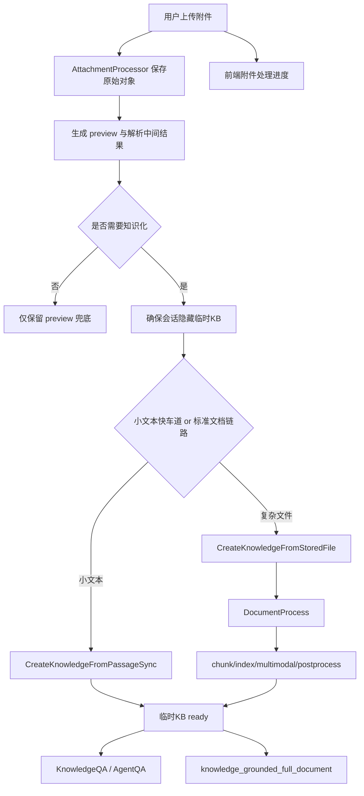

# 附件知识化与长文档一体化实施方案

## 1. 文档目的

本方案合并以下两份审查结论：

- [my_docs/20260706-01-长文档智能路由命中后未进入执行流程审查报告.md](my_docs/20260706-01-长文档智能路由命中后未进入执行流程审查报告.md)
- [my_docs/20260706-03-附件文档增强解析与知识化处理修正方案.md](my_docs/20260706-03-附件文档增强解析与知识化处理修正方案.md)

目标是形成一份后续可直接执行的完整实施方案，统一解决两类问题：

1. 聊天附件当前只保留前 500 行，无法最大化复用现有解析、切分、索引、检索和后处理能力。
2. 附件场景下，即便智能路由已经识别为长文档，后端仍因“有附件”门禁而拒绝进入长文档执行链路。

本方案的最终目标不是修补两个独立问题，而是把它们收敛成一套统一设计：

> 附件上传后先被知识化为会话级临时知识，再由普通问答、AgentQA、知识增强长文档和全文类生成统一消费这份知识。

## 2. 最终目标状态

系统完成改造后，应满足以下行为：

1. 用户上传附件后，系统不再只依赖 `MessageAttachment.Content` 的前 500 行预览，而是优先将附件物化为会话级隐藏临时知识。
2. 普通问答、AgentQA、长文档完整生成、完整翻译等场景，统一优先使用附件临时知识的检索结果，而不是直接把全文或前 500 行拼进 prompt。
3. 对于“根据附件生成完整方案/完整报告/完整长文档”这类请求，智能路由一旦判定为 `full_document` 或 `knowledge_grounded_full_document`，后端不得再因为附件存在而降级回普通 QA。
4. 附件的全文解析、图片提取、多模态 OCR/Caption、chunk 切分、向量索引、关键词索引、摘要、问题生成等能力，都应尽量复用现有知识库流水线，而不是新造第二套附件专用处理引擎。
5. 会话结束、会话删除或 TTL 到期后，附件临时知识及其隐藏临时 KB 能自动清理，不污染正常知识库列表。

## 3. 当前问题总览

### 3.1 附件已经被完整解析，但解析结果没有进入可检索体系

当前附件处理器并不只是保存原始文件。对于复杂文档和简单格式，后端已经调用了解析器：

- [internal/handler/session/attachment_processor.go](internal/handler/session/attachment_processor.go#L99)
- [internal/handler/session/attachment_processor.go](internal/handler/session/attachment_processor.go#L111)
- [internal/handler/session/attachment_processor.go](internal/handler/session/attachment_processor.go#L116)

并且会拿到：

- `ReadResult.MarkdownContent`
- `ImageRefs`
- `Metadata`
- 对内嵌图片的 provider URL 回写

但这些完整结果最终都会被压缩成 `MessageAttachment.Content` 里的预览文本，并且在文本、Markdown、音频三条路径上都被 `maxTextFileLines = 500` 截断：

- [internal/handler/session/attachment_processor.go](internal/handler/session/attachment_processor.go#L23)
- [internal/handler/session/attachment_processor.go](internal/handler/session/attachment_processor.go#L137)
- [internal/handler/session/attachment_processor.go](internal/handler/session/attachment_processor.go#L287)

结果是：

- 系统已经付出了完整解析成本。
- 却没有把完整结果转成可检索知识。
- 最终只有一段截断预览被继续使用。

### 3.2 附件链路完全绕过知识库主流水线

附件处理完后，只会进入：

- 普通问答的 `userContent += req.Attachments.BuildPrompt()`：[internal/application/service/session_knowledge_qa.go](internal/application/service/session_knowledge_qa.go#L200)
- AgentQA 的 `agentQuery += req.Attachments.BuildPrompt()`：[internal/application/service/session_agent_qa.go](internal/application/service/session_agent_qa.go#L237)

这条链路没有进入：

- `Knowledge` 记录创建
- `DocumentProcess`
- `chunk` 落库
- 向量/关键词索引
- `KnowledgePostProcess`

也就是说，附件当前只是“对话输入增强”，不是“知识输入”。

### 3.3 附件场景下，长文档路由被多层门禁拦截

当前长文档问题的核心不是“模型没识别出来”，而是“识别出来也不给走”。

已确认的阻断点包括：

1. 路由提示词把“有附件/图片”作为不优先进入新建长文档的信号：[internal/application/service/chat_route_service.go](internal/application/service/chat_route_service.go#L120)
2. regex fallback 在 `HasAttachments=true` 时不允许升级成长文档：[internal/application/service/chat_route_service.go](internal/application/service/chat_route_service.go#L210)
3. Handler 应用路由时，`full_document` / `knowledge_grounded_full_document` 遇到附件直接拒绝：[internal/handler/session/chat_route.go](internal/handler/session/chat_route.go#L291)
4. 执行层的 `shouldUseKnowledgeGroundedFullDocumentGenerationPath()` 和 `shouldUseDedicatedFullDocumentGenerationPath()` 都把附件当成禁入条件：[internal/application/service/session_agent_qa.go](internal/application/service/session_agent_qa.go#L474)、[internal/application/service/session_agent_qa.go](internal/application/service/session_agent_qa.go#L534)

因此，当前实现本质上是在保护一条错误约束：

> 只要是新建完整长文档，带附件就不能走长文档执行链路。

### 3.4 即使只放开门禁，现有长文档链路也不会真正使用附件全文

当前专用长文档路径里，大纲和章节提示词都不会使用附件正文：

- [internal/application/service/session_agent_qa.go](internal/application/service/session_agent_qa.go#L2398)
- [internal/application/service/session_agent_qa.go](internal/application/service/session_agent_qa.go#L2419)
- [internal/application/service/session_agent_qa.go](internal/application/service/session_agent_qa.go#L3845)
- [internal/application/service/session_agent_qa.go](internal/application/service/session_agent_qa.go#L3892)

因此，单纯删除门禁只能让“流程进入长文档”，不能让“长文档真正基于附件全文生成”。

## 4. 已有能力盘点

本方案之所以可执行，是因为当前系统已经具备实现目标的关键基础设施。

### 4.1 隐藏临时 KB 已经存在并在线上使用

`KnowledgeBase` 已有 `IsTemporary` 字段：

- [internal/types/knowledgebase.go](internal/types/knowledgebase.go#L59)

UI/查询层已会过滤临时 KB：

- [internal/utils/inject.go](internal/utils/inject.go#L622)
- [internal/application/repository/knowledgebase.go](internal/application/repository/knowledgebase.go)

`web_search` 已经在生产代码里使用“会话级临时隐藏 KB”：

- 创建临时 KB：[internal/application/service/web_search.go](internal/application/service/web_search.go#L142)
- Redis 存状态：[internal/application/service/web_search_state.go](internal/application/service/web_search_state.go#L30)
- 会话删除时清理：[internal/application/service/session.go](internal/application/service/session.go#L358)

这说明“会话内临时知识库”不需要新发明，而可以直接复用既有模式。

### 4.2 知识文件主流水线已经成熟

标准知识上传现在走的是完整主链：

1. `CreateKnowledgeFromFile()` 保存文件并创建 `Knowledge`：[internal/application/service/knowledge_create.go](internal/application/service/knowledge_create.go#L45)
2. 组装 `DocumentProcessPayload` 并入队：[internal/application/service/knowledge_create.go](internal/application/service/knowledge_create.go#L263)
3. `ProcessDocument()` 调用 docreader / parser engine / chunker / indexing：[internal/application/service/knowledge_process.go](internal/application/service/knowledge_process.go#L2665)
4. `KnowledgePostProcessService` 继续做 summary / question / graph / wiki 等：[internal/application/service/knowledge_post_process.go](internal/application/service/knowledge_post_process.go#L18)

`convert()` 里已经具备：

- `ReadRequest` / `ReadResult` 统一模型：[internal/types/docparser.go](internal/types/docparser.go)
- parser override 合并：[internal/application/service/knowledge_process.go](internal/application/service/knowledge_process.go#L3102)
- docreader 调用超时控制：[internal/application/service/knowledge_process.go](internal/application/service/knowledge_process.go#L3197)
- 文件读取与 URL 读取统一承载：[internal/application/service/knowledge_process.go](internal/application/service/knowledge_process.go#L3078)

### 4.3 文件服务已支持 server-side 复制

`FileService` 已支持 `CopyFile()`：

- [internal/types/interfaces/file.go](internal/types/interfaces/file.go#L11)

不同 provider 已实现 server-side copy 或等效复制：

- local：[internal/application/service/file/local.go](internal/application/service/file/local.go#L157)
- minio：[internal/application/service/file/minio.go](internal/application/service/file/minio.go#L168)
- s3：[internal/application/service/file/s3.go](internal/application/service/file/s3.go#L250)

知识克隆/移动已复用这条能力：

- [internal/application/service/knowledge_clone_move.go](internal/application/service/knowledge_clone_move.go#L23)

这意味着附件物化成知识库文件时，不必强制重新上传原始 bytes；同 backend 时可以直接 copy。

## 5. 选定架构

### 5.1 总体思路

选定方案是：

> 把聊天附件升级为会话级隐藏临时知识，再让普通问答、AgentQA 与长文档统一消费这份知识。

而不是继续维护一条“附件预览 prompt”主链。

### 5.2 三层模型

建议把附件处理拆成三层：

1. 原始附件层
   - 保存原始字节与基础元数据。
   - 保留下载、重试、复制、重新解析能力。

2. 附件知识化层
   - 将附件提升为会话级临时知识。
   - 复用标准 `DocumentProcess -> chunk/index/postprocess`。

3. 消费层
   - 普通问答、AgentQA、长文档、完整翻译统一优先消费临时知识检索结果。

### 5.3 目标流程



## 6. 关键设计决策

### 6.1 `MessageAttachment.Content` 只保留预览职责

不建议把 `MessageAttachment.Content` 改成全文字段。原因：

1. 会让消息体和 SSE payload 急剧膨胀。
2. 历史消息回放成本上升。
3. 无法自然承载检索、切分、索引和长文档 grounding。

因此：

- `Content` 继续做 preview / 兜底。
- 全文证据迁移到临时 KB 的 `Knowledge` / `Chunk`。

### 6.2 预览与全文能力解耦

当前 500 行机制的问题不是“太短”，而是“把 preview 当全文”。

改造后：

- preview 继续存在，用于即时展示、兜底与低风险场景。
- 全文能力通过临时 KB 提供。

这样就算 preview 继续保留 head/middle/tail 采样，也不会影响后续全文问答质量。

### 6.3 长文档必须消费附件临时 KB，而不是原始 preview

长文档一旦涉及附件全文生成，必须保证：

1. 路由层不再把附件当禁入条件。
2. 路由命中后使用附件 temp KB 形成有效知识范围。
3. `full_document` 场景统一转为 `knowledge_grounded_full_document`，即使原始 Agent 没配固定知识库。

因为此时“会话内附件临时 KB”本身就是有效知识范围。

### 6.4 小文本与复杂文件采用两条物化路径

#### 小文本快车道

适用类型：

- `.txt/.md/.markdown/.json/.xml/.yaml/.yml/.csv/.log`
- 且大小、行数在阈值内

做法：

- 直接使用全文内容调用 `CreateKnowledgeFromPassageSync()`：[internal/application/service/knowledge_create.go](internal/application/service/knowledge_create.go#L753)

收益：

- 无需再跑 docreader。
- 可在首轮问答内同步完成知识化。

#### 复杂文件标准链路

适用类型：

- PDF、DOCX、PPTX、XLSX、EPUB、MHTML
- 图片、音频
- 超过快车道阈值的长文本

做法：

- 新增 `CreateKnowledgeFromStoredFile()`，复用现有文件与文档处理主链。

收益：

- 最大化复用 `ProcessDocument()`、多模态、切分和索引能力。

## 7. 需要新增或调整的后端能力

### 7.1 新增 `AttachmentProcessResult`

当前 `AttachmentProcessor.ProcessAttachment()` 只返回 `*types.MessageAttachment`，信息不足以指导后续知识化。

建议新增一个中间结果模型，例如：

```go
type AttachmentProcessResult struct {
    Attachment         *types.MessageAttachment
    PreviewContent     string
    FullText           string
    MarkdownContent    string
    Metadata           map[string]string
    StoredImages       []docparser.StoredImage
    IsTextLike         bool
    CanFastMaterialize bool
}
```

核心目的不是字段名，而是把：

- 原始存储结果
- preview
- 完整解析结果

从一开始拆开，不再混在 `MessageAttachment.Content` 里。

涉及文件：

- [internal/handler/session/attachment_processor.go](internal/handler/session/attachment_processor.go)
- [internal/types/message.go](internal/types/message.go)

### 7.2 新增 `CreateKnowledgeFromStoredFile()`

当前 `KnowledgeService` 没有“从已有 `provider://path` 文件创建知识”的入口：

- [internal/types/interfaces/knowledge.go](internal/types/interfaces/knowledge.go#L12)

建议新增：

```go
CreateKnowledgeFromStoredFile(
    ctx context.Context,
    kbID string,
    filePath string,
    fileName string,
    fileType string,
    fileSize int64,
    channel string,
    processOverrides *types.KnowledgeProcessOverrides,
) (*types.Knowledge, error)
```

实现要求：

1. 复用 `CreateKnowledgeFromFile()` 的主要流程。
2. 文件来源改为：
   - 同 backend：`dstSvc.CopyFile()`。
   - 跨 backend：`srcSvc.GetFile()` + `dstSvc.SaveBytes()`。
3. 生成 `Knowledge` 记录。
4. 复用 `DocumentProcessPayload` 入队。

涉及文件：

- [internal/types/interfaces/knowledge.go](internal/types/interfaces/knowledge.go)
- [internal/application/service/knowledge_create.go](internal/application/service/knowledge_create.go)
- [internal/application/service/knowledge_util.go](internal/application/service/knowledge_util.go)

### 7.3 新增 `AttachmentTempKBStateService`

直接复用 web_search_state 的模式：

- [internal/application/service/web_search_state.go](internal/application/service/web_search_state.go)

建议新增：

- `GetAttachmentTempKBState(sessionID)`
- `SaveAttachmentTempKBState(sessionID, kbID, knowledgeIDs, attachmentMap)`
- `DeleteAttachmentTempKBState(sessionID)`

状态至少记录：

- `tempKBID`
- `knowledgeIDs`
- `attachmentURL -> knowledgeID`
- `parse_status`
- `updated_at`

优先实现建议：

- 第一版用 Redis 存储，与 web_search 保持一致。
- 暂不引入新表，避免数据库迁移。

涉及文件：

- 新增 `internal/application/service/attachment_temp_kb_state.go`
- 新增 `internal/types/interfaces/attachment_temp_kb_state.go`
- 更新 [internal/application/service/session.go](internal/application/service/session.go#L358) 会话清理链路

### 7.4 在 `qa.go` 中引入“附件知识化编排”

当前 [internal/handler/session/qa.go](internal/handler/session/qa.go#L1398) 只做了附件解析和保存。

建议在 `parseQARequest()` 中加入新的编排步骤：

1. 解析附件并拿到 `AttachmentProcessResult`。
2. 基于：
   - 附件类型
   - 附件大小
   - 用户请求是否需要全文 grounding
   - 是否是长文档/完整翻译

   决定是否启动附件知识化。

3. 若启动知识化：
   - 确保会话存在附件 temp KB。
   - 把附件物化为临时知识。
   - 将 temp KB 注入本轮有效知识范围。

4. 构造 `qaRequestContext` 时，带上：
   - `attachmentTempKBID`
   - `attachmentKnowledgeIDs`
   - `attachmentMaterializationStatus`

这样路由和执行层就能基于附件 temp KB 决策，而不是只看到 `Attachments`。

涉及文件：

- [internal/handler/session/qa.go](internal/handler/session/qa.go)
- [internal/handler/session/types.go](internal/handler/session/types.go)
- [internal/types/qa_request.go](internal/types/qa_request.go)

### 7.5 调整长文档路由：从“附件门禁”改为“附件知识 ready 判定”

建议的路由逻辑变更如下：

1. 若存在 `attachmentTempKBID` 且状态 ready：
   - `HasSelectedKnowledge=true`
   - `HasEffectiveAgentKB=true`
   - 附件不再视为长文档禁入条件

2. 对“根据附件生成完整方案/完整报告/完整翻译”这类请求：
   - 优先要求附件知识 ready
   - 然后统一走 `knowledge_grounded_full_document`

3. `full_document` / `knowledge_grounded_full_document` 的 gating 不再直接拒绝附件，而改为：
   - 若附件 temp KB 未 ready，则等待或返回“解析中”状态
   - 若已 ready，则把 raw attachment 只视为展示信息，不再视为执行阻断条件

需要调整的文件：

- [internal/application/service/chat_route_service.go](internal/application/service/chat_route_service.go)
- [internal/handler/session/chat_route.go](internal/handler/session/chat_route.go)
- [internal/application/service/session_agent_qa.go](internal/application/service/session_agent_qa.go)

### 7.6 调整 QA 执行层：弱化 `BuildPrompt()`，强化 temp KB 检索

当前两处主入口都直接把附件全文 preview 拼进 prompt：

- [internal/application/service/session_knowledge_qa.go](internal/application/service/session_knowledge_qa.go#L200)
- [internal/application/service/session_agent_qa.go](internal/application/service/session_agent_qa.go#L237)

建议改成：

1. `attachmentTempKB` 未 ready：
   - 允许少量 preview 作为兜底。

2. `attachmentTempKB` ready：
   - `BuildPrompt()` 只保留附件 metadata 和简要提示。
   - 主证据统一来自知识检索。

3. 对长文档类请求：
   - temp KB ready 前不允许直接用 preview 生成最终长文档。

涉及文件：

- [internal/application/service/session_knowledge_qa.go](internal/application/service/session_knowledge_qa.go)
- [internal/application/service/session_agent_qa.go](internal/application/service/session_agent_qa.go)

### 7.7 长文档执行层统一改用附件 temp KB 作为证据来源

长文档路径中应确保：

1. 不再把“有附件”当禁入条件。
2. 当 attachment temp KB ready 后，把它纳入有效 KB scope。
3. 若用户没显式选 KB、Agent 也没配 KB，但附件 temp KB 存在，则整条链路视作 `knowledge_grounded_full_document`。

这样“附件驱动长文档”就会回归统一的知识增强长文档主链，而不是走 dedicated prompt 拼接分支。

## 8. 前端改造建议

### 8.1 附件状态展示

前端当前只知道“上传完成”，不知道“附件知识化是否可用于问答”。

建议增加状态：

- 已上传
- 正在解析
- 正在建索引
- 已可用于问答
- 解析失败

### 8.2 长文档和全文类请求的前端表现

对于：

- 根据附件生成完整方案
- 根据附件生成完整报告
- 对附件全文翻译

若附件 temp KB 尚未 ready：

- 不要立即展示普通回答。
- 要展示“正在解析附件并建立检索索引”的流式状态。

### 8.3 不提供沉淀到正式知识库入口

当前约束调整为：

- 附件知识化只作为会话级临时能力存在。
- 不提供“保存到正式知识库”按钮。
- 不提供从附件 temp KB 提升到正式 KB 的前端入口。

这样可以把实现范围收敛到“会话内高质量问答与长文档 grounding”，避免引入新的长期知识治理链路。

涉及文件建议：

- [frontend/src/components/AttachmentUpload.vue](frontend/src/components/AttachmentUpload.vue)
- [frontend/src/components/Input-field.vue](frontend/src/components/Input-field.vue)
- [frontend/src/views/chat/index.vue](frontend/src/views/chat/index.vue)
- 新增附件处理进度组件或复用现有 timeline 区域

## 9. 分阶段实施计划

### 第 1 阶段：附件知识化主链打通

目标：附件不再只靠前 500 行参与问答。

任务：

1. 新增 `AttachmentProcessResult`。
2. 新增 `AttachmentTempKBStateService`。
3. 新增 `CreateKnowledgeFromStoredFile()`。
4. 在 `qa.go` 中完成附件物化编排。
5. 在 `session_agent_qa.go` / `session_knowledge_qa.go` 中让 temp KB 参与检索。

验收：

1. 上传复杂附件后，可在后台看到临时 KB 和 knowledge 记录创建。
2. 普通 QA 不再只依赖前 500 行。
3. 检索命中可追溯到附件生成的 chunk。

### 第 2 阶段：长文档路由与执行统一改造

目标：附件完整文档生成必须走长文档主链。

任务：

1. 删除或改写长文档路由中的附件门禁。
2. temp KB ready 后将附件知识注入有效知识范围。
3. 附件全文生成统一收敛到 `knowledge_grounded_full_document`。
4. 长文档大纲/章节逻辑不再直接依赖 raw attachment preview。

验收：

1. 复现请求不再出现 `blocked_by=has_attachments`。
2. 日志出现 `selected=knowledge_grounded_full_document`。
3. 输出内容覆盖附件后半段事实，而不是只覆盖前 500 行。

### 第 3 阶段：解析复用与性能优化

目标：避免复杂附件 parse 两次。

任务：

1. 让附件处理器返回可复用的完整解析结果。
2. 新增 `CreateKnowledgeFromReadResult()` 或等价入口。
3. 对已同步解析过的复杂附件，直接进入 chunk/index/postprocess。

验收：

1. 首轮复杂附件问答耗时下降。
2. docreader 重复调用次数下降。

### 第 4 阶段：生命周期治理

目标：附件临时知识可清理、不会泄漏。

任务：

1. 在会话删除、批量删除、TTL 到期时清理附件 temp KB。
2. 与 web_search temp KB 清理链路保持一致。

验收：

1. 会话删除后，附件 temp KB 同步清理。
2. 临时 KB 不会出现在普通 KB 列表里。

## 10. 需要修改的主要文件

### 后端

- [internal/handler/session/attachment_processor.go](internal/handler/session/attachment_processor.go)
- [internal/handler/session/qa.go](internal/handler/session/qa.go)
- [internal/handler/session/chat_route.go](internal/handler/session/chat_route.go)
- [internal/application/service/chat_route_service.go](internal/application/service/chat_route_service.go)
- [internal/application/service/session_agent_qa.go](internal/application/service/session_agent_qa.go)
- [internal/application/service/session_knowledge_qa.go](internal/application/service/session_knowledge_qa.go)
- [internal/application/service/knowledge_create.go](internal/application/service/knowledge_create.go)
- [internal/application/service/knowledge_util.go](internal/application/service/knowledge_util.go)
- [internal/application/service/session.go](internal/application/service/session.go)
- 新增 `internal/application/service/attachment_temp_kb_state.go`
- 新增 `internal/types/interfaces/attachment_temp_kb_state.go`
- [internal/types/interfaces/knowledge.go](internal/types/interfaces/knowledge.go)
- [internal/types/qa_request.go](internal/types/qa_request.go)

### 前端

- [frontend/src/components/AttachmentUpload.vue](frontend/src/components/AttachmentUpload.vue)
- [frontend/src/components/Input-field.vue](frontend/src/components/Input-field.vue)
- [frontend/src/views/chat/index.vue](frontend/src/views/chat/index.vue)
- 长文档状态/进度相关组件目录

## 11. 测试与验收矩阵

### 11.1 单元测试

1. `attachment_processor`
   - 不同文件类型返回 `AttachmentProcessResult`
   - preview 与全文结果分离
   - tenant storage provider 解析正确

2. `knowledge_create`
   - `CreateKnowledgeFromStoredFile()` 同 backend copy 成功
   - 跨 backend fallback copy 成功

3. `chat_route`
   - 带附件且请求完整方案时，不再被 `has_attachments` 拦截
   - temp KB ready 时，应命中 `knowledge_grounded_full_document`

4. `session_agent_qa` / `session_knowledge_qa`
   - temp KB ready 后不再以 preview 作为主证据

### 11.2 集成测试

1. 无知识库 Agent + 附件 + 普通问答
   - 应先物化附件临时知识，再基于检索回答

2. 无知识库 Agent + 附件 + 完整技术方案
   - 应进入 `knowledge_grounded_full_document`

3. 有知识库 Agent + 附件 + 完整技术方案
   - 应合并正式 KB 与附件 temp KB 共同 grounding

4. 图片/扫描件附件
   - 应复用 multimodal OCR/caption 流水线

5. 会话删除
   - 附件 temp KB 应被同步清理

### 11.3 验收标准

必须同时满足以下条件才算完成：

1. 附件上传后不再只保留前 500 行作为唯一证据。
2. 附件能够最大程度复用当前解析、切分、索引、检索和后处理能力。
3. 附件场景下，完整方案/完整报告/全文翻译能进入统一的长文档执行主链。
4. 会话级临时知识可清理、可沉淀、不污染普通知识库列表。

## 12. 上线与回滚建议

### 12.1 上线顺序

建议按阶段灰度：

1. 先上线附件 temp KB 与普通 QA 检索复用。
2. 再放开长文档附件门禁。
3. 最后做 parse-once / reuse-many 优化与“保存到正式 KB”。

### 12.2 回滚策略

若出现严重问题，可按层回退：

1. 禁用附件知识化编排，只保留 preview 注入。
2. 保留 temp KB 创建，但关闭长文档使用。
3. 暂停“保存到正式 KB”入口。

因为本方案优先复用现有能力，回滚应主要通过开关控制，而不是回退大量底层逻辑。

## 13. 最终实施结论

本次两份审查文档合并后的最终结论是：

1. 附件优化问题和附件长文档问题，本质上是同一个架构问题。
2. 真正需要建设的不是“更长的附件预览”，而是“附件知识化”。
3. 一旦附件进入会话级隐藏临时知识库，普通问答、AgentQA 和长文档就能共用一套全文证据来源。
4. 当前仓库已经具备完成该方案所需的大部分基础设施，缺的是：
   - 附件到知识库主链的桥接入口
   - 会话级附件 temp KB 状态管理
   - 长文档对附件 temp KB 的统一消费

因此，后续实施应严格围绕以下主线推进：

> 先把附件变成知识，再让长文档和问答消费知识，而不是继续让问答和长文档直接消费附件截断文本。

这条主线是当前仓库内最稳、最可复用、也最容易完整落地所有需求的方案。