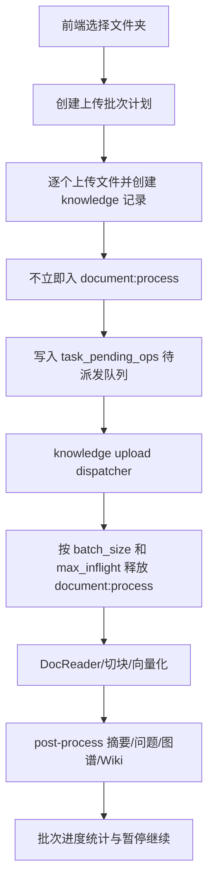

# 20260708-01-知识库文件夹上传分批解析优化方案

## 1. 结论摘要

当前知识库“上传文件夹”的问题，不是浏览器把所有文件并发上传到后端，而是前端虽然按文件逐个调用上传接口，但后端在每个文件落库后都会立刻把该文件投入 document:process 异步任务队列；默认 asynq worker 并发是 32，而 DocReader 默认 gRPC worker 是 4，本地解析服务与后续模型服务又会继续 fan-out，因此大批量文件会在服务端很快堆成“同时解析”。

现状的关键瓶颈有三点：

1. 没有“文件夹上传批次”的后端实体，只有单文件立即入队。
2. 没有按知识库或按上传批次的解析在途上限，worker 只受全局并发控制。
3. 文档解析完成后还会继续触发摘要、问题生成、图谱、Wiki 等后处理任务，进一步放大本地模型压力。

推荐方案不是只改前端，而是新增“上传批次计划 + 延迟派发 + 可控批次”的后端机制：

1. 上传阶段仍然逐个保存文件和创建 knowledge 记录。
2. 对文件夹/多文件批量上传，不再立即 enqueue document:process，而是先落入待派发队列。
3. 新增批次派发 worker，按 batch_size、max_inflight、dispatch_interval 分批释放解析任务。
4. 通过批次状态、暂停/继续、统计接口，让文件夹上传变成可观察、可控、可恢复的后台任务。

在正式改造前，建议先做临时缓解：

1. 将 WEKNORA_ASYNQ_CONCURRENCY 从默认 32 降到 4 到 8。
2. 将 DOCREADER_GRPC_MAX_WORKERS 控制在 2 到 4，保持与本机 CPU 和解析容器能力匹配。
3. 对大批量文件夹上传默认关闭问题生成、图谱抽取，必要时再开启。

## 2. 当前文件夹上传处理逻辑复盘

### 2.1 前端入口

当前文件夹上传入口在 frontend/src/views/knowledge/components/KbUploadSourceDropdown.vue：

1. 使用 webkitdirectory 读取整个文件夹。
2. filterUploadFiles 会过滤隐藏文件、视频文件和不支持的扩展名。
3. 过滤完成后，把全部有效 File 一次性交给上层页面。

这里的行为是“前端一次性收集全部文件”，但还不是“前端并发上传全部文件”。

### 2.2 上传确认与文件夹路径保留

frontend/src/views/knowledge/KnowledgeBase.vue 中的处理逻辑如下：

1. openUploadConfirmDialog 把文件列表交给 UploadConfirmDialog。
2. 用户确认后，handleUploadConfirmResult 调用 executeUploadBatch(files, { processConfig })。
3. getFolderUploadFileName 会从 webkitRelativePath 中去掉根目录名，仅保留子路径，例如 a/b/file.pdf。
4. 这个子路径通过 fileName 表单字段传给后端，用于知识库内展示和目录语义保留。

因此，当前“文件夹上传”本质上并没有单独的后端 API，只是把文件夹拆成一组单文件上传请求，并附带相对路径。

### 2.3 前端实际上传方式

executeUploadBatch 的核心行为是：

1. 遍历 files。
2. 对每个文件 await uploadKnowledgeFile(...)。
3. 每个文件使用同一个单文件接口 /api/v1/knowledge-bases/:id/knowledge/file。

这意味着：

1. 浏览器侧 HTTP 上传当前是串行的，不是 Promise.all 式全并发。
2. 但只要前几个文件上传成功，后端就会开始解析。
3. 文件夹中文件越多，后端可消费队列就越快堆高。

### 2.4 后端单文件创建知识逻辑

后端入口在 internal/handler/knowledge.go 的 CreateKnowledgeFromFile，负责：

1. 鉴权。
2. 读取 multipart file。
3. 校验文件大小、metadata、tag_ids、process_config。
4. 调用 kgService.CreateKnowledgeFromFile。

真正的控制逻辑在 internal/application/service/knowledge_create.go 的 CreateKnowledgeFromFile：

1. 读取知识库配置。
2. 校验文件类型。
3. 计算文件 hash 去重。
4. 保存原始文件到存储。
5. 创建 knowledges 记录，初始 parse_status = pending。
6. 立即构造 DocumentProcessPayload。
7. 立即 enqueue document:process。

也就是说，当前每个文件在保存完成后都会立刻进入解析队列，没有任何“批次缓冲层”。

### 2.5 document:process 任务的队列与并发

document:process 的入队参数在 internal/application/service/knowledge_task_options.go：

1. 固定进入 default 队列。
2. 使用 DocumentProcessTimeout 作为任务超时。

asynq server 在 internal/router/task.go 中统一启动：

1. 所有任务共用同一个 asynq.Server。
2. 全局并发默认值是 32。
3. 通过系统设置 asynq.concurrency 或环境变量 WEKNORA_ASYNQ_CONCURRENCY 覆盖。
4. critical/default/low/multimodal/graph/question 只是同一 server 上的多队列调度，不是独立进程池。

因此，对文件夹上传来说，真正的并发放大点在这里：

1. 每个文件都会生成 document:process。
2. 所有 document:process 都进入 default 队列。
3. 只要 worker 有空闲，就会继续并行执行更多文档。

### 2.6 文档解析内部继续放大后端压力

internal/application/service/knowledge_process.go 中的 ProcessDocument 负责：

1. 从存储加载文件。
2. 调用 DocReader / MinerU / PaddleOCR / builtin reader。
3. 处理 ASR、图片抽取、远程图片落存。
4. 切块、向量化、索引。
5. 决定是否触发 multimodal 和 post-process。

这里有两个重要特点：

1. 解析本身已经会大量占用 DocReader、本地 OCR、本地对象存储与 embedding 服务。
2. 解析完成后还会继续进入 post-process，而不是到这里就结束。

### 2.7 后处理任务进一步 fan-out

internal/application/service/knowledge_post_process.go 中，KnowledgePostProcess 会继续按文档内容 fan-out：

1. 摘要任务：summary:generation。
2. 问题生成任务：按 20 个 chunk 一批，进入 question 队列。
3. 图谱抽取任务：按 chunk 逐个进入 graph 队列。
4. Wiki ingest：先落 task_pending_ops，再由 Wiki worker 分批处理。

这意味着即使 document:process 被控制住，如果 question、graph、summary 没被一起纳入节流，模型服务依然会被后处理压满。

### 2.8 DocReader 侧当前默认能力

docreader/config.py 的默认值说明当前后端与解析器之间存在明显能力错配：

1. DOCREADER_GRPC_MAX_WORKERS 默认 4。
2. DOCREADER_MARKITDOWN_MAX_WORKERS 默认 1。
3. DOCREADER_ODL_MAX_WORKERS 默认 1。
4. DOCREADER_PDF_RENDER_MAX_WORKERS 默认 1。

当 asynq 默认并发是 32，而 DocReader 实际只允许 4 个 gRPC worker 时，系统会出现：

1. 大量 document:process 任务同时运行。
2. 大量任务同时阻塞在 DocReader 或模型服务 RPC 上。
3. 超时、重试、失败概率明显上升。

## 3. 根因判断

结合代码链路，当前“文件夹上传后所有文件同时解析”的直接根因是：

1. 文件夹上传没有自己的后端批次控制模型。
2. 单文件创建知识成功后立即入 document:process。
3. document:process 只受全局 asynq.concurrency 控制，不受知识库级限流控制。
4. 解析完成后还会触发摘要、问题生成、图谱、Wiki 等下游任务。
5. 系统已存在的多队列只是调度优先级，不是“每类任务独立硬上限”。
6. 现有唯一真正采用“待处理表 + 批量 worker + follow-up 调度”的是 Wiki ingest，而文档上传没有复用这套模式。

因此，单纯把前端做成“每 10 个文件一组上传”并不能从根上解决问题，因为：

1. 当前前端本来就是串行上传，不是并发上传风暴。
2. 真正的放大点在“后端立即解析”。
3. CLI、API、URL 导入、批量重解析如果继续走立即入队，仍然会绕过前端节流。

## 4. 可选优化路径对比

| 方案 | 改动范围 | 优点 | 缺点 | 结论 |
| --- | --- | --- | --- | --- |
| 仅前端分批显示/延迟上传 | 小 | UI 变化小 | 不能控制后端解析并发，CLI/API 无效 | 不能单独采用 |
| 仅降低全局 asynq 并发 | 很小 | 立刻见效 | 影响全部异步任务，无法表达“某个文件夹按计划处理” | 只适合作为临时缓解 |
| 新增文件夹上传批次 + 延迟派发 | 中等 | 真正可控、后端统一生效、可做暂停继续 | 需要新增表、API、worker | 推荐 |
| 单独起第二套 asynq server 管文件夹上传 | 大 | 能做独立并发 | 部署复杂，运维成本高 | 不是首选 |

## 5. 推荐方案

推荐方案：复用 Wiki ingest 的“持久待处理队列 + 批次 worker + follow-up 调度”模式，为文档批量上传新增上传批次计划。

### 5.1 目标

目标不是改变单文件解析能力，而是给“文件夹/多文件批量导入”增加以下控制面：

1. 可配置每次释放多少个文件进入解析。
2. 可配置同一知识库最多同时处于 processing/finalizing 的文档数。
3. 可配置每批次之间的间隔。
4. 可暂停、继续、取消未开始文件。
5. 可查看整批导入的进度和失败情况。
6. 不改变现有单文件上传接口的基本语义。

### 5.2 总体架构

### 5.3 设计原则

1. 上传与解析解耦：先落库、后派发。
2. 控制点在后端：不能只依赖浏览器行为。
3. 单文件路径保持兼容：不影响当前普通上传。
4. 复用现有 task_pending_ops 与 follow-up 调度经验，避免重新发明队列。
5. 把“同库在途解析上限”作为核心限流单位，而不是只看前端一批多少个文件。

## 6. 详细设计

### 6.1 数据模型

建议新增一张批次主表，并给 knowledges 增加批次关联字段。

#### 新表：knowledge_upload_batches

建议字段：

1. id
2. tenant_id
3. knowledge_base_id
4. source_type，值如 folder 或 multi_file
5. root_name，原始文件夹名
6. total_count
7. batch_size
8. max_inflight
9. dispatch_interval_seconds
10. status，值如 draft/running/paused/completed/cancelled/failed
11. process_config_json
12. created_by
13. started_at
14. finished_at
15. created_at
16. updated_at

#### 扩展 knowledges 表

建议新增字段：

1. upload_batch_id，可空
2. upload_sequence，可空

这样可以：

1. 按批次统计文档状态。
2. 保持批次内顺序。
3. 不需要再新建一张 item 表去重复存储每个 knowledge 的解析状态。

### 6.2 队列模型

建议继续复用 task_pending_ops，但新增一类待派发操作。

建议约定：

1. task_type = knowledge:upload_dispatch
2. scope = upload_batch
3. scope_id = upload_batch_id
4. dedup_key = knowledge_id
5. payload = { knowledge_id, knowledge_base_id, upload_batch_id, attempt, language }

作用：

1. 文件上传成功后，不直接 enqueue document:process。
2. 先把该 knowledge 写入待派发队列。
3. 由 dispatcher 决定何时释放到真正的解析 worker。

### 6.3 API 设计

建议新增以下接口。

#### 1. 创建上传批次

POST /api/v1/knowledge-bases/:id/upload-batches

请求体建议字段：

1. source_type
2. root_name
3. total_count
4. batch_size
5. max_inflight
6. dispatch_interval_seconds
7. process_config

返回：upload_batch_id。

#### 2. 单文件上传时挂载批次

沿用现有 POST /api/v1/knowledge-bases/:id/knowledge/file，增加可选字段：

1. upload_batch_id
2. defer_parse=true
3. upload_sequence

行为调整：

1. 无 upload_batch_id 或 defer_parse=false：保持当前逻辑，立即 enqueue document:process。
2. 有 upload_batch_id 且 defer_parse=true：创建 knowledge 后只写入 task_pending_ops，不直接解析。

#### 3. 查询批次进度

GET /api/v1/knowledge-bases/:id/upload-batches/:batch_id

返回建议包含：

1. total_count
2. pending_count，parse_status = pending
3. processing_count，parse_status in processing/finalizing
4. completed_count
5. failed_count
6. cancelled_count
7. paused
8. 当前 batch_size、max_inflight、dispatch_interval_seconds

#### 4. 暂停 / 继续 / 取消

建议接口：

1. POST /api/v1/knowledge-bases/:id/upload-batches/:batch_id/pause
2. POST /api/v1/knowledge-bases/:id/upload-batches/:batch_id/resume
3. POST /api/v1/knowledge-bases/:id/upload-batches/:batch_id/cancel

### 6.4 Dispatcher Worker 设计

建议新增任务类型：knowledge:upload_dispatch。

worker 行为：

1. 读取 upload_batch 配置。
2. 如果批次状态是 paused 或 cancelled，直接退出。
3. 查询当前知识库 in-flight 文档数：parse_status in processing/finalizing。
4. 计算 available_slots = max_inflight - inflight_count。
5. 如果 available_slots <= 0，按 dispatch_interval_seconds 安排 follow-up。
6. 从 task_pending_ops 中按 upload_batch_id peek 最多 min(batch_size, available_slots) 条。
7. 为这些 knowledge 逐个 enqueue 标准 document:process。
8. 成功后删除已消费的 pending ops。
9. 如果该批次还有剩余待派发文件，再安排下一次 follow-up。

这里建议像 Wiki ingest 一样使用：

1. Redis SetNX 或 lite lock 做批次级互斥。
2. PendingCount + ProcessIn 做 follow-up 调度。

### 6.5 为什么用“按知识库在途数”而不是“只按每批释放数”

这是本方案的关键点。

如果只控制“每次从批次里取 10 个文件”，但不控制“当前知识库已经有多少个文件在 processing/finalizing”，那么：

1. 一个批次释放 10 个后，下一次 follow-up 又可能继续释放 10 个。
2. 两个批次同时上传到同一个知识库时，也会互相绕过限制。
3. URL 导入、批量重解析也可能与文件夹上传叠加。

按知识库在途数控制有两个好处：

1. 可以保护真正共享的 DocReader 和模型资源。
2. 可以把同一个知识库上的多个批次统一纳入一个资源门控口径。

### 6.6 前端改造建议

建议改动以下位置：

1. frontend/src/views/knowledge/KnowledgeBase.vue
2. frontend/src/views/knowledge/components/UploadConfirmDialog.vue
3. frontend/src/api/knowledge-base/index.ts
4. 新增 upload batch store，例如 frontend/src/stores/uploadBatch.ts

前端行为建议：

1. 文件夹上传时先创建 upload_batch。
2. 再按当前已有串行模式逐个上传文件，但每个请求带 upload_batch_id 和 defer_parse=true。
3. 上传完成后，不再把“上传成功”等同于“开始立即解析”。
4. 页面新增一个批次进度卡片，显示 pending/processing/completed/failed。
5. 在 UploadConfirmDialog 增加“批量处理计划”面板。

建议提供三个预设：

1. 保守模式：batch_size=5，max_inflight=2，dispatch_interval=10s，关闭问题生成和图谱。
2. 标准模式：batch_size=10，max_inflight=4，dispatch_interval=5s。
3. 全速模式：仅在远程高性能解析服务场景可选。

### 6.7 与现有 process_config 的关系

当前 UploadConfirmDialog 已经支持 process_config，这是一个现成优势。

建议不要把“解析批次控制参数”塞进 process_config，而是分离：

1. process_config 继续负责解析规则、chunking、VLM、ASR、问题生成、图谱。
2. upload_batch_config 负责 batch_size、max_inflight、dispatch_interval。

这样职责清晰，也不会污染现有 KnowledgeProcessOverrides。

### 6.8 后处理压力一并纳入治理

如果只控制 document:process，而不处理后处理 fan-out，本地模型服务仍可能被压满。

建议同时做两件事：

1. 批量上传默认预设关闭问题生成和图谱，必要时由用户显式开启。
2. 如果后续还需要进一步限流，再给 summary/question/graph/Wiki 增加“批量导入模式”的统一节流策略。

第一阶段不建议大改 post-process 代码，只先通过批量预设降低模型压力。

## 7. 分阶段实施计划

### Phase 0：立即缓解，不改业务链路

目标：先把本地服务压垮的问题快速降下来。

实施项：

1. 下调 WEKNORA_ASYNQ_CONCURRENCY 到 4 到 8。
2. 检查并下调 DOCREADER_GRPC_MAX_WORKERS、DOCREADER_ODL_MAX_WORKERS、DOCREADER_MARKITDOWN_MAX_WORKERS。
3. 在运维文档中增加“批量上传前临时关闭问题生成/图谱”的操作说明。

验收标准：

1. 50 到 100 个文件夹上传时，解析失败率明显下降。
2. DocReader 不再长时间堆满请求。

局限：

1. 仍然没有真正的批次计划。
2. 所有异步任务吞吐一起下降。

### Phase 1：后端引入上传批次与延迟派发

目标：从根上把“立即入队”改为“按计划派发”。

后端改动清单：

1. 新增 migration：knowledge_upload_batches。
2. 扩展 knowledges：upload_batch_id、upload_sequence。
3. 在 internal/router/router.go 注册 upload batch 路由。
4. 在 internal/handler/knowledge.go 增加创建批次、查询批次、暂停继续取消接口。
5. 在 internal/application/service/knowledge_create.go 中增加 defer_parse 分支。
6. 新增 knowledge upload batch service。
7. 新增 knowledge:upload_dispatch asynq handler。
8. 复用 internal/application/repository/task_queue.go 的持久待处理队列能力。

验收标准：

1. 文件夹上传 100 个文件，任何时刻 processing/finalizing 数量不超过 max_inflight。
2. 批次可暂停，暂停后不再继续派发新文件。
3. 服务重启后 pending ops 不丢失。

### Phase 2：前端计划控制与批次可视化

目标：让用户能显式配置批次策略并观察进度。

前端改动清单：

1. UploadConfirmDialog 新增“批量处理计划”区域。
2. KnowledgeBase.vue 在文件夹上传时先创建 upload_batch。
3. 新增上传批次进度卡片或抽屉。
4. 新增暂停/继续/取消交互。

验收标准：

1. 用户能看到整批导入剩余多少、正在处理多少、失败多少。
2. 用户暂停后，已有 processing 文档继续完成，但不再派发新的 pending 文档。

### Phase 3：补充批量导入预设与运维指标

目标：让本地部署更稳，问题更易定位。

实施项：

1. 增加“保守/标准/全速”批量预设。
2. 增加 upload batch 相关日志和指标。
3. 在 settings 或运维文档中明确本地部署推荐值。

建议指标：

1. upload_batch_pending_total
2. upload_batch_dispatch_total
3. upload_batch_active_batches
4. upload_batch_dispatch_skipped_no_slot_total
5. knowledge_processing_inflight_by_kb

## 8. 代码层面的具体落点

### 前端

1. frontend/src/views/knowledge/components/KbUploadSourceDropdown.vue
   当前保持不动，只负责收集文件。
2. frontend/src/views/knowledge/KnowledgeBase.vue
   文件夹上传改为“先创建批次，再逐个上传并 defer_parse”。
3. frontend/src/views/knowledge/components/UploadConfirmDialog.vue
   新增 upload_batch_config UI。
4. frontend/src/api/knowledge-base/index.ts
   新增 createUploadBatch、getUploadBatch、pauseUploadBatch、resumeUploadBatch、cancelUploadBatch。

### 后端

1. internal/router/router.go
   注册 upload batch 路由与新任务处理器。
2. internal/handler/knowledge.go
   增加 upload batch handler，并扩展 CreateKnowledgeFromFile 的表单参数。
3. internal/application/service/knowledge_create.go
   defer_parse 分支不再直接 enqueue document:process。
4. internal/application/service/knowledge_process.go
   保持 document:process 逻辑不变，避免重写解析主流程。
5. internal/application/service/knowledge_upload_batch.go
   新增批次服务与 dispatcher。
6. internal/application/repository/task_queue.go
   继续复用现有 pending ops 存储，无需新造持久队列。
7. migrations/versioned
   新增批次表和 knowledges 扩展字段。

## 9. 为什么这是当前代码库里最顺手的实现路径

原因很明确：

1. Wiki ingest 已经证明 task_pending_ops + follow-up worker 模式在本仓库可行。
2. document:process 现有实现已经足够复杂，不适合重写为另一套专用解析器。
3. 当前前端上传本来就是串行的，因此把控制点放到后端最有收益。
4. 单文件上传和文件夹上传可以共用同一个 knowledge/file 接口，只是文件夹上传多一个 defer_parse 分支。

这条路径改动虽不小，但结构上最稳，也最符合仓库现有技术风格。

## 10. 不建议采用的做法

以下做法不建议单独采用：

1. 只在前端 sleep 或 setTimeout 让用户“慢慢传”。
2. 只把 executeUploadBatch 改成每 10 个文件一组请求。
3. 只靠 lowering asynq.concurrency 解决所有批量导入问题。
4. 直接在 ProcessDocument 内部用 retry/backoff 硬挡住并发，而不建立上传批次计划。

这些方案要么无法控制后端真实在途解析数，要么会把所有异步任务一起拖慢。

## 11. 建议的默认参数

对于当前本地部署、小规模 DocReader/本地模型服务场景，建议第一版默认值如下：

1. batch_size = 10
2. max_inflight = 2
3. dispatch_interval_seconds = 5
4. 文件夹上传默认关闭问题生成
5. 文件夹上传默认关闭图谱抽取

如果后续观察到：

1. DocReader 压力仍然过大，则先降 max_inflight。
2. 模型服务压力更大，则先关问题生成和图谱，再看是否需要延长 dispatch_interval。

## 12. 最终实施顺序建议

建议按下面顺序推进，避免一次性改动过大：

1. 先做 Phase 0，立刻降低失败率。
2. 再做 Phase 1，只上后端批次派发，不先做复杂前端交互。
3. 后端稳定后，再做 Phase 2 的上传批次 UI、暂停继续、统计展示。
4. 最后做 Phase 3 的预设、指标和运维文档补齐。

这样可以先把“解析同时爆发”的核心问题收住，再逐步把体验补完整。
