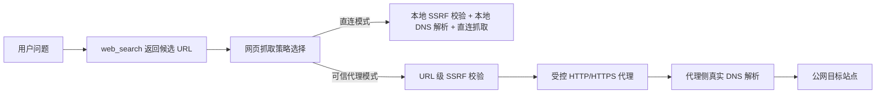

# 网页抓取在 VPN 或 fake-ip 场景下命中 SSRF 的原因分析与彻底解决方案

## 1. 现象

在智能体回答“郑州今天的天气怎么样”时，网络搜索能够返回候选结果，但网页抓取阶段失败，典型错误如下：

```text
URL rejected for security reasons: SSRF validation failed: hostname www.cnweather.com resolves to restricted IP 198.18.0.63: restricted range 198.18.0.0/15
```

同一轮里 www.tianqi.com 也解析到 198.18.0.64 并被拦截。说明失败发生在“搜索结果 URL 抓取全文”阶段，不是搜索引擎本身不可用。

结合当前机器“已开启 VPN 代理”的事实，这不是少量域名偶发命中白名单的问题，而是当前网页抓取实现与 VPN 的 fake-ip 或透明代理模式存在系统性冲突。

## 2. 基于当前代码的真实根因

### 2.1 统一 SSRF 校验会先做本地 DNS 解析

当前 WeKnora 的网页抓取路径都会先做统一 SSRF 校验：

- Agent 工具 web_fetch：`internal/agent/tools/web_fetch.go` 的 `validateAndResolve` 调用 `utils.ValidateURLForSSRF`。
- 自动网页全文抓取 pipeline：`internal/application/service/chat_pipeline/web_fetch.go` 调用 `internal/infrastructure/web_fetch.FetchURLContent`，该函数同样先调用 `utils.ValidateURLForSSRF`。
- 统一校验入口：`internal/utils/security.go` 的 `ValidateURLForSSRF` 先检查白名单，未命中时进入 `isSSRFSafeURL`。

`isSSRFSafeURL` 内部会对目标域名执行本地 DNS 解析，并检查解析结果是否落入受限网段。项目把 `198.18.0.0/15` 明确列入 `restrictedIPv4Ranges`，这是正确的安全策略，因为该网段是 RFC 2544 定义的测试保留网段，不应被当作互联网公网目标。

### 2.2 当前网页抓取实现默认走“本地解析 + DNS pinning”，不是“代理解析”

除统一校验外，抓取实现本身也重复依赖本地 DNS：

- Agent 工具版 web_fetch 在 `validateAndResolve` 里会 `LookupIP`，再把域名 pin 到单个 IP。
- Agent 工具的 chromedp 抓取会设置 `host-resolver-rules`，强制浏览器使用本地选出的 `PinnedIP`。
- Agent 工具的 HTTP fallback 也是把请求 URL 的 Host 改成 `PinnedIP:port` 后直连。
- 自动 pipeline 使用的 `internal/infrastructure/web_fetch/fetcher.go` 同样先 `LookupIP`，只要没选出公网 IP 就直接报错 `no public IP for host ...`。

也就是说，当前网页抓取路径的设计前提是“应用自己解析目标域名，并直接连接目标站点”，而不是“应用把请求交给可信代理，由代理在外网侧解析并访问目标站点”。

### 2.3 当前网页抓取 HTTP 客户端并没有真正复用环境代理

这一点是当前场景的关键：

- `internal/infrastructure/web_fetch/fetcher.go` 中直接 new 了一个 `http.Client`，没有设置 `ProxyFromEnvironment`。
- `internal/agent/tools/web_fetch.go` 使用 `utils.NewSSRFSafeHTTPClient`，但该 helper 里的 `http.Transport` 只设置了 `DialContext`，没有设置 `Proxy`，因此默认也不会自动走 `HTTP_PROXY` 或 `HTTPS_PROXY`。
- 反过来，项目里的网络搜索客户端已经有现成的代理感知实现：`internal/infrastructure/web_search/proxy.go` 的 `NewSearchHTTPClient` 会显式设置 `ProxyFromEnvironment` 或使用管理员指定的 `proxy_url`。

结论：当前网页抓取链路既在抓取前本地解析目标域名，又没有稳定地把请求交给环境代理处理，因此在 VPN fake-ip/TUN 模式下会系统性命中 SSRF 误判。

## 3. 为什么“继续补域名白名单”不是当前场景的可行方案

你当前的前提是：

1. 抓取目标页面很多，域名很多。
2. 机器上长期开着 VPN 代理。

在这个前提下，逐个补域名有三个问题：

1. 不可维护。搜索结果来源会动态变化，新闻站、天气站、百科、论坛、官网都可能出现，无法持续穷举。
2. 不够彻底。即使把域名加入白名单，当前 pipeline 抓取路径仍可能因为后续 `PinnedIP` 不是公网 IP 而失败。
3. 安全面扩大。随着域名越加越多，白名单最终会演变成“事实上的大范围放行”，失去 SSRF 防护原本意义。

因此，白名单只能作为个别内网固定地址的特例机制，不应该再作为“公网网页抓取在 VPN 环境下的主解决路径”。

## 4. 彻底解决的目标

目标应该调整为：

- 保留现有 SSRF 安全边界，不删除 `198.18.0.0/15` 拦截。
- 不再依赖“本地 DNS 看到的 IP”来判断 VPN 场景下的公网网页是否可抓。
- 让网页抓取明确区分“直连模式”和“可信代理模式”。
- 让网页抓取真正复用 VPN 代理或受控出口，而不是在代理前就被本地 fake-ip 拦截。
- 对现有代码架构改动尽量小，只修改网页抓取相关链路，不扩大到模型调用、知识库、文档解析等无关出站流量。

## 5. 推荐的彻底方案：引入“可信代理出口模式”

### 5.1 核心思路

把当前网页抓取的安全模型从“应用本地解析目标站点”改成“双模式”：

- 直连模式：保持现有逻辑，本地解析 + SSRF 校验 + DNS pinning。
- 可信代理模式：应用只校验目标 URL 的协议、主机名形式、显式内网目标和危险端口；真正的 DNS 解析与外网访问交给管理员配置的可信代理或公网出口完成。

适合当前机器开着 VPN 的场景。



### 5.2 这套方案为什么适合当前环境

当前报错指向 `198.18.x.x`，高度符合 VPN fake-ip 行为。此时：

- 应用本地看到的并不是真实公网 IP。
- 让应用继续本地解析目标域名没有意义，只会不断误判。
- 真正可信的应该是 VPN 暴露给应用的代理出口，或者一个专门的 egress fetch/proxy 服务。

所以，正确的信任边界应该从“信任每个目标域名”转为“信任一个管理员控制的出口代理”。

### 5.3 代码层的最小改动方案

不建议全局改写 SSRF 基础设施；建议只在网页抓取链路增加一个代理感知分支。

#### 方案 A：给网页抓取增加独立的抓取模式配置

建议新增以下运行时配置，作用范围仅限网页抓取：

```bash
WEB_FETCH_MODE=trusted_proxy
WEB_FETCH_PROXY_URL=http://host.docker.internal:7890
```

或允许显式回退：

```bash
WEB_FETCH_MODE=direct
```

其中：

- `WEB_FETCH_MODE=direct` 复用当前实现。
- `WEB_FETCH_MODE=trusted_proxy` 表示网页抓取 URL 必须经管理员配置的代理出口。
- `WEB_FETCH_PROXY_URL` 只允许运维配置，不对普通用户暴露。

如果不想单独新增 `WEB_FETCH_PROXY_URL`，也可以复用：

```bash
HTTP_PROXY=http://host.docker.internal:7890
HTTPS_PROXY=http://host.docker.internal:7890
```

但从运维清晰度看，网页抓取单独配置更好，避免把其他出站流量一并切到 VPN 代理。

#### 方案 B：新增“代理感知的 URL 校验函数”，不要在代理模式下本地解析目标域名

建议保留当前 `ValidateURLForSSRF` 不动，再增加一个只给网页抓取代理模式使用的新入口，例如：

```go
ValidateURLForTrustedProxyEgress(rawURL string) error
```

其校验规则建议为：

- 仍只允许 `http` 和 `https`。
- 仍禁止空 Host、超长 URL、直接 IP、十进制/十六进制/八进制等 IP-like host。
- 仍禁止 `localhost`、`.local`、`.internal`、metadata、常见内网保留主机名。
- 仍禁止高风险端口，如 22、2379、3306、5432、6379、9200 等。
- 关键区别：不要在代理模式下对目标网页域名执行本地 `LookupIP`。

原因很直接：在 VPN fake-ip 模式下，本地 DNS 结果本来就是假的。继续本地解析只会把公网目标误判成 SSRF。

但代理地址本身仍应通过现有 SSRF 校验。也就是说：

- “目标网页 URL”在代理模式下走轻量 URL 级校验。
- “代理出口 URL”仍走严格 `ValidateURLForSSRF`，确保应用只连到受控代理。

#### 方案 C：网页抓取客户端改为真正支持代理

当前项目里，`internal/infrastructure/web_search/proxy.go` 已经有现成模式：

- 支持 `ProxyFromEnvironment`
- 支持管理员配置的 `proxy_url`
- 继续保留 SSRF 安全 Dialer
- 重定向时继续做 URL 校验

网页抓取应复用这套思路，而不是继续手写一个不带代理能力的 `http.Client`。

建议改法：

1. 抽一个公共的 outbound HTTP client builder，供 `web_search` 与 `web_fetch` 共用。
2. 在 `web_fetch/fetcher.go` 中，代理模式下不要再 `LookupIP + PinnedIP`，直接使用原始 URL 发请求，并让 `Transport.Proxy` 指向受控代理。
3. 在直连模式下保留现有 DNS pinning 逻辑，避免影响无代理部署。

#### 方案 D：Agent 工具版 web_fetch 也必须同步修改

仅改自动 pipeline 不够，因为 Agent 工具版同样会失败。

建议修改点：

- `internal/agent/tools/web_fetch.go`

建议行为：

1. 代理模式下，`validateAndResolve` 不再做目标域名 `LookupIP` 和 `PinnedIP` 选择。
2. HTTP 抓取分支直接走带代理的 `http.Client`。
3. chromedp 分支不要再设置 `host-resolver-rules`，而应改为注入 `--proxy-server=`。
4. 如果当前阶段想进一步降低改动面，可在代理模式下先禁用 chromedp，只走 HTTP 抓取；等第一阶段跑稳后，再补浏览器代理支持。

这一步很重要，因为当前 chromedp 的 `host-resolver-rules` 本质上就是在绕过代理的 DNS 解析能力。

### 5.4 对当前 VPN 场景的具体要求

#### 场景 1：VPN 能提供明确的 HTTP 或 HTTPS 代理地址

这是最理想的落地方式。建议：

```bash
WEB_FETCH_MODE=trusted_proxy
WEB_FETCH_PROXY_URL=http://host.docker.internal:7890
NO_PROXY=localhost,127.0.0.1,::1,redis,mysql,postgres,minio,searxng,docreader
```

说明：

- `WEB_FETCH_PROXY_URL` 指向宿主机上的 VPN 代理端口，容器内通过 `host.docker.internal` 访问。
- `NO_PROXY` 只排除本地组件，避免内部流量误走 VPN。
- 网页抓取所有外网目标统一经代理出去，目标站点 DNS 解析在代理侧完成。

#### 场景 2：VPN 只有 TUN 或 fake-ip，没有明确代理端口

这类情况下，应用层无法彻底解决。原因是：

- 应用本地 DNS 看到的就是 `198.18.x.x` 之类 fake-ip。
- 应用没有可显式连接的代理出口。
- SSRF 校验无法区分“这是 fake-ip 映射的公网网站”还是“这真是内部受限地址”。

此时必须二选一：

1. 给 app 容器提供一个显式 HTTP/HTTPS 代理出口。
2. 把 app 容器的 DNS 改成真实 DNS，避开 fake-ip。

如果两者都做不到，就不存在“应用内彻底解决”的方案。因为问题不在某个域名，而在网络层把公网域名统一伪装成了受限 IP。

#### 场景 3：VPN 只有 SOCKS5 端口

建议不要让网页抓取直接依赖 SOCKS5 作为第一实现，优先在宿主机上桥接出一个 HTTP 代理端口再给 app 使用。这样：

- Go 侧复用现有 `http.Transport.Proxy` 更简单。
- chromedp 与 HTTP 抓取的行为更容易统一。
- 诊断与审计更直接。

### 5.5 为什么这是“对现有架构破坏小”的方案

因为改动只收敛在网页抓取链路，不需要推翻现有 SSRF 框架：

- 保留 `ValidateURLForSSRF` 供默认直连场景继续使用。
- 只为网页抓取新增“trusted_proxy”分支，不影响模型调用、知识库上传、文档解析等其他 URL 校验场景。
- 优先复用现有 `web_search/proxy.go` 的代理客户端模式，而不是重造一套。
- 不需要大规模修改数据库结构；如果不希望加系统设置，首期甚至只靠环境变量即可落地。

## 6. 推荐实施顺序

### 第一阶段：先让网页抓取真正走受控代理

1. 增加 `WEB_FETCH_MODE` 与 `WEB_FETCH_PROXY_URL`。
2. 给 `internal/infrastructure/web_fetch/fetcher.go` 增加代理模式分支。
3. 给 `internal/agent/tools/web_fetch.go` 增加代理模式分支。
4. 代理模式下取消目标站点本地 `LookupIP + pinning`。
5. 代理模式下把目标 URL 的校验切换为“URL 级防护，不做本地 DNS 解析”。

这一步完成后，网页抓取不再被 fake-ip 大面积卡死。

### 第二阶段：补强浏览器抓取与配置入口

1. chromedp 注入 `--proxy-server=`。
2. 需要时增加系统设置页，让系统管理员在线配置 `web_fetch.proxy_url` 或 `web_fetch.mode`。
3. 给抓取日志增加字段：当前抓取模式、代理地址是否启用、是否发生直连回退。

## 7. 建议的代码落点

建议改动集中在以下文件：

- `internal/infrastructure/web_fetch/fetcher.go`
    - 增加代理模式客户端选择。
    - 代理模式下禁用本地 DNS pinning。

- `internal/agent/tools/web_fetch.go`
    - `validateAndResolve` 改为按模式分支。
    - HTTP 抓取和 chromedp 抓取接入代理。

- `internal/utils/security.go`
    - 保留现有 `ValidateURLForSSRF`。
    - 新增仅供“可信代理出口模式”使用的 URL 级校验函数。

- `internal/infrastructure/web_search/proxy.go`
    - 可下沉为通用 outbound client builder，供网页搜索和网页抓取复用。

不建议的做法：

- 不建议把 `198.18.0.0/15` 从受限网段里删掉。
- 不建议把 `utils.NewSSRFSafeHTTPClient` 直接全局改成默认使用环境代理，否则会影响其他出站流量语义。
- 不建议继续走“补很多域名白名单”的策略。

## 8. 验证步骤

### 8.1 网络前提验证

```bash
docker compose exec app env | grep -Ei 'WEB_FETCH_MODE|WEB_FETCH_PROXY_URL|HTTP_PROXY|HTTPS_PROXY|NO_PROXY'
docker compose exec app getent hosts www.cnweather.com
```

预期：

- 如果是 trusted_proxy 模式，`getent hosts` 即使仍返回 `198.18.x.x`，网页抓取也不应再依赖这个结果。
- 如果没有明确代理地址，说明当前网络前提还不具备彻底解决条件。

### 8.2 功能验证

重新提问：

```text
郑州今天的天气怎么样
```

预期：

- `web_search` 仍能返回天气站结果。
- `web_fetch` 不再报 `hostname ... resolves to restricted IP 198.18.x.x`。
- 如果页面本身反爬或被代理拦截，错误应变成 HTTP 层或代理层错误，而不是本地 SSRF 假阳性。

### 8.3 安全回归验证

下列目标在 trusted_proxy 模式下仍必须拒绝：

```text
http://127.0.0.1:8080/
http://localhost:8080/
http://169.254.169.254/latest/meta-data/
http://10.0.0.1/
http://172.17.0.1/
http://192.168.1.1/
```

也就是说，trusted_proxy 模式不是“关闭 SSRF”，而是把“是否做目标域名本地 DNS 解析”从应用端挪到了可信代理端。

## 9. 最终建议

在“抓取目标域名很多 + 机器长期开启 VPN 代理”的前提下，继续补域名白名单不是主解决路径。

彻底方案应当是：

1. 为网页抓取增加 `trusted_proxy` 模式。
2. 让网页抓取真正走管理员控制的 HTTP/HTTPS 代理出口。
3. 代理模式下停止对目标网页域名做本地 DNS 解析与 IP pinning。
4. 只对代理出口做严格 SSRF 校验，对目标网页保留 URL 级安全校验。

如果当前 VPN 只有 TUN 或 fake-ip、没有显式代理端口，那么必须先补一个可供 app 容器使用的代理出口，或者让 app 容器脱离 fake-ip DNS。否则这不是应用代码能彻底解决的问题。

对现有代码架构破坏最小、又能真正解决问题的落地路径，是把 `web_search` 已有的代理能力模式推广到 `web_fetch`，而不是继续扩大域名白名单。