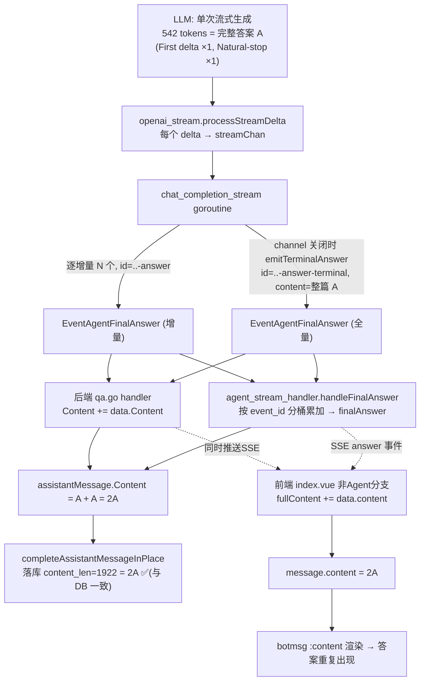

# 快速问答模式"重复回答"审查文档

- 日期：2026-08-18
- 现象：Web 端「快速问答」（agent_id=`builtin-quick-answer`，非 Agent 模式）回答一个问题时，答案**重复出现多遍**（用户感知为 3 遍；经数据库验证，持久化内容为 **2 份逐字相同的完整答案**叠加）。
- 证据：日志 `my_docs/test/1`（16:11:23~16:11:56，session `8d87b822-fd55-4222-be6a-fdd7ea216fbc`，查询"介绍一下什么是四足机器人"）+ 线上数据库 `messages` 表。
- 结论：**不是 LLM 重复生成**，而是**同一次生成结果在后端累加落库与前端渲染时被重复拼接**。核心缺陷：流式流水线在逐增量（delta）之外，**额外又发了一次"完整全文"的终局事件，而累加逻辑没有区分"增量"与"全量"，导致全文被多加一遍**。本文档只分析、不改代码。

---

## 1. 证据

### 1.1 日志（my_docs/test/1）：LLM 只生成了 1 次

整条请求链路里，模型**只流式输出一遍**：

| 时间 | 行 | 内容 |
|---|---|---|
| 16:11:30 | L45 | 请求进入，route 判定 `normal_qa`（走非 Agent 快速问答） |
| 16:11:45.436 | | `[PIPELINE] stage=Stream action=model_started`（**唯一一次** model_call / model_started） |
| 16:11:48.371 | | `[LLM Stream] First delta.Content ... elapsed_ms=2934`（**第一次**出字） |
| 16:11:56.001 | | `[LLM Stream] Natural-stop ... finish=stop ... first_content_seen=true`（**唯一一次**自然结束） |
| 16:11:56.001 | | `[LLM Usage] completion_tokens=542`（**仅 542 tokens**） |
| 16:11:56.019 | | `Persisted assistant completion ... content_len: 1922`（落库 1922 字） |

关键矛盾：**模型只产出了 ≈542 tokens（约 960 中文字）的一次答案**，但落库 `content_len=1922` ≈ 960×2。且 `First delta` 与 `Natural-stop` 全日志各只出现 1 次 → LLM 侧没有重复生成。

### 1.2 数据库（决定性证据）：内容 = 2 份完整答案

```
messages.id = 0cc90c18-5a55-493d-b1d8-a9f1a1195448
length(content) = 1922  -- bytes？ 实为字符长度，≈ 961 × 2
```

按答案首句锚点「根据检索到的信息」切分，**恰好出现 2 次**，且两份正文**逐字相同**（4 个小节标题 `### 1. 核心定义与历史` … `### 4. 应用场景` 各重复 2 遍）：

```
[第1份] 根据检索到的信息，四足机器人（Quadruped Robot …）…… 支持自主导航与二次开发等特征。
[第2份] 根据检索到的信息，四足机器人（Quadruped Robot …）…… 支持自主导航与二次开发等特征。
```

> 结论：持久化层就是"同一份完整答案被写了两遍"，与 LLM 单次生成直接对账吻合（961×2≈1922）。

### 1.3 关于"3 遍"

数据库铁证是 **2 份**。用户看到的"反复回答 3 遍"，是以下两者叠加的**视觉结果**：
1. 流式阶段（打字机）已把第 1 遍答案"打"出来；
2. 终局"全文"事件到达时，内容瞬间从 1 遍跳变成 2 遍全量文本，再经渲染层铺开。

因此"2 份持久化 + 流式/渲染过程"在观感上表现为"答了好几遍"。若确需精确到"3 遍"，建议复现时抓一份**含刷新/重新进入会话（历史加载）**的完整日志再比对；但根因（终局全文被当增量重复累加）不变。

---

## 2. 根因（代码逐层）

### 2.1 源头：流式插件同时发送「逐增量」与「终局全文」

`internal/application/service/chat_pipeline/chat_completion_stream.go` 的 `OnEvent` goroutine：

- 对每个 delta：
  - `answerBuilder.WriteString(response.Content)`（累加完整答案）
  - 发 `EventAgentFinalAnswer`，`ID: answerID`（**固定为 `xxx-answer`**），`Content: 增量`，`Done: response.Done`
- **channel 关闭时 `emitTerminalAnswer()`**：
  - `finalContent := answerBuilder.String()`（**完整全文**）
  - 再发**一个** `EventAgentFinalAnswer`，`ID: xxx-answer-terminal`（**新 ID**），`Content: finalContent`（**整篇**），`Done: true`

问题：整篇终局事件的**语义是"全量"**，但事件类型仍是 `final_answer`（与增量事件同类型），仅靠 ID 不同。下游累加者无法据此区分"该追加"还是"该替换"。

```
事件序列（answer 类型）:
  delta1  (id=..-answer, content=增量1, done=false)
  ...
  deltaN  (id=..-answer, content=增量N, done=true/false)   ← N 个增量合计 = 完整答案 A
  terminal(id=..-answer-terminal, content=完整全文A, done=true)   ← 多出来的全量 A
```

### 2.2 后端：无条件累加，把终局全文又加一遍

`internal/handler/session/qa.go`（正常/快速问答模式 `mode == qaModeNormal`）：

```go
streamCtx.eventBus.On(event.EventAgentFinalAnswer, func(...) error {
    data, _ := evt.Data.(event.AgentFinalAnswerData)
    streamCtx.assistantMessage.Content += data.Content   // ← 无差别 += ，terminal 的整篇 A 也被加上
    ...
})
```

- N 个 delta 累加 → `Content = A`
- terminal 事件再 `+= A` → **`Content = 2A`** ← 落库值（1922）

### 2.3 SSE 侧累加：同样翻倍

`internal/handler/session/agent_stream_handler.go` `handleFinalAnswer`（把每个 `final_answer` 事件写入共享 SSE 流，供前端消费）：

```go
seg := h.findAnswerSegment(evt.ID)   // 按 evt.ID 分桶
if seg == nil { ...新建... }
seg.content += data.Content          // terminal 是新 ID → 新桶 → 又是 A
h.finalAnswer = h.composeFinalAnswer() // 合并所有非 superseded 桶 = A + A = 2A
```

随后 `handleComplete` 取 `authoritativeAnswer`（= `h.finalAnswer` 或 complete 事件里的 `FinalAnswer=message.Content`），二者都已 = 2A，写回 `assistantMessage.Content = 2A`。

### 2.4 前端：非 Agent 分支同样 `fullContent += 事件.content`

`frontend/src/views/chat/index.vue`（快速问答 = 非 Agent 模式分支）：

```js
// 对每个 response_type === 'answer' 事件：
fullContent.value += data.content;      // ← terminal 事件的 content=完整A，也被 +=
...
} else {
    obj.content = fullContent.value;     // = 2A
}
if (data.done) { fullContent.value = ""; }
updateAssistantSession(obj);
```

前端渲染走主内容区 `<botmsg :content="session.content">`（index.vue L54），`session.content` = 2A → 页面上看到答案重复。

---

## 3. 数据流全链路（一图看清"翻倍"发生在哪）



**翻倍点（红色含义）= 步骤 C 额外发出「全量」终局事件，而 F/G/J 三处累加者都把它当作增量再加一遍。**

---

## 4. 为什么是"同一个答案的两份"而非乱序/多段

- N 个增量 delta 共用**同一个 event_id**（`..-answer`），在 SSE 侧聚合为"第 1 份"；
- 终局全量事件用**独立 event_id**（`..-answer-terminal`），聚合为"第 2 份"；
- 两份内容都等于完整答案 A → 结果就是 A 紧挨着 A，而非多段碎片。这与 DB 中"两份逐字相同"完全一致。

---

## 5. 影响面

- **快速问答（非 Agent，`qaModeNormal`）全量复现**：每条回答都会多带一份完整答案。
- 后果：
  1. **DB 存储与历史回放都翻倍**（刷新/重新进入会话，历史 content 仍是 2A，重复永久存在）；
  2. **知识库索引/引用、导出、复制**均取 `message.content`，会连带重复；
  3. **token/展示成本高**：SSE 传输量、前端 DOM、导出文件都按 2A 计；
  4. Agent 模式（`qaModeAgent`）走的是 `handleAgentToolCall` 的 `final_answer` 工具路径，**不经过** `chat_completion_stream.emitTerminalAnswer`，故本次未观察到同样问题（需另行验证长文档/自动续写场景）。

---

## 6. 修复方向（本次不改代码，仅列建议，供评审）

按"最小改动 + 语义正确"排序：

1. **首选：终局事件不要重复携带全量正文。**
   `chat_completion_stream.go` 的 `emitTerminalAnswer()` 发送 `Done=true` 的终结标记时，`Content` 置空（或改为独立的 `EventAgentComplete/complete` 语义），只发"结束"不发"内容"。增量已经完整，无需再发一份全量。这样 F/G/J 三处累加者不再多收一份，前端与 DB 均自然收敛为 1 份。
   - 注意：`AgentStreamHandler` 依赖某些场景的"一次性全量答案"做 fallback（`shouldFallbackAnswerFromComplete` 仅当**没有**任何增量时兜底）。因此不能简单删掉，而应保证"只有增量确实为空时才发全量"，与现有 fallback 语义对齐。

2. **次选：区分事件语义，累加方按 `Done/全量` 替换而非追加。**
   在 `AgentFinalAnswerData` 增加"全量/增量"标记（或约定终局事件 `Content` 为空）。前端 `index.vue` 与后端 `qa.go / handleFinalAnswer` 对"全量"事件执行**替换**（`content = X`），对"增量"执行**追加**（`content += x`）。

3. **兜底：持久化前去重 / 幂等。**
   `completeAssistantMessageInPlace` 落库前，对 `Content` 做"尾部完全重复段落"检测与去重，防御历史与异常路径。

4. **回归验证点**：
   - 快速问答单题 → DB `content` 应为 1 份；
   - 刷新/重进会话 → 仍 1 份；
   - 复制/导出 → 1 份；
   - 空增量（纯 fallback / stop 前无正文）场景 → 仍能正常兜底出全量答案（不回归 `shouldFallbackAnswerFromComplete`）。

---

## 7. 附：复现与验证命令

```bash
# 查看某条 assistant 消息正文与长度、锚点出现次数（判断重复份数）
psql -c "SELECT length(content) FROM messages WHERE id='<assistant_message_id>';"
psql -tA -c "SELECT content FROM messages WHERE id='<assistant_message_id>';" > /tmp/m.txt
grep -o '根据检索到的信息' /tmp/m.txt | wc -l   # =2 即两份完整答案
```

- 日志关键字（可快速判定是否命中该 bug）：同一次请求里 `First delta.Content` 与 `Natural-stop` 各 1 次，但 `Persisted assistant completion ... content_len` ≈ 模型 `completion_tokens` 对应中文长度的 **2 倍** → 命中。

---

## 8. 修复实施记录（2026-08-19，已实施）

采用**方案 1（首选）**，单点修复：

### 8.1 改动内容

`internal/application/service/chat_pipeline/chat_completion_stream.go` → `emitTerminalAnswer()`

```diff
-		Content:          finalContent,
+		Content:          "",
```

终局事件（`xxx-answer-terminal`）保留 `Done=true / CompletionStatus=completed / FinishReason=stop / AllowIndexing / AllowComplete` 等**状态元数据**，但不再重复携带全文。`chatManage.ChatResponse.Content` 仍写入完整答案（供非流式消费方与单测断言使用）。

### 8.2 修复后事件序列

```
delta1..deltaN  (id=..-answer, 增量)          → 累加 = A
terminal        (id=..-answer-terminal, Done=true, content="") → 仅收口，不再累加
```

三处累加者（`qa.go` 落库 / `agent_stream_handler.handleFinalAnswer` / 前端 `fullContent +=`）对空串天然幂等，无需改动，DB 与页面均收敛为 1 份。

### 8.3 安全性核对（所有 EventAgentFinalAnswer 消费方）

| 消费方 | 对空 Content 终局事件的行为 | 结论 |
|---|---|---|
| `handler/session/qa.go`（落库） | `Content += ""` 无害；`data.Done` 触发落库/complete 事件 | ✅ 不受影响 |
| `handler/session/agent_stream_handler.go` | `data.Content != ""` 才建段累加（终局事件不建段）；SSE 仍 append `Done=true` 空事件 → 前端正常收口 | ✅ |
| 前端 `index.vue` 非 Agent 分支 | `fullContent += ""` 无害；`data.done` 分支照常 `syncMessageCompletionState` 并清空 | ✅ `content` 为空不触发 1.3 节任何分支改写 |
| `chat_pipeline/memory.go` | `fullResponse += ""`；storeOnce 以 delta 累积全文存忆 | ✅ |
| `im/service.go` | `WriteString("")` 安全；另有 `mergeIMAgentAnswerBuffers` 兜底 | ✅ |
| Agent 模式（`finalize.go`/`observe.go`/`think.go`） | 不经过本插件；其既有模式本就是"全文事件 + 空 Done 事件"，本次修复使本插件与其对齐 | ✅ 未触碰 |
| 零增量兜底（无正文/取消） | `answerBuilder` 为空时原代码 `emitTerminalAnswer` 直接 return（不发事件），与改前行为一致；complete 事件的 `FinalAnswer` 兜底语义（`shouldFallbackAnswerFromComplete`）不依赖 terminal 事件携带内容 | ✅ 不回归 |
| `-terminal` ID 后缀 | 全库 grep 确认无任何代码/前端依赖该后缀做特殊判断 | ✅ |

### 8.4 验证

- 单测：`TestPluginChatCompletionStream_EmitsTerminalEventWhenChannelClosesWithoutDone` 增补断言 `assert.Empty(t, terminal.Content)`（防回归），chat_pipeline 包全量 PASS；
- 回归：`go build ./internal/handler/session/... ./internal/im/... ./internal/agent/...` OK，`go test ./internal/handler/session/...` PASS，`go vet` 通过。

### 8.5 遗留说明

- **历史数据**：修复前已落库的 2 份重复内容（如 session `8d87b822` 的历史消息）不会被自动清理，如需要可对 `messages` 表做一次性去重脚本处理（按"消息内容=两段逐字相同的重复"识别），本次未执行。
- **建议端到端复验**：Web 快速问答单题 → DB `content` 1 份、刷新重进 1 份、复制/导出 1 份。
- `chunk_merge` 阶段日志出现两次的现象与本次修复无关（属检索结果合并层），如需处理另立任务。
